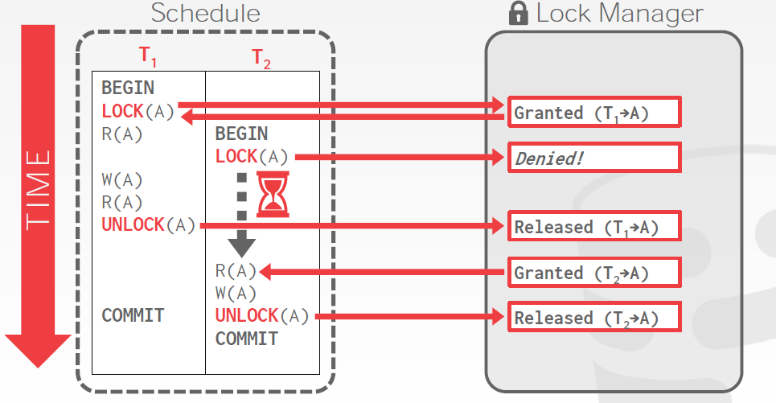
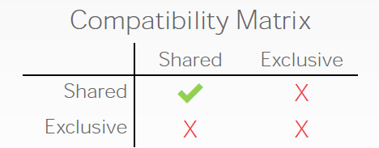

# Concurrency Control

## 	Transaction

交错的操作可能会造成各样的问题。我们需要正式的正确性的标准来决定什么样的交错（interleaving）是可以做的。对于数据库的操作可以被简化为对数据库的读和写，读写的对象可以是元组、表等等。

事物可以被定义为一些列的读写操作：（$R(A)，W(B)$）。在SQL中，一个新的事务由`BEGIN`开始，然后以`COMMIT`或`ABORT`结束。其中`ABORT`代表放弃之前所做的修改，它可以自我冲突，也可以有DBMS放出，而`COMMIT`表示数据库管理系统既可能保存它所做的修改，也能`ABORT`了这些修改。

事务要么做，要么全不做。事务管理器的功能包括：

- 给日志管理器发信号，使信息能以日志形式上保存。
- 保证并发的事务之间不会互相干扰


### 	Correct Execution of Transactions

正确性的定义（ACID）：

- Atomicity（原子性）：数据的所有行为要么全部发生，要么全都不发生。
- Consistency（一致性）：如果每个事务都是一致的，且数据库在事务开始的时候是一致的，那么在结束的时候数据库也是一致的。
- Isolation（隔离性）：每个事务的执行与其他事物是隔离的
- Durablity（）：如果事物提交（`COMMIT`）了，那么其影响是永久的，而不会被失败所打断。

#### 	Atomicity

每个事务有两种可能的结果，同时DBMS必须保证书屋是原子的。

保证原子性有以下几种方法：

1. 日志（Logging）
2. （Shadow Paging）

#### 	Consistency

如果数据是逻辑正确的，那么所有关于这个数据库的数据的查询也会得到逻辑上正确的结果。

数据库的一致性：数据库的模型应当是对现实世界的准确的建模，而且遵循完整性条件。

事务的一致性：这实际上是应用的任务。

#### 	Isolation

用户提交事务，而其他的事务都是自己执行自己的。但实际上数据库是通过交错事务的各种操作来实现并发的。**并发协议**保证了多个事务之间的操作能够合理的交错。协议有两种类型：

- 悲观的：首先要努力不让问题发生
- 乐观的：假定冲突极少发生，然后在它们发生的时候去处理它们就行了。例如：


### 	The Primitive Operation of Transactions

事务要操作的有三个地址空间：

- 数据库元素的磁盘块空间
- 缓冲区的主存空间
- 事务的局部地址空间

为了描述数据在不同地址之间的移动操作，定义如下原语：

- `INPUT(x)`：将数据库元素$X$拷贝到主存缓冲区
- `READ(X,t)`：将元素$X$拷贝到事务的局部变量$t$，如果这个变量不在内存中，需要先输入到主存
- `WRITE(X, t)`：将局部变量$t$拷贝到主存缓冲区的$X$位置，如果这个变量$X$不在内存中，需要先输入到主存
- `OUTPUT(X)`：将包含$X$的缓冲区的块写回磁盘

在事务的讨论中，假定数据库元素的大小不会超过一个块。


## 	Serial & Serialiable Schedule

### 	Schedules

调度是一个或多个事务的重要动作的序列。

### Serial Schedules

一个不会交错不同事务行为的调度称为**串行化调度**。也就是说事务之间的有**严格的前后顺序，而没有重叠**。串行事务可以保证数据库状态的一致性，但是它的要求太严格了。如果某个调度和某个串行调度的**效果相同**（等价），就称这个调度是可**串行化的**。

### The Effect of Transaction Semantics

### A Notation for Transaction and Schedules

### A Notation for Transaction and Schedule


## 	Conflict-serializability

### Conflicts

我们需要一种定义等价的方式，这种定义是基于“冲突”的。如果两个操作属于不同的事务，而且作用同一个对象，并且其中有一个操作是写操作，那么这两个操作是冲突的。对应以下三种冲突：

- 写-读冲突：不可重复读
- 写-读冲突：脏读，读到的是其他事物通过交错写入的值，而不是自己上一步中的值，这违反了隔离性
- 写-写冲突：覆盖没有提交的数据


冲突的定义可以检查事务是否正确，但它无法生成一个正确的调度。

可串行化有不同的等级：

- 冲突可串行化（绝大多数数据库管理系统支持这种）
- 视图可串行化（没有DBMS做得到）

如果两个事务涉及相同事务的相同行为，且每个冲突的行为的顺序都相同，那么它们被称为冲突等价的。也就是说，如果你可以通过交换不同事务的连续的不冲突的操作来将某个调度转化为串行调度，那么他就是串行可串行化的。


这个方法在只有两个事务的时候是非常容易的，但是如果有多个事务就很麻烦了。更高效的方法是使用图：

### Using Dependency Graphs to Test Conflict-Serializability

每个节点代表一个事务，从节点$T_i$到$T_j$的一条边意味着$T_i$中有一个操作$O_i$和$T_j$中的操作$O_j$冲突，而且$O_i$在调度中要出现得更早。现在，一个调度是否是冲突可串行化等价于这个依赖图是否有回路。


### Why the Precedence-Graph Test Works


### 	Veiw Serializability


## 	Enforcing Serializability By Locks

### Locks

之前的方法需要了解整个调度才能知道这个调度是否正确，或者有没有方法变成可串行化的执行顺序，但是在真正执行程序的时候我们是不知道将来的事的，所有需要其他的方法来保证调度的正确性。锁是一种悲观的方法，使用**锁**可以保护对象不造成冲突，例如：



#### 	Locks vs. Latches

|        | Locks                  | Latches          |
| ------ | ---------------------- | ---------------- |
| 分隔   | 用户事务               | 线程             |
| 保护   | 数据库内容             | 内存中的数据结构 |
| 时间   | 整个事务期间           | 关键区           |
| 模式   | 共享、排他、更新、意向 | 读、写           |
| 死锁   | 检测、解决             | 避免             |
| 通过   | 等待、超时、终止       | 代码规范         |
| 保存于 | 锁管理器               | 受保护的数据结构 |

#### 	Basic Type

锁的基本类型有：

- S-Lock：对读共享的锁
- X-Lock：对写排他的锁



如上图，共享锁可以其他事物持有共享锁的时候请求到，但是排他锁其他任何锁都无法请求。规则总结如下：

- 任何事务想要读取对象时，必须申请一个共享锁（或者排他锁）
- 如果一个对象上只有共享锁，那么可以授予其他的事务共享锁
- 如果一个对象上有排他锁，不可以授予其他任何事务任何锁
- 如果一个事务对某个对象持有共享锁，而且只有它对这个事务持有共享锁，这时它申请写这个对象，可以更新锁的类型，从共享锁升级为排他锁。
- 任何事务想要写一个对象，必须先申请排他锁

锁的实现需要一个锁管理器，而锁管理器需要一个哈希表来存储所有可能施加的锁，然后使用一个队列来处理所有的想要施加锁的请求。

#### 	Updating Locks

在上面我们也描述了锁的更新规则，但这是有可能造成死锁的，具体情况如下：


我们实现锁的机制的时候，任何事务申请任何锁，在申请失败的时候需要等待其他的事务释放锁，然后再重新去申请。但是在上述的情况下，$T_1, T_2$同时持有共享锁，然后都去申请排他锁，就会造成死锁。

为了解决这个问题，我们可以使用第三种锁的类型，也就是“更新锁”。”？》《：|


### The Locking Scheduler

### Two-Phase Locking(2PL)

两阶段锁是一个并发协议，它可以决定一个事务是否应该在数据库运行中访问某个对象。这个协议不需要提前知道一个事务将执行怎样的查询。

- 阶段一（锁的增长）：每个事务从数据库管理系统的锁管理器请求它需要的锁。然后锁管理器可以批准或者否决它们的锁请求。
- 阶段二（锁的收缩）：事务只允许释放它之前请求过的锁，在它无法请求新的锁。

在增长阶段结束之前，事务不允许再请求或者更新锁了。这意味着，**所有的施加锁的请求先于所有的释放锁的请求**。


两阶段锁协议可以保证冲突可串行化，但一个显然的问题是，他无法应对级联终止，会造成不可重复读，而且可能造成死锁。


在上图中，事务1的最后放弃它所有的变更，那么事务2的所有基于事务1所有的事情都成了无用功，但他是无法提前预料到这一点的，所以最后需要回滚他所做的操作。

一种处理级联终止的方法是使用强限制两阶段锁。也就是在收缩阶段不再“收缩”了，不再释放任何的锁，而是在最后事务结束的时时候一次性释放所有的锁。这种锁保证了隔离性，也就是在某个事务结束前，其他任何事物都没法介入到这些已经出于修改中的对象来。

### Why Two-Phase Locking Works


## 	Deadlocks

死锁的例子：


### Deadlock Detection by Timeout

### The Waits-For Graph

数据库管理系统可以通过等待图来记录每个事务想要施加的锁，在这个图中，事务表示节点，边表示某个事务想要施加锁，但是必须等待另一个事务释放锁。一旦图中检测到环，就说明此时系统中存在死锁。


### Deadlock Handling

当数据库系统检测到死锁时，他会选择一个**“受害者”事务**，通过**将其回滚**来打破死锁的循环。根据这是事务被调用的方式，他之后可能会重启或者终止（终止要更常见些）。选择受害者事务可以参考如下的数据：

- 创建的时间戳
- 它已经锁住的对象的数量
- 需要回滚的事务的数量

我们同时需要注意过去重启的事务的数量，以防止饥饿。

#### 	Rollback Length

在选择了

### Deadlock Prevention by Ordering Elements

### Detecting Deadlocks by Timestamps

### Comparison of Deadlock-Management Methods


## 	Locking systems with serveral lock modes

### Shared and Exclusive Locks

### Compatibility Matrices

### Upgrading Locks

### Update Locks

### Increment Locks


## 	An Architecture for a locking scheduler

### A Scheduler That Inserts Lock Actions

### The Lock Table


## 	Hierarchies of database elements

### Locks With Multiple Granularity

### Warning Locks

### Phantoms and Handling Insertion Correctly


## 	Tree Protocal

### Motivation for Tree-Based Locking

### Rules for Access to Tree-Structred Data

### Why the Tree Protocol Works


## 	Concurrency Control by timestamps

相比于悲观的锁，使用时间戳的方法是乐观的吗。基于时间戳的方法可以在执行事务之前，就决定好它们的序列化顺序。

### 	Timestamps Ordering(T/O) Concurrency

每个事务$T_i$都被分配了一个独特的、固定的、单调递增的时间戳 $TS(T_i)$，对于事务 $T_i$和$T_j$，$TS(T_i) < TS(T_j)$，那么DBMS必须保证执行调度必须等价于 $T_i$在 $T_j$之前的序列计划。实现的策略有：

- 系统锁：使用系统时间作为时间戳，也就是事务用调度器首次通知自己的时间作为时间戳。
- 逻辑计数器：
- 混合

T/O的基本思想是：给每个对象$X$都带上一个上一次读和写这个对象的事务的时间戳的标签（ $W-TS(X)$和$R-TS(X)$），然后对于每个操作要访问的对象，我们都可检查这个事务是不是要访问“来自未来”的对象，如果是，那么就终止这个事务，然后重启。

例如，某个事务$T_i$要读某个对象，如果 $TS(T_i) < W-TS(X)$，这意味着这个事务想要读某个将要被修改的对象的“过去的值”，这显然是不行的。这时我们会终止这个进程，然后以一个新的时间戳重启它。

如果时间戳上并没有违背T/O，那么我们就可以允许这次读，然后将$R-TS(X)$更新为：
$$
\max ( R-TS(X), TS(T_i))
$$
还要在本地给$X$一个备份，保证$T_i$的可重复读。

在读的情况下，如果$TS(T_i) < R-TS(X)$，或者$TS(T_i) < W-TS(X)$，也需要终止并重启$T_i$，否则，将允许$T_i$写$X$，并且更新$W-TS(X)$，同时和读一样要准备一个$X$的本地备份。

#### 	Thomas Write Rule

如果$TS(T_i) < R-TS(X)$，终止并重启$T_i$。如果$TS(T_i) < W-TS(X)$，托马斯写规则说的是，无视这次写违背了时间戳顺序，继续执行而不是终止。


### Physically Unrealizable Behaviors

### Problems With Dirty Data

### The Rules for Timestamp-Based Scheduling

### Multivation Timetamps

### Timestamps Versus Locking


## 	Concurrency control by validation

### Architecture of a Validation-Based Scheduler

### The Validation Rules

### Comparison of Three Concurrency-Control Mechanisms


## 	Serializability & Recoverability

### The Dirty-Data Problem

### Cascading Rollback

### Recoverable Schedules

### Schedule That Avoid Cascading Rollback

### Group Commit

### Logical Logging

### Recovery From Logical Logs


## 	Long-duration transactions

### Problems of Long Transactions

### Sagas

### Compensating Transactions

### Why Compensating Transaction Work


## 	Latches

### 	Locks vs. Latches

- 锁：相对于锁存器来说，锁是一种**更高级的**，保护数据库的内容（例如**元组、表、整个数据库**）不受其他**事务**的危害的原语。数据库系统**可以把事务持有的锁暴露给用户**。锁需要**有能力回滚**事务的修改。
- 锁存器：相比锁，锁存器是一种**更低级的**原语。它可以用来保护数据库系统中的**内部数据结构**的**临界区**不受线程的“危害”。锁存器不需要能够回滚，也不需要暴露给用户。

### 	Latches Implementation

现代CPU提供一种原子的比较-交换（atomic compare-and-swap），是实现锁存器的一种原语。

#### 	Blocking OS Mutex

使用OS自带的互斥量。Linux提供`futex`。

实际上，在DBMS中使用操作系统的互斥量是一个坏主意，因为有大量的额外开销。例如`std::mutex`。

- 优点：很简单
- 缺点：昂贵，而且不可拓展

```cpp
std::mutex;
m.lock();
m.unlock();
```


#### 	Test-and-Set Latch (TAS)

非常高效（只需要单条指令完成latch或unlatch）。

例如`std::atomic<T>`：

```cpp
std::atomic_flag latch;
while (latch.test_and_set()) {
    // retry? yield? abort?
}
```


#### 	Reader-Writer Locks

这种锁存器有两种模式。

- 允许并发读
- 必须维持一个读/写队列以防止饥饿
- 可以基于spinlock实现


### 	Hashtable Latching

由于线程访问数据结构的方式有限，哈希表是很容易支持并发访问的。

- 所有的线程都只能朝同一个方向移动，而且一次只能访问一页/一个槽。
- 死锁时不可能的

对于哈希表的锁存器有两种粒度：

- 页锁存器
  - 每页都有自己的读写锁存器来保护整个内容
  - 线程在访问一页前必须申请读或写锁存器
- 槽锁存器
  - 每个槽有自己的锁存器
  - 可以用单模式的锁存器减少元数据和计算的额外开销


### 	B+ Tree Latching

这里的挑战是避免两个问题：

- 多个线程尝试去同时修改一个节点
- 一个线程在遍历树的时候，另一个线程想要分裂或者合并节点

锁存器的捕获/耦合是一种用于防止上述问题的协议。基本的想法如下：

- 给父节点锁存器
- 给子节点锁存器
- 如果父节点认为自己“安全”了，就释放锁存器。“安全”的节点意味着在更新的时候它不会分裂（不是满的）或者合并（比半满要多）。

#### 	Basic Latch Crabbing Protocal

- 搜索：从根节点往下，重复地在子节点上获取锁存器，然后释放父节点的锁存器。
- 插入/删除：从根节点开始往下，

#### 	Improved Latch Crabbing Protocal


#### 	Leaf Node Scans
