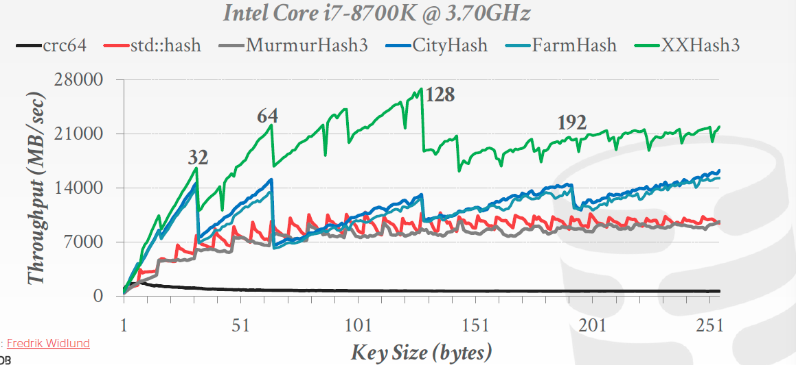

# 哈希表

## 设计选择

- 数据组织：我们应该怎样把数据结构放到内存/页中，以及需要存储哪些信息来支持有效的访问？
- 并发：多个线程访问数据结构时怎样才能不产生问题？

## Data Structures

A DBMS uses various data structures for many different parts of the system internals. Some examples include: 

- **Internal Meta-Data:** This is data that keeps track of information about the database and the system state. Ex: Page tables, page directories
- **Core Data Storage**: Data structures are used as the base storage for tuples in the database. 
- **Core Data Storage**: The DBMS can build data structures on the fly while processing a query to speed up execution (e.g., hash tables for joins). 
- **Table Indices**: Auxiliary data structures can be used to make it easier to find specific tuples.

There are two main **design decisions** to consider when implementing data structures for the DBMS: 

1. *Data organization*: We need to figure out how to layout memory and what information to store inside the data structure in order to support efficient access. 
2. *Concurrency*: We also need to think about how to enable multiple threads to access the data structure without causing problems.

## 	哈希表

A **hash table** implements an unordered associative array that maps keys to values.

It uses a **hash function** to compute an offset into the array for a given key, from which the desired value can be found.

Space Complexity: ***O(n)***

Operation Complexity:

- Average: ***O(1)*** 
- Worst: ***O(n)***

**Money cares about constants!**

### 	静态（static）哈希表

分配一个巨大的数组，使得每个元素都内被存下。

### 	设计选择

- 哈希函数
  - 如何把一个很大的键空间映射到一个很小的邻域中
  - 速度和碰撞率之间的权衡
- 哈希机制
  - 如何处理哈希之后的键碰撞
  - 分配一个很大的哈希表和增加额外的查找/插入指令之间的权衡

## 	哈希函数

- CRC-64 (1975)：用于网络中的错误检测
- MurmurHash (2008)：快速的，一般的哈希函数
- Google CityHash (2011)：对于短键（小于64字节）很快
- Facebook XXHash (2012)
- Google FarmHash (2014)

## 	

## 静态哈希机制

### 	线性探测

### 	Robin Hood

### 	Cuckoo

