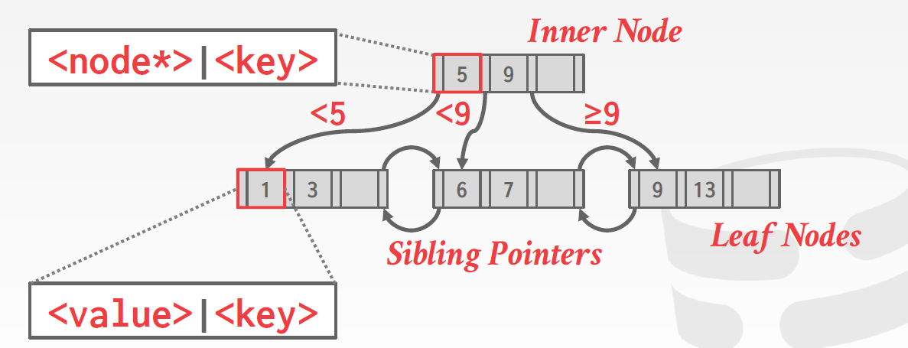

# Index 

所谓索引，就是把一张表中的一些属性，连带这个这些属性的具体的值单独拿出来，然后带上指针，指针指向特定的数据（页（块）、元组），使得我们在需要找到某个特定数据的时候（任何需要用到查询的操作，以及连接这种），能够加速查找的过程。下面介绍的就是不同的属性值和指针组织的方式，能提供不同程度不同便利性的查找加速。

## 	Index Structure Basics

### Sequential Files


```select * from r where a = 10```，为了这样一个语句去检查所有的关系R中的列是很浪费时间的。我们需要能直接根据键值很快找到记录的方法。

一个想法是，如果我们能将记录根据他们的某个属性顺序排列，就可以通过二分查找很快找到想找的记录在上面地方。索引就是用来加速这种查找过程的结构。

例如说，一个关系存在一个数据文件中，而这个数据文件可能有**多个索引文件**用来加速查找。通常，表的主键上我们会建立**主索引**，其他属性上建立**辅助索引**。

**顺序文件**是这样的文件：其记录按照主键排好序。记录分布在不同的数据块中，每个数据块内部也是根据主键排列的，每个数据块不一定是满的。

#### 	Desnse & Sparse Indexes

索引有稠密和稀疏之分：顺序文件会为所有的记录建立一个指针，但是稀疏索引只为每个数据块建立索引。


注意，我们需要索引文件足够小，使之可以永久地放在主缓冲区中。这样在查询的时候就可以只访问主存，而不用做磁盘I/O操作。但是索引文件可能还是占据多个存储块，即使使用二分法也需要多次I/O。所以可以考虑在索引上面再建立索引，也就是多级索引来保证一级索引的使用更加有效。例如说在第一层使用稀疏索引，在第二层使用稠密索引：


### 		Secondary Indexes

#### 	Application of Secondary Indexes

堆：我们可以使用辅助索引来构造一个堆，即关系的记录之间没有特定的顺序：


聚簇文件（clustered file）：如果我们经常需要查询两个关系之间的某种多对一关系，例如说，查询某个工作室制作的所有影片，那么我们就可以不必根据两张表的主键排序，而是将文件如下组织


#### 	Indirection in Secondary Indexes

作为中间连接的**桶**：如3-5，索引重复时，会造成大量的空间浪费，我们想要每个键都只出现一次，就可以用到桶（bucket）；


使用桶来查找的例子：


### 	Document Retrieval Inverted Index

一般来说，在数据文件中，我们知道每个数据文件包含哪些单词。但是在需要进行信息检索时，也就是给定单词需要知道这个单词出现在哪些文件里的时候，就绪要用到倒排索引。在下图中，每个单词后面有一个指针，指向一个数组（也就是上面描述的桶），这个数组包含了指向所有它出现过的文件的指针。这就称为倒排索引。

具体来说，我们把文档这样组织：每个属性都是一个布尔值，表示每个单词在不在这个文档中（例如100000个单词），也就是说每个文档表示成一个元组。然后从一些具体的单词（文档中出现的）建立一个二级索引，就形成了倒排索引。


索引分为：

- 顺序索引：基于值的顺序排序
- 散列索引：把值根据散列函数分布到散列桶中。

稠密索引和稀疏索引的区别：


显然


## 	表索引


要做范围内的搜索，哈希表是不行的。

表索引是一张表的属性的子集的复制品，这些属性以某种让访问更加高效的方式组织或排序。数据库管理系统要保证表的内容和表的索引是逻辑上同步的。

数据库管理系统有责任找到对每个查询而言最合适的索引。要权衡的是索引的数量和存储以及维护需要的开销。


## 	B-Tree

### 		The Structure of B-trees

B树的家族：

- B-Tree (1971)
- B+Tree (1973)
- B*Tree (1977?)
- $B^{link}$-Tree (1981)

一般的B树的内部节点和叶节点的定义：

- 叶节点：最后一个指针指向下一个叶节点，其他的指针则指向它有的键对应的记录
- 内部节点：如果有$n$个键，那就有$n+1$个指针，划分为$n+1$个范围，指向不同范围的内部节点或者叶节点。


### 	B+树

B+树的不变量，假设每个内部节点的最大键数为$d-1$，最大指针数为$d$：

- 每个内部节点的指针数比键数多一个
- 所有的叶节点到根节点的距离相同
- 对于每个有$k$个键值的内部接节点$N$，子节点中的顺序关系是满足的。
- 每个内部节点至少有$\lfloor d/2 \rfloor$个键
- 每个叶节点至少有$\lfloor d/2 \rfloor$个键
- 每个在表中出现的键必须也在叶子中出现，并且叶子从左到右是有序的

搜索、顺序访问、插入和删除都是$O(\log n)$



如上图，每个B+数的节点是一个<u>键值对的数组</u>，数组本身一般是<u>有序</u>的。键和属性类型相同，内部节点的键作为划分范围的点，值则是指向子节点的指针。此外，每个叶节点的前后有指针连接前后的的叶节点方便顺序遍历。

每个节点内部的情况如下：


每个节点

节点的值有两种方法

- 方法一：只存record ID，用一个指针指向索引条目对应元组的位置
- 方法二：元组数据，把元组的实际数据存在页节点中，二级索引必须将记录ID（record id）作为其值存储

#### 		Differences Between B-Tree and B+ Trees

B树中，值可以在树的任何位置（本身并没有内部节点或外部节点这一区分）。B+树中有很多重复的键，内部节点中的键使用来知道该去哪里找到叶节点的，但是值只存在叶节点中。所以，如果要删除一个节点，在B+树中只要在叶节点中删除就好了，根据是否需要再平衡，内部节点可能不需要修改。B树在空间上显然是比B+树更加节约的，但是在多个线程对树进行更新的时候可能会出现问题。


#### 		Practical B+ Trees

一般情况下，B+数的填充因子是67%，也就是数据中67%是原本有效的元组数据。


#### 		Duplicate Keys

方法一：增加记录ID

#### 	Application of B-trees

1. B树的搜索键是数据文件的主键，而且索引是稠密的。也就是说在叶节点中数据文件中的每个记录都有一个对应的键值。但是数据文件本身未必是按主键排序的。
2. 数据文件根据主键排序的，而B树是一个稀疏索引，在叶节点中，对于数据文件的每一块都只有一个键-指针对。
3. 数据文件是按照某个不是主键的属性排序的，而这个属性是B树的搜索键。


### 	Operations of B+ Trees

#### 	Search


如果找到了键直接等于$v$的地方，就可以返回对应的指针。否则返回`null`。


####  Range Queries


支持迭代器。


#### 	Insertion

思路：插入的当前接

1. 找到要插入的叶字
2. 如果叶子是有足够的空间，那么直接插入
3. 如果叶子没有足够的空间，那就将它分成两个节点。
   1. 如果这个节点是一个叶节点（虽然上面我们是找到叶节点再插入，但是这里的递归调用不是直接调用的整个大的`insertion`方法，而而是里头这一部分），那就将这两个节点中的第二个节点中的最小值（中间键值）复制，然后将其插入父节点中。


举例：


如上，我们在插入到第二个叶节点之后，需要分裂成两个叶节点，但是此时的父节点只能承载3个叶节点，所以需要增加父节点中的键值数量。所以把中间值（13）插入到父节点中，然中间值后面的指针指向第二个节点，前面的指针指向前的节点。

另一个例子是需要把父节点连续分裂的情况：


在上一个例子的基础上，这一次父节点也满了


描述：插入键值$K$，内容位于指针$P$

- 如果树是空的，则创建一个空的叶节点，这同时也是根节点（此时没有内部节点）。
- 如果不是空的，就要用搜索找到能插入它的叶子$L$。
  - 如果叶子的键数小于$L-1$​，，那么调用`insert_in_leaf`将其插入。
  - 否则插入这个叶节点将超出容量，需要分裂。分裂的具体步骤是：
    - 创建节点$L^{\prime}$，将插入$K$后的$n-1$个键-指针对复制到一个新的内存区域$T$中
    - 

插入的键值$L$小于叶子中的所有键值


#### 	Deletion

思路：

`delete`：先下降到键所在的叶子中，从这个节点中移除这个键和对应的指针。

`delete_entry()`：

如果这个叶子是同时也是根，同时它只有一个子节点，那就删掉这个节点，让它的子节点成为根。

如果当前节点的键值数量过少，

- 但是前面或者后面的兄弟的键够借（也就是比下限多一个及以上），就借给它，然后调整父节点中指针的指向
- 而且前后的兄弟的键也不够借（数量等于下限），那么：

1. 如果删除后节点的有足够的键，就结束
2. 如果当前节点的键值数量过少，
3. 如果当前的节点键数量过少，
   1. 如果是当前是内部节点，


### 	聚类索引（Clustered Indexes）

一般而言，堆中的页是一个无需的集合，有时我们希望它们一定程度上“有序”，也就是说我们希望在叶节点上做顺序遍历的时候节点的集合之间是有序的。


### 	条件搜素（search condition）

相比于哈希表必须给出某个主键才能找到对应的值，索引可以根据<u>一些属性中的某些属性的值</u>来确定值的位置。例如给出一个关于属性$<a,b,c>$的索引，数据库可以支持以下两种“没有给出所有属性“情况下的搜索；

- 知道$a = 5$以及$b =3$
- 只知道$b=3$

### B+Tree Design Choices

#### 	节点的大小

存储设备的速度越慢，对于B+树最优的节点的大小就越大。例如：

- HDD：1MB
- SSD：10KB
- 内存：512B

最优的大小同时取决于工作方式，例如是进行叶节点的遍历还是从根到叶的遍历。

#### 	合并门槛（merge threshold）

当及节点是半满的时候，有一些数据并不会进行节点的合并。因为延迟合并操作可以减少重新组织的操作量。

有时候，允许下溢的存在，然后周期性地重建整棵树是一个更好的选择。

#### 	变长键

- 方法一：指针，将键作为指针
- 方法二：变长


## Tree Indexes

## 

### B+ Tree


#### 

##### Node Size

##### Merge Threshold

##### Variable Length Keys

##### Intra-Node Search


#### Optimizations

##### Prefix Compression

##### Deduplication

##### Suffix Truncation 

For the most part the key ent

##### Bulk Insert

##### Pointer Swizzling


#### Additional Index Usage

- Implicit Indexes
- Partial Indexes
- Covering Indexes
- Index Include Columns

#### Trie Index


#### Radix Tree


#### Inverted Indexes


## 	Hashtables


## 	Multidimensional Indexes


## 	Hash Structures for Multidimensional Data

### 	Grid Files

### 	Lookup in a Grid Files

### 	Insertion into Grid Files

### 	Performance of Grid Files

### 	Partitioned Hash Functions

### 	Comparsion of Grid Files and Partitioned Hashing


## 	Tree Structures for Multidimensional Data

### 	Multiple-Key Indexes

### 	Performance of Multiple-Key Indexes

### 	kd-Trees

### 	Operations on kd-Trees

### 	Adapting kd-Trees to Secondary Storage


## 	Bitmap Indexes

### 	Motivation for Bitmap Indexes

### 	Compressed Bitmaps

### 	Opretating on Run-Length-Encoded Bit-Vectors

### 	Managing Bitmap Indexes


## Index Concurrency Control

### 	Latches Overview

#### Locks vs. Latches


#### 	Latch Implementation

### 	Hash Table Latching


### 	B+ Tree Latching


### 	Leaf Node Scans


### 	Delayed Parent Updates

A *concurrency control protocol* is the method that the DBMS uses to ensure “correct” results for concurrent operations on a shared object. A protocol’s correctness criteria can vary:

- **Logical Correctness**: This means that the thread is able to read values that it should be allowed to read. 
- **Physical Correctness**: This means that there are not pointers in the data structure that will cause a thread to read invalid memory locations.

#### 

​	
