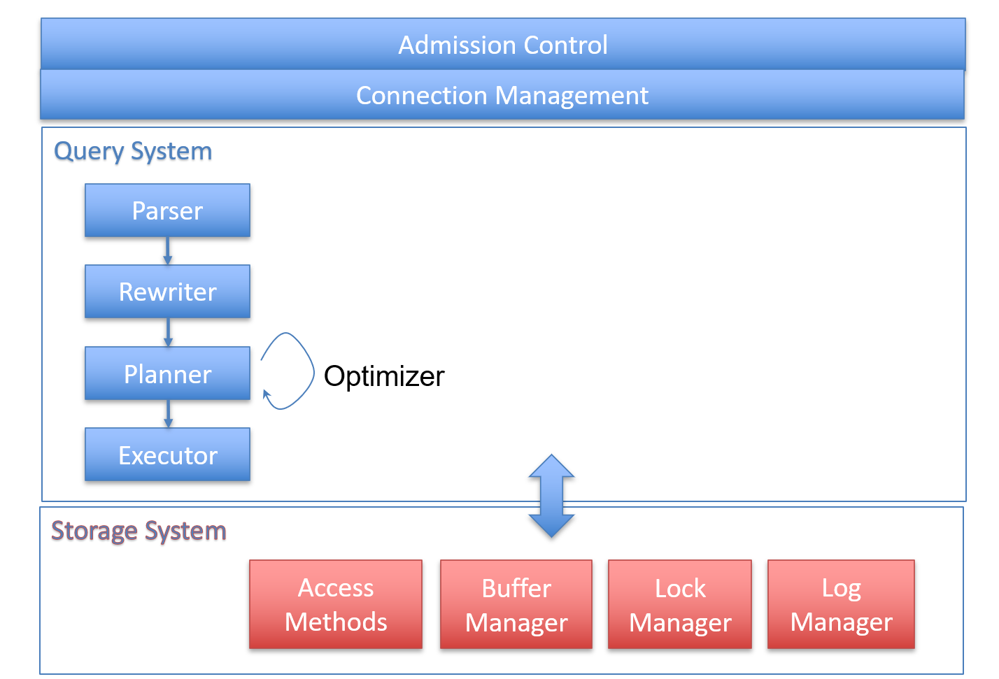
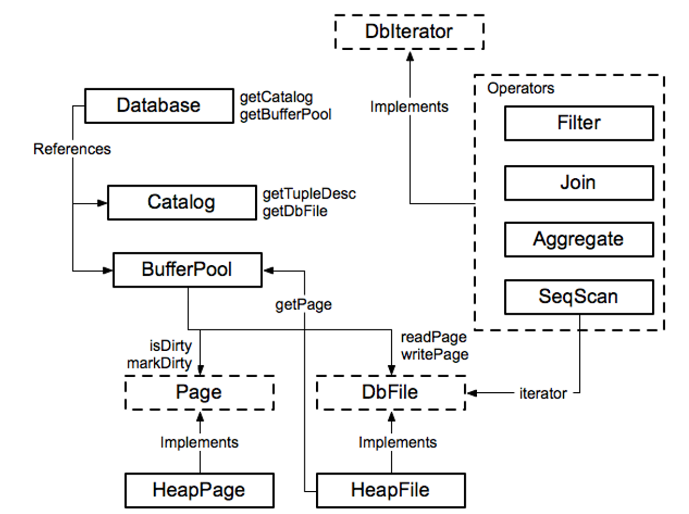
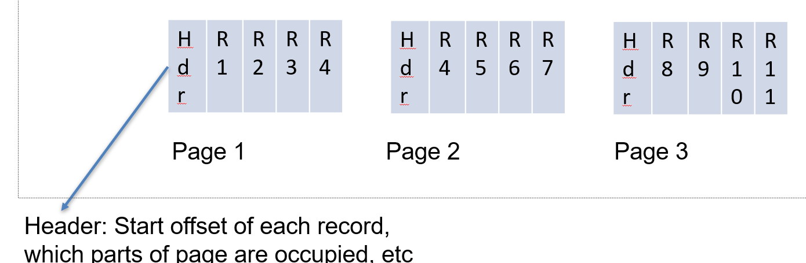
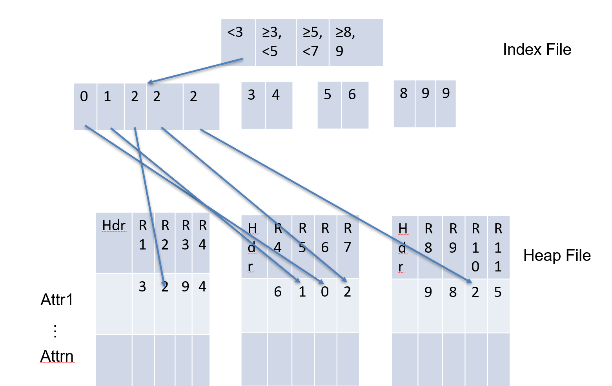
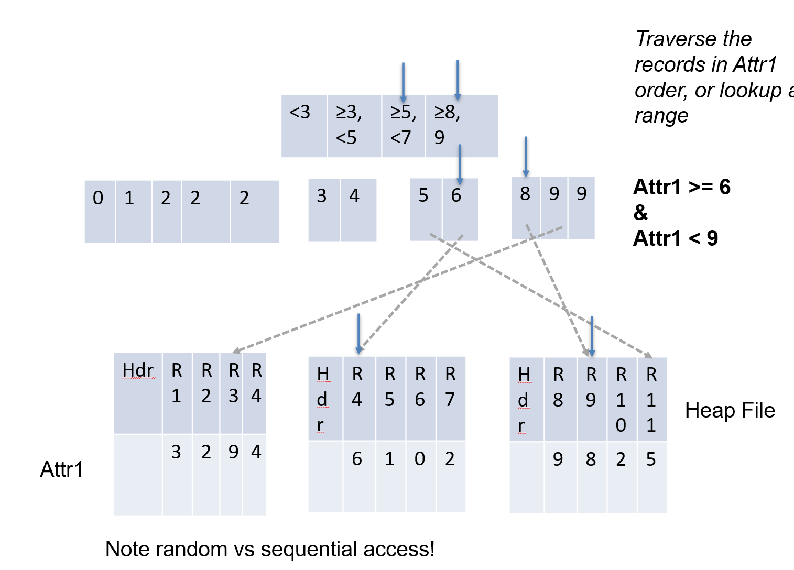
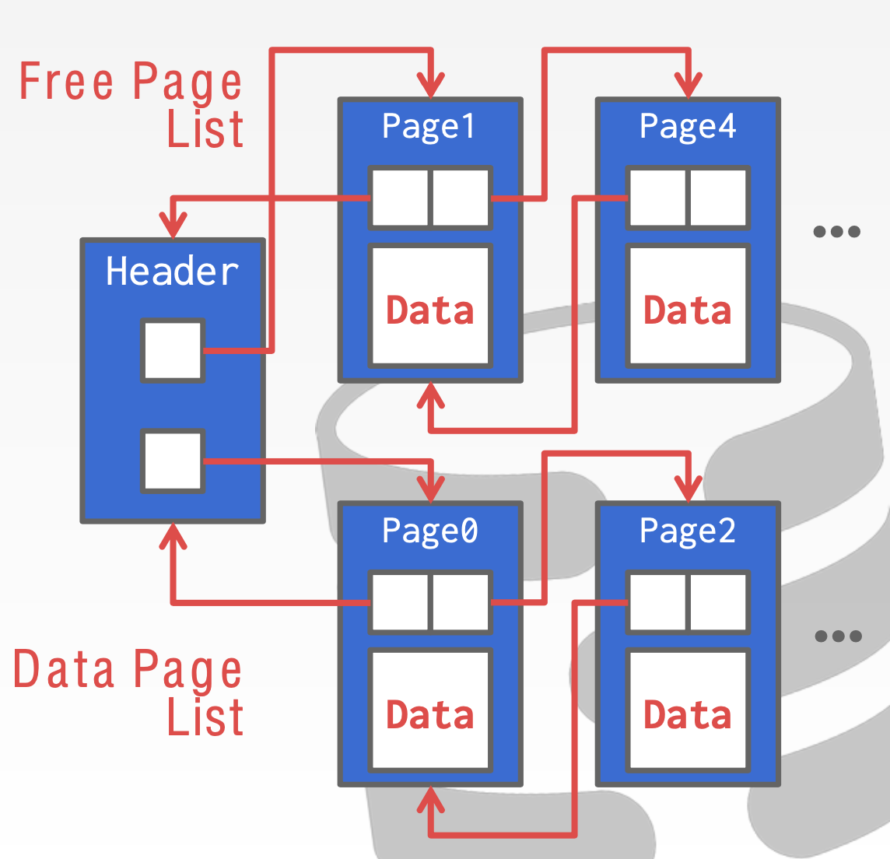
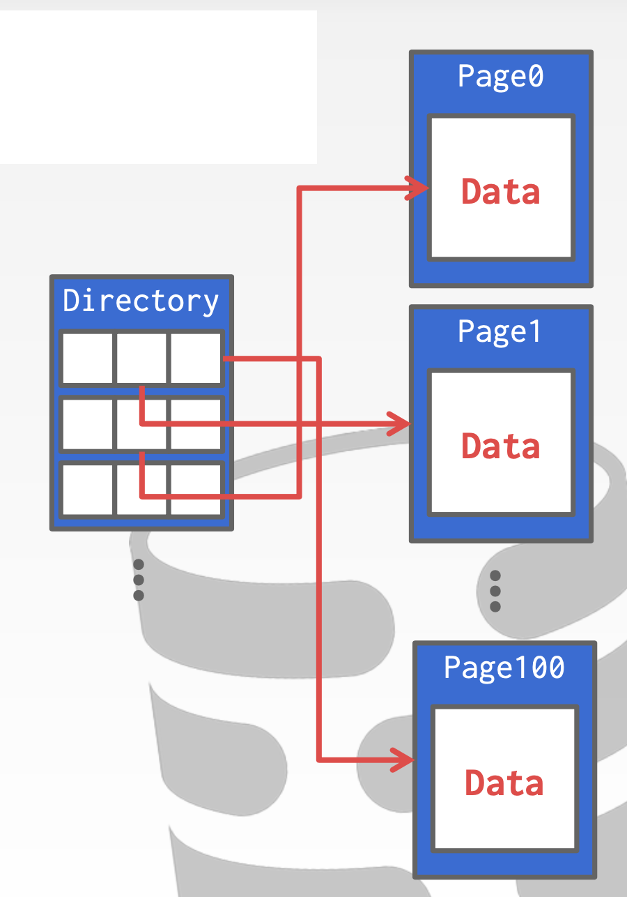
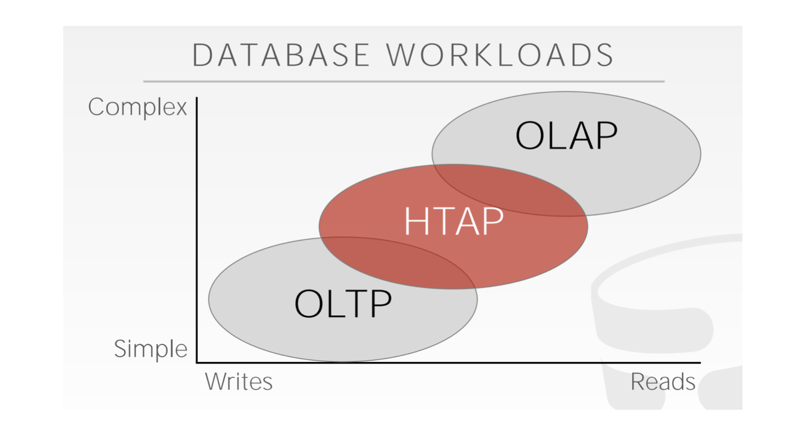
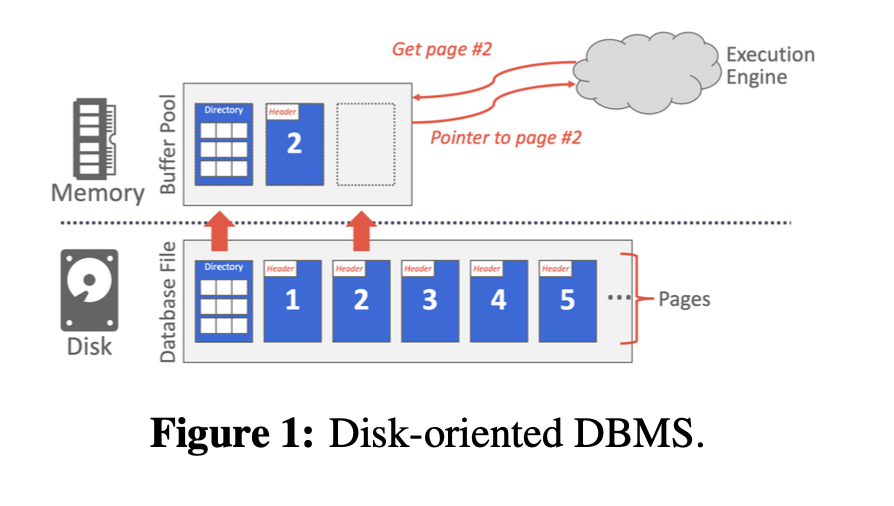
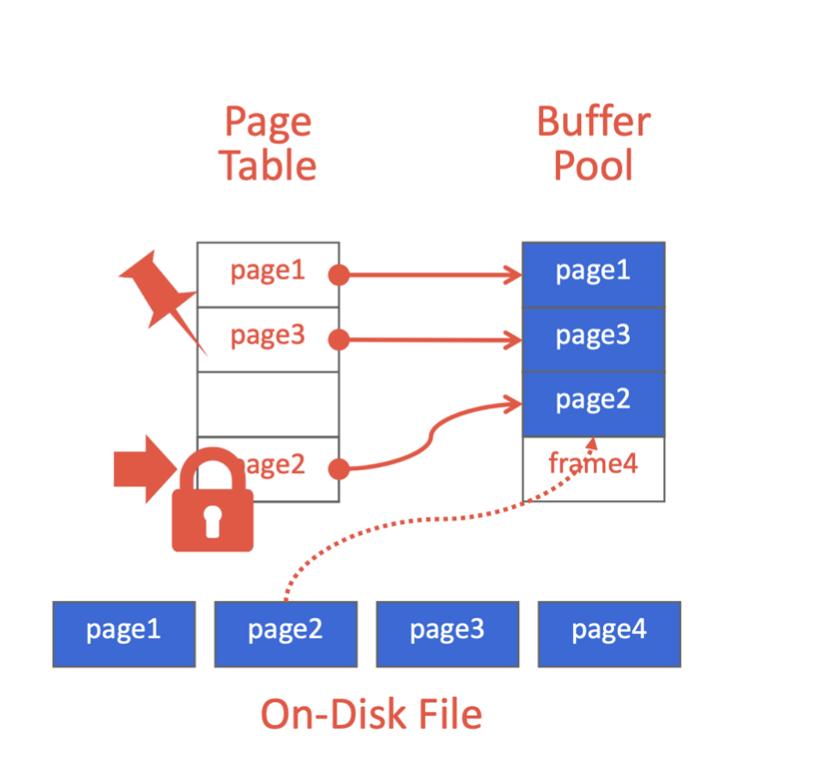

# Database

## 	Components



### 	Query Processing Steps

- Admission Control
- Query Rewriting
  - View Substitution
  - Predicate Transforms
  - Subquery Flattening
- Plan Formulation (SQL $\to$ Tree)
- Optimization

### 	Query Execution

Executing a query involves chaining together a series of operators that implement the query.

Operator types:

-  scan from disk/mem 
- filter records
- join records
- aggregate records 

### 	Module Diagram of Simple DB



## STORAGE HIERARCHY

The DBMS assumes that the primary storage location of the database is on non-volatile disk. The DBMS's components manage the movement of data between non-volatile and volatile storage.

Volatile: Random Access Byte-Addressable

Non-Volatile: Sequential Access Block-Addressable

### 	IMS (Hierarchical Model)

Data organized as ***segments***, which is **collection of records**, each with same **segment type**.

Segments have different **physical representations**:

- Unsorted 
- Indexed
  - Sorted
  - Hashed


### SEQUENTIAL VS. RANDOM ACCESS

Random access on non-volatile storage is usually much slower than sequential access.

### SYSTEM DESIGN GOALS

- Allow the DBMS to manage databases that exceed the amount of memory available. 
- Reading/writing to disk is expensive, so it must be managed carefully to avoid large stalls and performance degradation. 
- Random access on disk is usually much slower than sequential access, so the DBMS will want to maximize sequential access.


## Physical Storage

The DBMS stores a database as one or more files on disk typically in a proprietary format.

- The OS doesn't know anything about the contents of these files.

Early systems in the 1980s used custom filesystems on raw storage.

### 	Accessing Data

**Access Method**: way to read data from disk.

**Heap File**: unordered arrangement of records Arranged in pages




#### 	Heap Scan

Read Heap File In Stored Order, even with a predicate, read all records

#### 	Index

Index maps from a value or range of values of some attribute to records with that value or values. 从值找到记录。

Several types of indexes, including trees (most commonly B+Trees) and hash indexes

API如：

- Lookup(value) $\to$ records
- Lookup(v1 .. vn) $\to$ records

Value is an attribute of the table, called the “key” of the index

##### 	Tree Index 



##### 	Index Scan



##### 	Clustered Index

Order pages on disk in index order


#### Database pages

A page is a fixed-size block of data.

- It can contain tuples, meta-data, indexes, log records...
- Most systems do not mix page types.
- Some systems require a page to be self-contained.

Each page is given a unique identifier.

- The DBMS uses an indirection layer to map page ids to physical locations.

##### Types of pages

There are three different notions of "pages" in a DBMS:

- 

A hardware page is the largest block of data that the storage device can guarantee failsafe writes.

#### Database Heap

A heap file is an unordered collection of pages where tuples that are stored in random order.

- Create / Get / Write / Delete Page
- Must also support iterating over all pages.

Two ways to represent a heap file:

- Linked List
- Page Directory

It is easy to find pages if there is only a single heap file. Need meta-data to keep track of what pages exist in multiple files and which ones have free space.

##### Heap File: Linked list

Maintain a header page at the beginning of the file that stores two pointers:

- HEAD of the free page list. 
- HEAD of the data page list.



##### Heap File: Page Directory

The DBMS maintains special pages that tracks the location of data pages in the database files.

The directory also records the number of free slots per page.

The DBMS must make sure that the directory pages are in sync with the data pages.



### Page layout

Every page contains a header of meta-data about the page's contents. 

- Page Size
- Checksum
- DBMS Version
- Transaction Visibility
- Compression Information

Some systems require pages to be self- contained (e.g., Oracle).

For any page storage architecture, we now need to decide how to organize the data inside of the page.

→ We are still assuming that we are only storing tuples.

- Tuple-oriented
- Log-structured

#### Tuple Storage

How to store tuples in a page?

**Strawman Idea:** Keep track of the number of tuples in a page and then just append a new tuple to the end.

- What happens if we delete a tuple?
- What happens if we have a variable-length attribute?

##### Slotted Pages

The most common layout scheme is called slotted pages.

The slot array maps "slots" to the tuples' starting position offsets.

The header keeps track of:

- The # of used slots
- The offset of the starting location of the last slot used.

##### RECORD IDS

The DBMS needs a way to keep track of individual tuples.

Each tuple is assigned a unique record identifier.

- Most common: **page_id** + **offset/slot** 
- Can also contain file location info.

An application cannot rely on these ids to mean anything.

#### Tuple Layout

A tuple is essentially a sequence of bytes. 

It's the job of the DBMS to interpret those bytes into attribute types and values.

##### Tuple Header

Contains meta-data about the tuple. 元数据

- Visibility information for the DBMS’s concurrency control protocol (i.e., information about which transaction created/modified that tuple). 
- Bit Map for NULL values.  空数据的位图
- Note that the DBMS does not need to store meta-data about the schema of the database here.

##### Tuple Data

Actual data for attributes.

- Attributes are typically stored in the order that you specify them when you create the table. 
- Most DBMSs do not allow a tuple to exceed the size of a page. 大小不能超过页

##### Unique Identifier

- Each tuple in the database is assigned a unique identifier. 
- Most common: page id + (offset or slot). 
- An application cannot rely on these ids to mean anything.

**Denormalized Tuple Data**: If two tables are related, the DBMS can “pre-join” them, so the tables end up on the same page. This makes reads faster since the DBMS only has to load in one page rather than two separate pages. However, it makes updates more expensive since the DBMS needs more space for each tuple.

### Data Representation

The data in a tuple is essentially just byte arrays. It is up to the DBMS to know how to interpret those bytes to derive the values for attributes. A *data representation* scheme is how a DBMS stores the bytes for a value. 字节数组

##### Integers

Most DBMSs store integers using their “native” C/C++ types as specified by the IEEE-754 standard. These values are fixed length.

Examples: ```INTEGER```,``` BIGINT```,``` SMALLINT```,``` TINYINT```.

##### Variable Precision Numbers

These are inexact, variable-precision numeric types that use the “native” C/C++ types specified by IEEE-754 standard. These values are also fixed length.

Operations on variable-precision numbers are faster to compute than arbitrary precision numbers because the CPU can execute instructions on them directly. However, there may be rounding errors when performing computations due to the fact that some numbers cannot be represented precisely.

Examples: ```FLOAT```,  ``` REAL```.

##### Fixed-Point Precision Numbers

These are numeric data types with arbitrary precision and scale. They are typically stored in exact, variable- length binary representation (almost like a string) with additional meta-data that will tell the system things like the length of the data and where the decimal should be.

These data types are used when rounding errors are unacceptable, but the DBMS pays a performance penalty to get this accuracy.

Examples: ```NUMERIC```,  ``` DECIMAL```.

##### Variable-Length Data

These represent data types of arbitrary length. They are typically stored with a header that keeps track of the length of the string to make it easy to jump to the next value. It may also contain a checksum for the data.

Most DBMSs do not allow a tuple to exceed the size of a single page. The ones that do store the data on a special “overflow” page and have the tuple contain a reference to that page. These overflow pages can contain pointers to additional overflow pages until all the data can be stored.

Some systems will let you store these large values in an external file, and then the tuple will contain a pointer to that file. For example, if the database is storing photo information, the DBMS can store the photos in the external files rather than having them take up large amounts of space in the DBMS. One downside of this is that the DBMS cannot manipulate the contents of this file. Thus, there are no durability or transaction protections.

Examples: ```VARCHAR```,  ``` VARBINARY```, ``` TEXT```,  ``` BLOB```.

##### Dates and Times

Representations for date/time vary for different systems. Typically, these are represented as some unit time (micro/milli)seconds since the unix epoch.

Examples: ```TIME```, ``` DATE```,``` TIMESTAMP```.

##### System Catalogs

In order for the DBMS to be able to deciphter the contents of tuples, it maintains an internal catalog to tell it meta-data about the databases. The meta-data will contain information about what tables and columns the databases have along with their types and the orderings of the values. 

Most DBMSs store their catalog inside of themselves in the format that they use for their tables. They use special code to “bootstrap” these catalog tables.

### Workloads

There are many different workloads for database systems. By workload, we are referring to the general nature of requests a system will have to handle. This course will focus on two types: Online Transaction Processing and Online Analytical Processing.

##### OLTP: Online Transaction Processing

##### OLAP: Online Analytical Processing

##### HTAP: Hybrid Transaction + Analytical Processing




### Storage Models


#### N-Ary Storage Model (NSM)

In the n-ary storage model, the DBMS stores all of the attributes for a single tuple contiguously in a single page, so NSM is also known as a “row store.” This approach is ideal for OLTP workloads where requests are insert-heavy and transactions tend to operate only an individual entity. It is ideal because it takes only one fetch to be able to get all of the attributes for a single tuple.

##### Advantages:

- Fast inserts, updates, and deletes.
- Good for queries that need the entire tuple.

##### Disadvantages:

- Not good for scanning large portions of the table and/or a subset of the attributes. This is because it pollutes the buffer pool by fetching data that is not needed for processing the query.

#### Decomposition Storage Model (DSM)

In the decomposition storage model, the DBMS stores a single attribute (column) for all tuples contiguously in a block of data. Thus, it is also known as a “column store.” This model is ideal for OLAP workloads with many read-only queries that perform large scans over a subset of the table’s attributes.

##### 	Advantages:

- Reduces the amount of wasted work during query execution because the DBMS only reads the data that it needs for that query.
- Enables better compression because all of the values for the same attribute are stored contiguously.

##### Disadvantages:

- Slow for point queries, inserts, updates, and deletes because of tuple splitting/stitching.

### Buffer pool

The DBMS is responsible for managing its memory and moving data back-and-forth from the disk. Since, for the most part, data cannot be directly operated on in the disk, any database must be able to efficiently move data represented as files on its disk into memory so that it can be used. A diagram of this interaction is shown in Figure 1. A obstacle that DBMS’s face is the problem of minimizing the slowdown of moving data around. Ideally, it should “appear” as if the data is all in the memory already.



Another way to think of this problem is in terms of spatial and temporal control.

*Spatial Control* refers to where pages are physically written on disk. The goal of spatial control is to keep pages that are used together often as physically close together as possible on disk.

*Temporal Control* refers to when to read pages into memory and when to write them to disk. Temporal control aims to minimize the number of stalls from having to read data from disk.

#### Locks vs. Latches

We need to make a distinction between locks and latches when discussing how the DBMS protects its internal elements.

##### Locks

A lock is a higher-level, logical primitive that protects the contents of a database (e.g., tuples, tables, databases) from other transactions. Transactions will hold a lock for its entire duration. Database systems can expose to the user which locks are being held as queries are run. Locks need to be able to rollback changes.

##### Latches

A latch is a low-level protection primitive that the DBMS uses for the critical sections in its internal data structures (e.g., hash tables, regions of memory). Latches are held for only the duration of the operation being made. Latches do not need to be able to rollback changes.

#### Buffer Pool

The *buffer pool* is an in-memory cache of pages read from disk. It is essentially a large memory region allocated inside of the database to store pages that are fetched from disk. 内存中的对于磁盘中的页面的缓存。

The buffer pool’s region of memory organized as an array of fixed size pages. Each array entry is called a *frame*. When the DBMS requests a page, an exact copy is placed into one of the frames of the buffer pool. Then, the database system can search the buffer pool first when a page is requested. If the page is not found, then the system fetches a copy of the page from the disk. See Figure 2 for a diagram of the buffer pool’s memory organization.

