# Query Processing & Optimization


## 	Parsing and Preprocessing

### 	Syntax and Parse Tree

语法树有两种节点：

- 原子：也就是一些关键词或者操作符
- 语义类别，用尖括号表示
  - 例如<Query>，<Condition>，<Attribute>，<Pattern>，<Relation>

#### 	Grammer

<Query>的规则如下：

```sql
<Query> ::= SELECT <SelList> FROM <FromList> WHERE <Condition>
```

冒号加等号表示“可以表示为”，后面的那些语义类别的名字的含义表示他们只能跟在对应的关键词后面。

Select-list的规则有两种：

```sql
<SelList> ::= <Attribute>, <SelList>
<SelList> ::= <Attribute>
```

From-list的规则也类似：

```sql
<FromList> ::= <Relation> , <FromList>
<FromList> ::= <Relation>
```

<Condition>的规则：

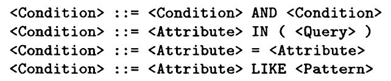

语法树的生成如下：

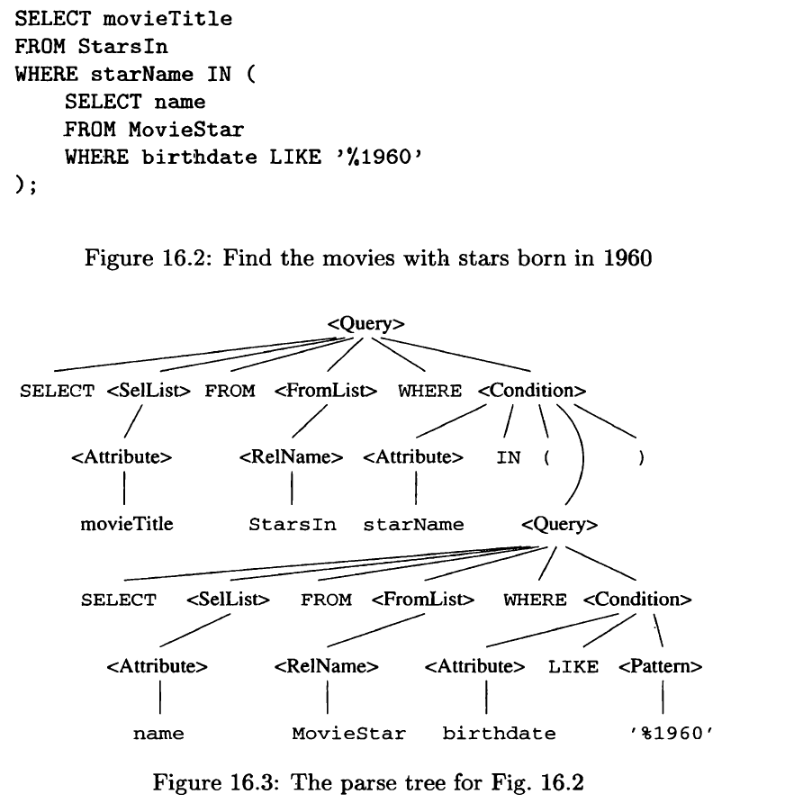

### 	Preprocessor

即使查询语句的语法是正确的，预处理器应该做语义检查，例如：

- 检查关系的使用
- 检查并解析属性的使用
- 检查类型

### 	View

预处理器牵涉到视图。


## 	Algebraic Laws for improving query plans

### 	Pushing selections


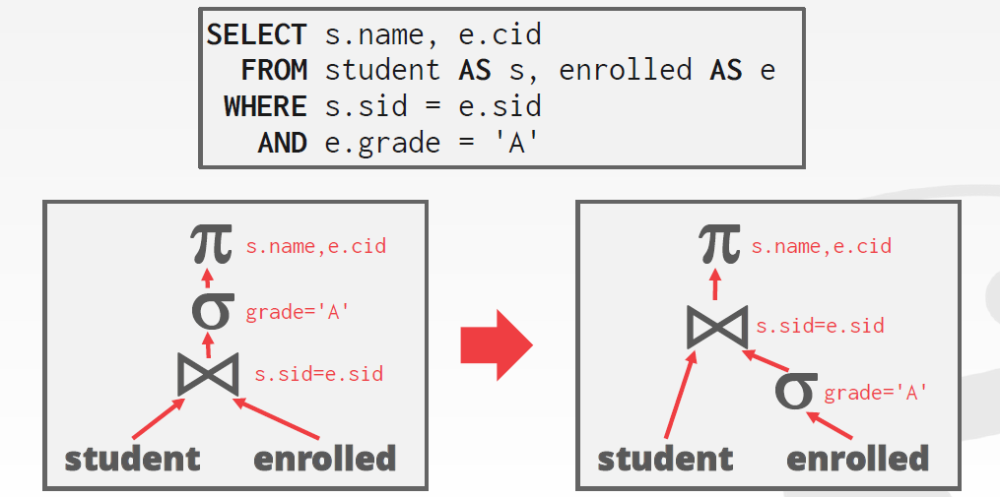

以上图为例，我们可以把条件$\sigma$这一谓词挪到下面，减少`enrolled`这张表的大小，就可以减少合并时操作的量。也就是说过滤这样的谓词可以尽可能推倒下面去。

### 	Pushing projection


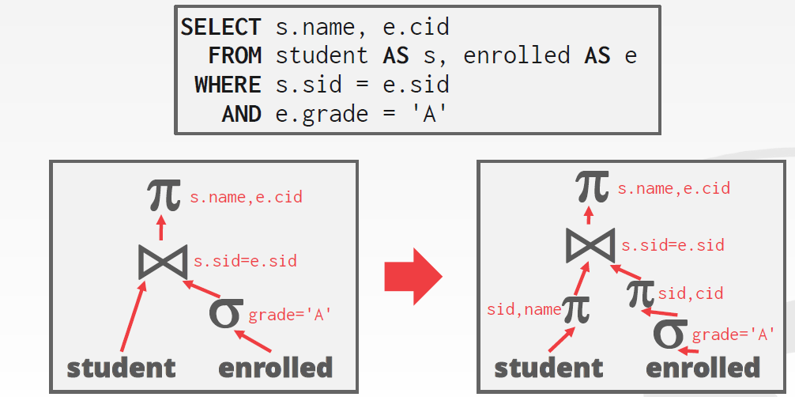


### 	Laws about joins and products

$$
 R  \Join_C S = \sigma_C(R \times S)
\\
R \Join S = \pi_L(\sigma_C (R \times S))
$$

在第二个等式中，条件$C$表示R和S中名字相同的属性满足的条件。

### 	Laws involving duplicate elimination

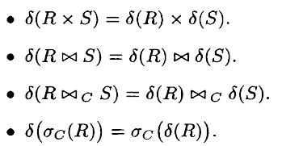

### 	Laws involving grouping and aggregation


### 	Example

假设要执行下述的查询语句：

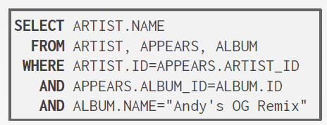

那么首先可以将谓词尽可能移到下面：

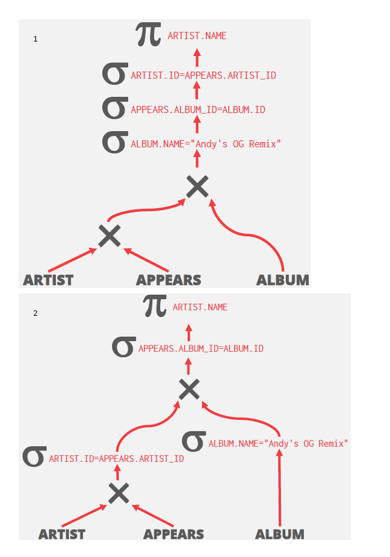

然后笛卡尔积和谓词就可以结合成`join`（2到3）：

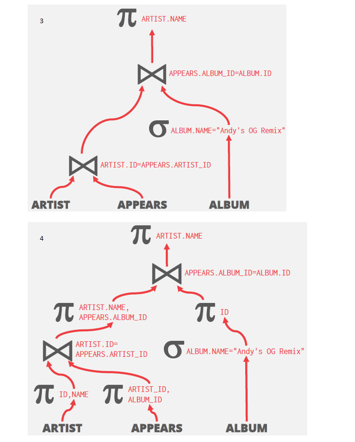

最后来优化`join`（3到4），根据最后需要的是`artist`的`name`字段，我们可以在`join`之前通过$\pi$大大减小表的大小。


## 	From parse tree to logical query plan


### 	Conversion to Relational Algebra


### 	Removing Subqueries From Condition


### 	Improving the Logical Query Plan


### 	Grouping Associative/Commutavtive Operators


## 	Logical Query Optimization

关于查询优化，有两个角度：一是改写查询，移除其中愚蠢或是低效的东西。这种技巧需要查看目录，但是并不需要查看数据。另一种是基于查询代价计算的搜索，我们枚举每个查询计划，测算它们的执行时间，然后选择代价最小的执行计划，这种方法是要关注数据库数据的状态的。总而言之，第一种方法中，我们只能枚举可能的最优的执行计划，但是由于缺乏具体计算的方法，很难真正决定到底哪个方案是最优的，所以这时需要代价模型来做最后的决定。

事实上，通过找到等价的关系代数表达式，数据库管理系统无需代价模型就能找到更好的查询计划。 

### 	Predicate Pushdown


### 	Projection Pushdown


## 	Nested Queries

数据库系统将内嵌的子查询语句作为一个或者多个值来处理，有两种优化的方法：

- 将其重写/去相关/扁平化
- 


## 	Expression Rewriting

优化器会把一个查询表达式中`WHERE`的部分转化为最优的表达式。这是使用`if/then/else`语句或是模式匹配来实现的。例如：

- 去除不可能的谓词


- 消去`join`

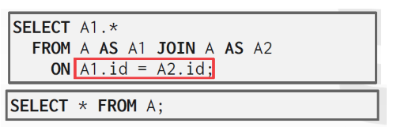

- 无视投影
- 合并谓词


## 	Cost Estimation


### 	Estimation of the size of intermediate relation

#### projection

#### selection

以$S = \sigma_{A = c} (R)$为例，S中的元组数为：
$$
T(S) = T(R) / V(R,A)
$$
当然，这假设了$S$中的属性是均匀分布的。对于范围上的条件的查询，例如$S = \sigma_{a <c} (R)$，直觉是这样的查询只能得到少部分的元组，所有一般我们假设返回三分之一的元组，也就是：
$$
T(S) = T(R)/3
$$


###  Estimate the size of a join

等值连接的结果的元组数可能与自然连接相同。假设现在要做连接操作$R(X,Y) \Join S(Y,Z)$，其中Y是某个属性，而X和Z可以是一系列属性。问题在于我们不知道Y这一列在R和S中的状态如何，例如：

- 如果两个关系的Y值属于两个没有交集的集合，那么$T(R\Join S) = 0$
- Y可能是S的主键，但是是R的外键，所以此时R中的每个元组与唯一一个S中的元组连接，此时$T(R \Join S) = T(S)$
- 如果R和S中的所有的元组几乎都有相同的Y值，那么那么$T(R\Join S)\simeq T(R)T(S)$

如果要只关注大多数情况，就需要做下面两个假设：

（1）

（2）

那么最后的估计是：
$$
T(R\Join S) = T(R)T(S) / \max(V(R,Y), V(S,Y))
$$


#### 	Natural join with multiple join attributes

#### 	Joins of many relations


### 	Estimation of other opeators

#### 	Union

如果是包的并，那么结果就是两个输入的大小之和。而对于集合，可以选择大的大小的一半加上小的大小的一半。

#### 	Intersection

最多是较小的那个的大小，最少是0，取平均就是较小的大小的一半。

#### 	Difference

取平均：$T(R)-T(S)/2$

#### 	Duplicate Elimination

#### 	Grouping and Aggregation


## 	Introduction to Cost-Based Plan Selection

根据数据库此时的状态测量执行特定查询计划的代价。代价的模型有如下选择：

1. 物理代价：预测CPU周期，I/O，缓存不命中和RAM的消耗，预取等等。
2. 逻辑代价：测量每个操作符的结果的大小（独立于操作符的算法）
3. 算法代价：操作符算法实现的复杂度

实际上，查询的执行时间中占主导的还是访问磁盘总次数所用的时间，因为CPU的运行时间几乎是可以忽略不计的。所以必须考虑对顺序或是随机I/O的选择。

另一方面，如果数据库管理系统能完全掌控缓冲区的管理，那么这就是十分好建模的。

以Postgres为例，它用一些常数（magic constant factor）来表示CPU和I/O访问的代价。同时，需要假定数据库存在于磁盘中，并且内存不是很大。在内存中处理一个元组要比从磁盘中读出它快400倍，顺序IO比随机IO快4倍。


有一些计算是必要的，因为根据实际情况，即使是把去重尽可能压到下面也未必是更高效的，例如：

### 	Using Histogram to Estimate Size Parameters

通过遍历，之前提到的那些参数都是很好测量的。实际上，数据库管理系统对每张表维护一个直方图，最常见的有几种直方图：

- 等宽：此时需要知道某个属性的所有取值中的最大和最小值。
- 等高：每次取出相等个数的值，所有每次取出的值的范围是不相同的。
- 最常出现的值：把最常出现的值以及它们出现的次数列举出来。

使用直方图的好处是，现在连接的大小的估计相比之前的方法可以更加准确了。特别是，如果连接的属性在两个关系的直方图中都显式地出现了，那么我们就可以准确知道对于这个值将生成多少元组。例子如下：

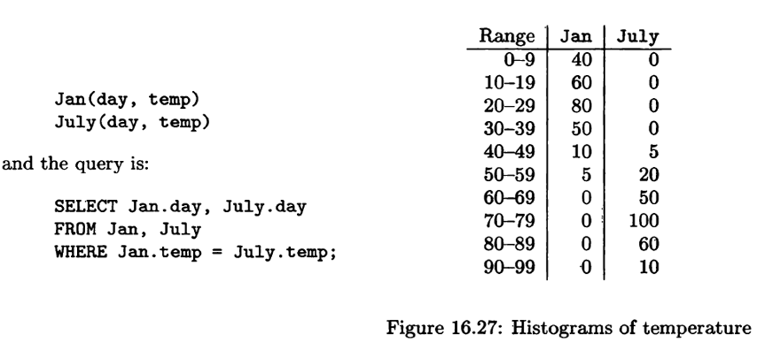

要找出两张表中温度相同的元组的个数，注意到其中大部分交叉都有一边是空的，只有50-59和40-49这一段有交集，所以最后连接的大小是：
$$
T_1 T_2/V = (5\times10 + 5 \times 20)/10 = 15
$$
要相乘再除以$V$（也就是分段的大小）的原因可以理解为，我们假设这些值在这一小段内是均匀分布的，也就是从50到59这10个值里，每个都能取到。那么对于June中的每个值，我们用对应July中的每一个值来与之连接，当然，最后只有一个值与这个值是相等的。所以最后结果如此。

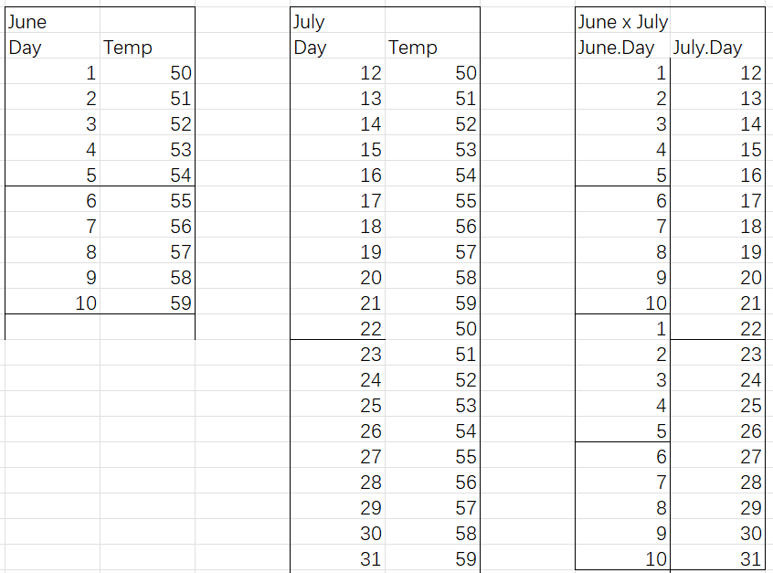

​	

### Computation of Statistics

统计数据只需要周期性地计算，因为首先数据不会那么快地改变，其次不那么准确的统计数据也是同样有效的。

计算关系R的所有元组的统计数据是非常耗时的，尤其是对每个属性都计算的话。所以一个解决方案是只计算机抽样过来的部分数据的统计数据。


### Heuristic Approaches to Enumerate Physical Plans

有两种探索可能的物理计划空间的方法：

- 自顶向下：从根节点开始，尝试每个可能（的参数），并且计算其代价，最后选择代价最小的方法。
- 自底向上（动态规划）：对于逻辑查询计划树的子表达式，我们从底部计算所有可能的代价，然后组合向上，直到计算到根节点。

#### 	Heuristic Selection

一种“贪心”的方法是，我们每次选择连接的结果最小的方式，试图得到总的代价最小的计划。其他尝试的方法有：

1. 如果逻辑计划需要计算$\sigma_{A=c}(R)$，而且R中对属性A存有索引，那么进行索引扫描得到所需的元组就行了。
2. 如果逻辑计划有很多关于属性A的条件，那么就可以实现一个过滤器操作。
3. 如果连接的某个参数（表）在连接属性上有索引，那么可以直接在内循环中使用索引连接。
4. 如果连接的某个参数在某个连接属性上是有序的，那么 排序连接会比哈希连接更好。
5. 当计算三个以及更多关系的并集或交集的时候，先处理大小最小的关系比较好。

#### 	Branch-and-Bound Plan Enumeration

剪枝。


#### 	Hill Climbing 


#### 	Dynamic Programming


#### 	Selinger-Style Optimization

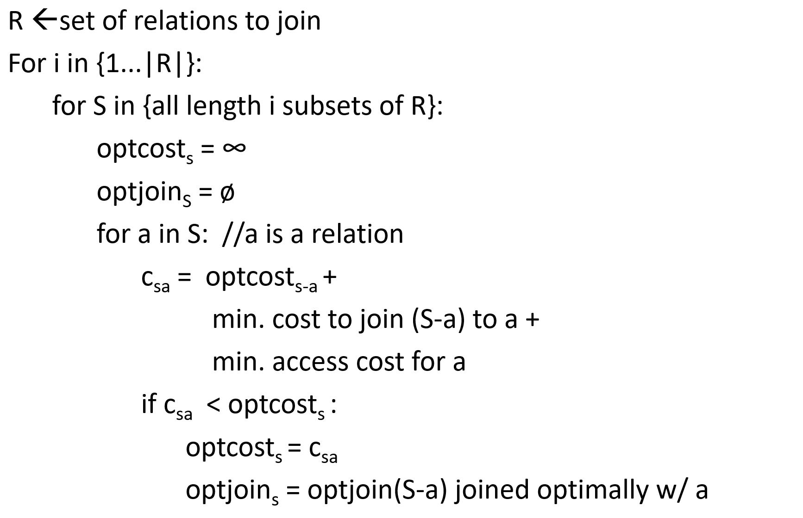

假设要计算$\{r_1, r_2, r_3, r_4\}$之间的最佳连接顺序，那么如果我们提前知道了要如何连接$\{r_1, r_2\}$，那么剩下就只需要计算$\{r_1, r_2\}$和$\{r_3, r_4\}$之间的连接顺序就行了（后面那个集合的连接顺序是尚未决定的）。

反过来，在Selinger的算法中，我们每次从$\{r_1, r_2, r_3, r_4\}$中拆出一个关系，然后递归计算。		

### 	Selectivity

过滤选择性（filter selectivity）：这是一个在0到1之间的数，表示通过某个条件的元组的比例。所以0代表没有元组能通过这个条件，1代表所有矩阵都可以通过这个条件。

数据库管理系统在其内部目录中存储了关于表、属性、索引的统计。对于任何关系$R$，数据库管理系统维持如下信息：

- 其中所有的元组数$N_R$（NCARD）
  - 每个属性$A$的不同的取值数量$N(A,R)$（ICARD），也是索引中键的数量

- 页的数量TCARD
- 索引中的页的数量：NINDEX
- 索引中每个字段的最大和最小值

对于每个属性$A$，同为某个取值的记录的平均个数称为选择基数（selection cardinality）$\mathrm{SC}(A,R) = N_R / V(A,R)$。

#### Cost of projection


#### Cost of Selection

谓词$P$的选择性即是满足其条件的元组所占的比例，有以下谓词：

- 相等
- 范围
- 否定
- 析取（conjunction）
- 合取（disjunction）

选择基数实际上有以下假设：

1. 统一分布的数据：每个取值的分布是相同的
2. 独立的谓词：谓词所在的属性是独立的（这在并集和交集）
3. 包容原则（inclusion principle）

#### 	


## 	Choosing an order to joins

### 	Left and right join arguments

以之前提到的一趟算法为例，我们假设连接操作的两个参数，而且左边的那张表的大小要更小一些，为它在内存中建立一个内存数据结构来存储，将它称为build relation，而右边的那个逐块读取，称之为probe relation，其他的连接算法也会区分其参数，例如：

- 内嵌循环连接：假定左边的关系位于外层循环
- 索引连接：假设右边的关系建有索引、

一般而言，我们约定俗成选择较小的关系作为左边的参数。

### 	Left-deep join trees

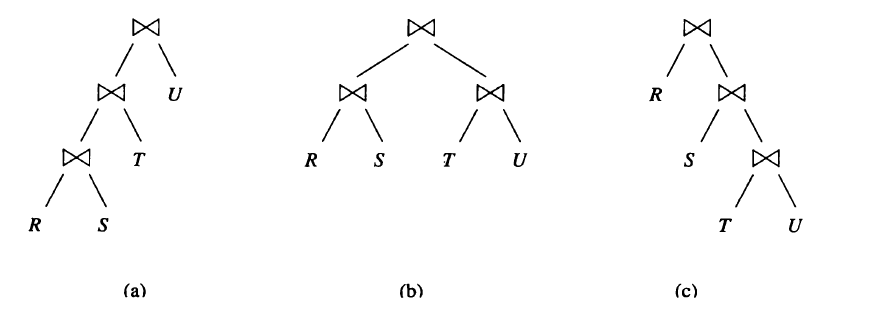

如上图所示，图（a）称为左深树，图（c）称为右深树，也就是说所有的子节点都位于左子树或者右子树。不属于这二者的树，例如图（b），称为浓密树。

选择左深树作为连接的模型有以下理由：

- 左深树的整个空间比所有树构成的空间要少得多，搜索起来没有那么费劲。
- 对于一般的连接算法而言，左深树的结合不错。

结合之前的定义，左边的表较小，而且建有索引，在一趟算法中，左深树在任何时候需要的内存都比其他情况要小；在内嵌循环连接中，

### 	Dynamic programming 

#### 	Dynamic Programming to Select a Join Order and Grouping


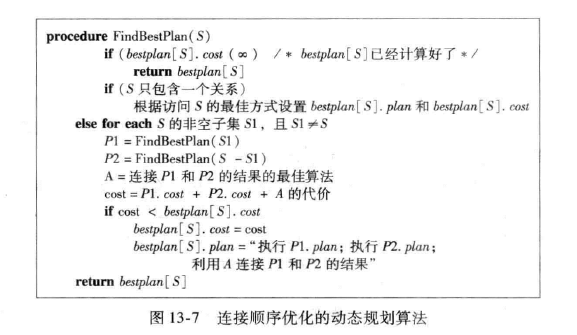

如上图，前两个If语句表示终止条件，而后面的则是将么个问题分解的步骤。


#### 	Dynamic Programming With More Detailed Cost Functions


#### 	A Greedy Algorithm for Selecting a 


## 	Completing the Physicacl Query Plan

### 	Choosing a selection method

### 	Choosing a join method

### 	Pipelining versus materialization

### 	Pipelining binary operation

### 	Notation for physical query plans

### 	Ordering of physical operation


### 	Sketches


现代数据库通过从表中收集样本来测试选择性。当表发生必要的变化时，更新样本。


### 	Single Relation Query Planning

选择最好的访问方法：

- 顺序扫描
- 二分搜索（聚类索引）
- 索引扫描


#### OLTP Query Planning

对于OLTP查询是十分简单的，因为它们是Search Argument Able的。所以我们通常只要选择最好的索引就好了。

### 	Multi-relation Query Planning

在System R中，基本的决策是：只考虑左-深合并树：

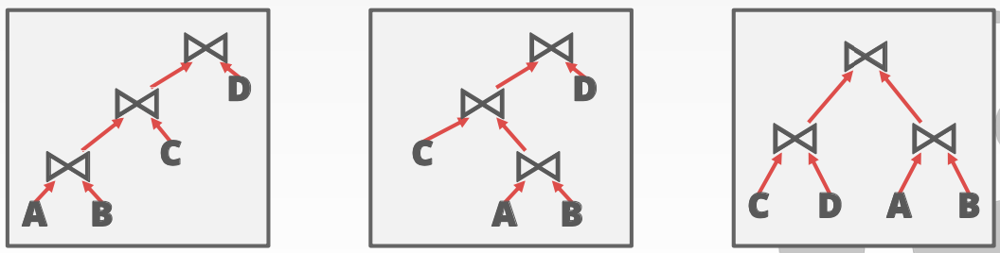


所以上面的情况中，通常的做法如第一张图。
