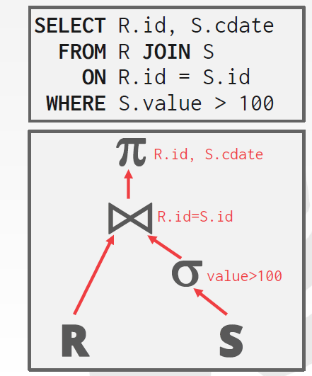
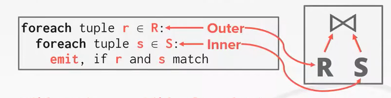
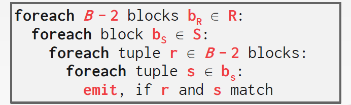
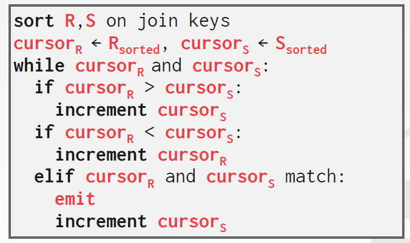

# Query Exectution

## 	Introduction ot Physical-Query-Plan Operators

### Scanning Tables

### Sorting While Scanning Tables

### The Computation Model for Physical Operators

### I/O Cost for Scan Operators

### Iterators for Implementation of Physical Operators

### 	Physical Operator

物理计划由物理计划操作符构成，例如：

- 扫描表
- 排序
- 

### 	Iterator Model

物理操作符可以用迭代器来实现。迭代器需要实现三个方法：

- `open()`
- `getNext()`
- `close()`

## 	One-Pass Algorithm

我们需要决定查询命令中的每个操作符如何具体执行，可以讲这些算法分为三类：

- 一趟算法：仅从磁盘读取一次数据，也就是说操作对象能完全装入内存
- 两趟算法：操作对象不能完全装入内存，但是可以先从磁盘读取一次，做某种处理，写回，然后在读取再处理。
- 多趟算法

然后，操作符也可以分类：

- 一次单个元组：不用把整个关系读入内存，只用读取一个页
- 整个关系，一元操作：
- 整个关系，二元操作

对上面两中分类方式组合得到

### One-Pass Algorithms for Tuple-at-a-Time Operation

### Unary, Full-Relation Operations

### Binary Operation

## 	Nested-Loop Join

## 	Two-Pass Algorithms Based on Sorting

Two-Phase Multiway Merge-Sort

Duplicate Elimination Using Sorting

Grouping and Aggregation Using Sorting

A Sort-Based Intesection and Difference

A Simple Sort-Based Join Algorithm

Analysis of Simple Sort Based Join

## 	Two-Pass Algorithms Based on Hashing

## 	Index-Based Algorithms

## 	Buffer Management

## 	Sorting

`ORDER BY`，`GROUP BY`，`JOIN`，`DISTINCT`这些操作符的实现都可能需要排序。问题在于，数据量很大的情况下，无法将所有的数据整个放入内存，使用例如快速排序这样的算法。这时候的需要外部排序（external sorting）。这种排序需要把数据做适当的分割，所以相比随机I/O，顺序I/O更好。

标准的给大量数据排序的算法是**外部合并排序**。这个算法有两个过程：

- 阶段一——排序：把小块的、能放入内存的数据排好序，然后将这些页写回内存
- 阶段二——合并：将排序好的子文件合并成大文件

m问题：最后合并所有的文件不也是需要内存能放下整块数据吗？

### 	Two-way Merge Sort

### 	General (K-way) Merge Sort

### 	Double Buffering Optimization

### 	Using B+ Trees

显然，使用B+树索引就不需要外部排序算法了，特别是索引还是聚簇索引的时候，直接从叶节点遍历就行了。

## 	Aggregation

常见的聚合函数有：`SUM`、`MAX`、`MIN`、`AVG`、`COUNT`等。

### 	Sorting

DBMS可以使用`GROUP BY key(s)`将元组排序。根据情况可以使用快速排序或者外部排序。然后在排好序的数据上进行顺序扫描得到结果。这个对于`MAX`、`MIN`这类的聚合函数来说直接速度快了很多。

此外，在排序聚合中查询的操作顺序如何优化也是一件十分重要的事情。

### 	Hashing

在计算聚合方面，哈希要比排序更为廉价。在数据库扫描整个表的时候，它建立了一个临时的哈希表，确保每个记录都在这个哈希表中。但是一旦这个哈希表超过内存的大小，就需要将其分裂，其中一部分去到磁盘。完成这个需要两个阶段：

- 阶段一，分割：
- 阶段二，再哈希：

### 	

## 	Join algorithms

一般而言，我们要做的是二元联合操作，其中，我们希望较小的那个表永远在左边（也称为外表outer table）。

在设计算法的时候，要考虑两点：

其一是：我们希望联合操作符把什么样的东西发送给它在查询计划树里的父节点呢？

其二是代价分析的标准，也就是如何决定一个算法一定比另一个好。

### 	Ouput

对于第一个，输出的内容决定于：

- 处理模型
- 存储模型
- 查询中的数据要求

#### 	Output data

我们只需要把外部和内部的元组的所有属性拼在一起组成输出元组就行了。而查询计划树中后续的操作则需要到合并之前的表中去得到其需要的信息。 在下面的例子中，合并之后做投影得到需要的属性就可以了。 

另一种方法是，只把符合条件的记录ID复制到联合表中，然后看投影需要哪些属性在去原表中找。也就是把需要的列再添加进来。显然，对于列存储来说这是很方便的的。这也称为迟具体化（late materialization）。实际上这种优化的代价是很大的，所以有时候不如不做。

### I/O cost analysis

假设表$R$中有$M$页，一共$m$个元组，表$S$中有$N$页，一共$n$个元组。I/O代价的标准时：联合所需的计算的IO的量。 

### Stupid Nested Loop Join

如上图所示，左表也就是较小的表要放到外部循环，这一点在下面的性能分析中是很明显的。因为需要读出$R$中的每一页得到所有元组，然后对每个元组读出$S$中的所有页，所以总的代价就是：
$$
M + (m \cdot N)
$$

#### Block nested loop join

思路：相比于对每个$R$中的元组读出所有$S$中的块，我们可以把$R$中的每一页读，这样就大大减少了需要的读写时间： 
$$
M + M \cdot N
$$
当我们有多个缓冲池的时候，可以用缓冲池来进行加速：

如果缓冲池的数量已经比表的数量多很多了，性能可以非常好：

内嵌循环的糟糕的原因在于：它没有利用任何的局部性，也没有注意数据自身的规律来做优化。所以一个很自然的想法是，如果我们知道数据的组织，例如，数据已经用索引组织好了，那么找到复合条件的元组就非常容易。或者说在联合的时候

### Sort-Merge Join

例如说在上面的例子中，我们首先把两边都按照条件上的属性排序，然后运行下述算法：

#### 	Phrase #1: Sort

#### 	Phrase #2: Merge

### Hash Join

