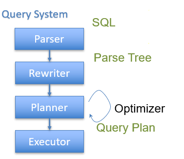
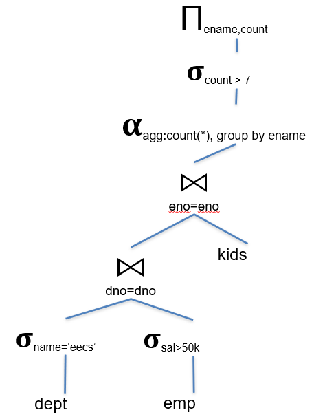
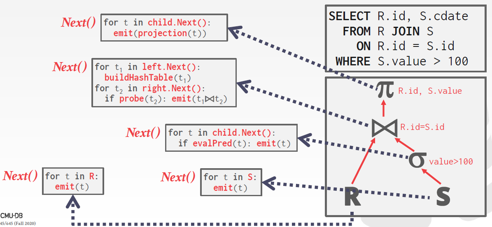
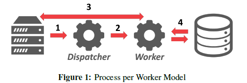

# Query Processing


## Query Processing

### 	Query Processing Steps

#### 	Flow of a Query



#### Admission Control

#### Query Rewriting

##### View Substitution


##### Predicate Transforms

- Remove & simplify expressions, improve
- Constant Simplification
- Exploit constraints
- Remove redundant expressions

##### Subquery Flattening

- Many Subqueries Can Be Eliminated
- Not always possible; 

#### Plan Formulation (SQL to Tree)

假设有数据库关系：

```sql
emp (eno, ename, sal, dno)
dept (dno, dname, bldg)
kids (kno, eno, kname, bday)
```

进行查询

```sql
SELECT ename, count(*)
FROM emp, dept, kids
AND emp.dno=dept.dno
AND kids.eno=emp.eno
AND emp.sal > 50000
AND dept.name = 'eecs'
GROUP BY ename
HAVING count(*) > 7

```

可以被解析为如下的树：




#### Optimization


#### 	Query Plan


### 	Processing Models


#### 	Iterator Model

迭代器模型也叫火山模型或者流水线模型，是最常见的处理模型。几乎每个基于行的DBMS都使用这个模型。



迭代器模型为数据库中的每个操作都实现一个`next`操作。查询计划中的每个节点都一直对自己的孩子调用`next`，直到到达叶节点。

这个模型对于基于磁盘的系统十分有效，因为在读下一个元组或者页之前，可以完全利用好当前内存中的所有元组。


#### 	Materialization Model

物化模型是迭代器模型的特殊情况。相比迭代器模型每次调用`next`只返回一个元组，物化模型的操作符每次都返回它所有的元组。

每个查询计划的操作符都实现`output`函数，这个函数：

- 操作符一次性处理他的孩子的所有元组
- 这个函数的返回结果是这个操作符需要释放的所有元组。

这个模型对于OLTP工作模式很有利，因为此时的查询语句一次查询只访问很少一部分的元组。

显OLAP不适合用这个模型，因为其查询会产生大量中间结果。而且这些结果可能需要被写回到磁盘。


#### 	Vectorization Model

如同迭代器模型，向量化模型也需要实现`next`，但是每次调用会返回一批（batch）元组，而不是一个元组。

向量化模型对于OLAP查询语句是很友好的，因为它需要扫描大量的元组，而向量化模型可以减少调用`next`的次数。

同时，向量化模型更容易使用向量化的指令（SIMD）来处理一批元组。、


### 	Processing Direction

- 方法一：自顶向下

- 方法二：自底向上

  

### 	Access Method

访问的方法有两种：直接扫描表，或者扫描索引

#### 	Sequential Scan

优化方法：

- 预取
- 

#### 	Index Scan


### 	Modification Queries


### 	Expression Evaluation


##  Parallel Exection

### 	Background

并行执行的好处：

- 提高吞吐量（每秒能执行的查询数）和延迟上的性能
- 从DBMS的外部客户端角度提高响应性和可用性。
- 潜在地降低总拥有成本（total cost of ownership）

### 	Parallel vs. Distributed Databases

- 并行DBMS：资源，或者节点在物理上是挨得很近的。节点之间的交流是通过高速的内部连接进行的。
- 分布式DBMS：由于各节点之间的距离较远，节点之间的交流开销就会更高，失败也不能无视。

### 	Process Model

- 处理模型：定义了系统将如何支持在多用户环境下的并发请求。
- 工人：DBMS由许多工人构成，工人的责任是为客户执行任务，返回需要的结果
- 应用：发送大量的请求，请求被分给不通过的工人

#### 	Process per Workers



- 每个工人是一个操作系统的进程
- 最左边的表示应用程序，
- 优势：单个工人崩溃不会影响到整个系统，因为它们有自己各自的上下文。
- 问题：多个工人就是多个进程，由于地址空间独立，所有同一个页可能被复制了多份，浪费了空间。一个解决方案是对全局数据结构使用共享内存，使得它们可以在内存间共享。

#### 	Process Pool

- 

#### Thread per Worker


#### 	Scheduling


### 	Inter-Query Parallelism


### 	Intra-Query parallelism


#### 	Intra-Operator Parallelism


#### 	Inter-Operator Parallelism (Vertical)


#### 	Bushy Parallelism


### 	I/O Parallelism

#### 	Multi-Disk Parallelism


#### Datanase Partitioning


#### Processing Models

A DBMS *processing model* defines how the system executes a query plan. It specifies things like the direction in which the query plan is read in as well as what kind of data is passed between operators along the way. There are different models of processing models that have various trade-offs for different workloads.

These models can also be implemented to invoke the operators either from *top-to-bottom* or from *bottom- to-top*. Although the top-to-bottom approach is much more common, the bottom-to-top approach can allow for tighter control of caches/registers in pipelines.


