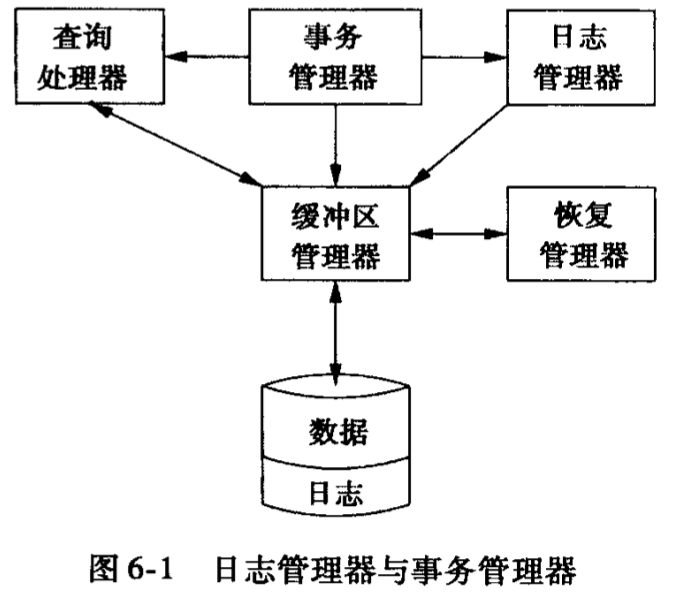

# Recovery

如何使用不通过类型的日志来做到可恢复性？

## Issues & Models for Resilinet Operation

### 	Failure Models

日志可以用来恢复一下问题：

- 错误数据输入
- 介质（例如磁盘）故障
- 灾难性故障
- 系统故障：导致事务状态丢失

### Transaction

交错的操作可能会造成各样的问题。我们需要正式的正确性的标准来决定什么样的交错（interleaving）是可以做的。对于数据库的操作可以被简化为对数据库的读和写，读写的对象可以是元组、表等等。

事物可以被定义为一些列的读写操作：（$R(A)，W(B)$）。在SQL中，一个新的事务由`BEGIN`开始，然后以`COMMIT`或`ABORT`结束。其中`ABORT`代表放弃之前所做的修改，它可以自我冲突，也可以有DBMS放出，而`COMMIT`表示数据库管理系统既可能保存它所做的修改，也能`ABORT`了这些修改。

事务要么做，要么全不做。事务管理器的功能包括：

- 给日志管理器发信号，使信息能以日志形式上保存。
- 保证并发的事务之间不会互相干扰

### 	Correct Execution of Transactions

正确性的定义（ACID）：

- Atomicity（原子性）：数据的所有行为要么全部发生，要么全都不发生。
- Consistency（一致性）：如果每个事务都是一致的，且数据库在事务开始的时候是一致的，那么在结束的时候数据库也是一致的。
- Isolation（隔离性）：每个事务的执行与其他事物是隔离的
- Durablity（）：如果事物提交（`COMMIT`）了，那么其影响是永久的，而不会被失败所打断。

#### 	Atomicity

每个事务有两种可能的结果，同时DBMS必须保证书屋是原子的。

保证原子性有以下几种方法：

1. 日志（Logging）
2. （Shadow Paging）

#### 	Consistency

如果数据是逻辑正确的，那么所有关于这个数据库的数据的查询也会得到逻辑上正确的结果。

数据库的一致性：数据库的模型应当是对现实世界的准确的建模，而且遵循完整性条件。

事务的一致性：这实际上是应用的任务。

#### 	Isolation

用户提交事务，而其他的事务都是自己执行自己的。但实际上数据库是通过交错事务的各种操作来实现并发的。**并发协议**保证了多个事务之间的操作能够合理的交错。协议有两种类型：

- 悲观的：首先要努力不让问题发生
- 乐观的：假定冲突极少发生，然后在它们发生的时候去处理它们就行了。例如：

### 	The Primitive Operation of Transactions

事务要操作的有三个地址空间：

- 数据库元素的磁盘块空间
- 缓冲区的主存空间
- 事务的局部地址空间

为了描述数据在不同地址之间的移动操作，定义如下原语：

- `INPUT(x)`：将数据库元素$X$拷贝到主存缓冲区
- `READ(X,t)`：将元素$X$拷贝到事务的局部变量$t$，如果这个变量不在内存中，需要先输入到主存
- `WRITE(X, t)`：将局部变量$t$拷贝到主存缓冲区的$X$位置，如果这个变量$X$不在内存中，需要先输入到主存
- `OUTPUT(X)`：将包含$X$的缓冲区的块写回磁盘

在事务的讨论中，假定数据库元素的大小不会超过一个块。

## 	Uno logging

### Log Records

### The Undo-Logging Rules

### Recovery Using Undo Logging

### Chechpointing

### Nonquiescent Checkpointing

## 	Redo logging

### The Redo-Logging Rule

### Recovery With Redo Log

### Chechpointing a Redo Log

### Recovery With a Checkpointed Redo Log

## 	Undo/Redo logging

### The Undo/Redo Rules

### Recovery With Undo/Redo Logging

### Chcckpointing an Undo/Redo Log

## 	Protecting against media failures

### The Archive

### Nonquiescent Archiving

### Recovery Using Archive and Log 

​	
