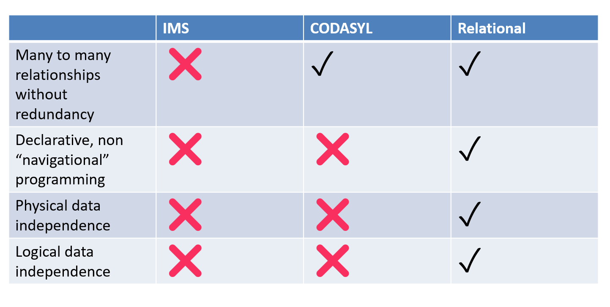
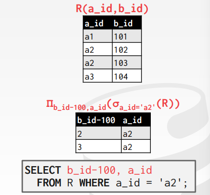
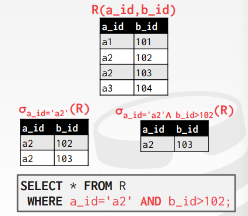
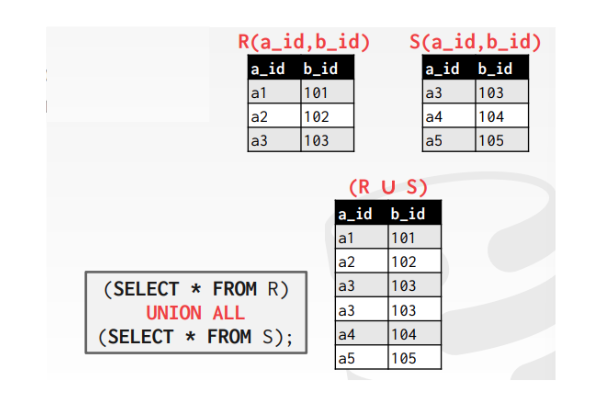
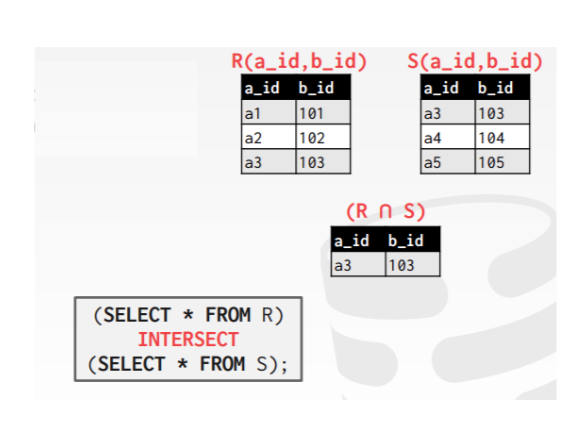
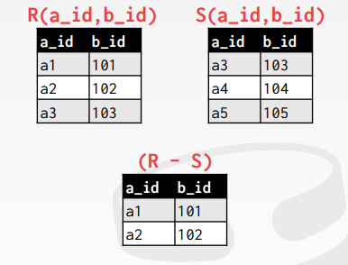
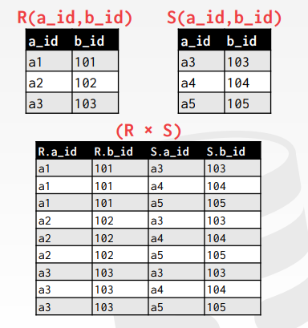
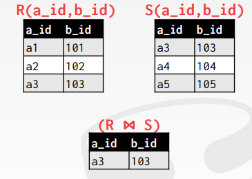
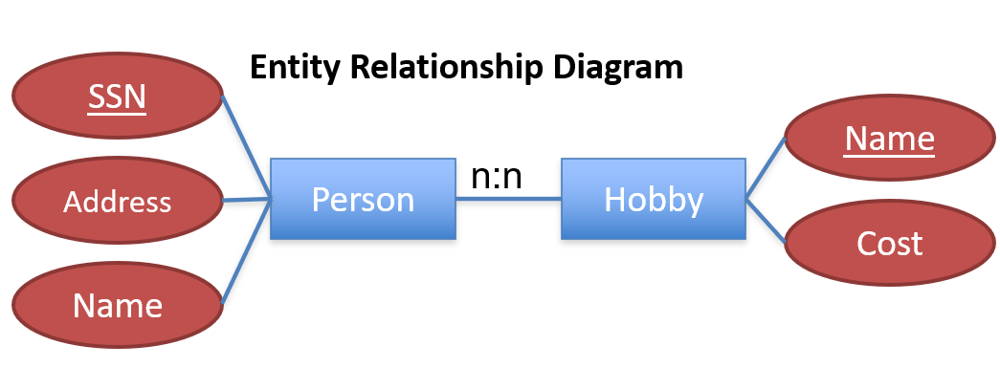

# Relation Model

## Struture of Relational Database 关系数据库的结构

是表的集合。表中的一行代表**一组值**之间的**联系**，这一组值解释一个**元组**（tuple），也就是表中的一行。属性（attribute）就是表中的列。

对于关系中的每个属性，都有一个取值集合，叫做该属性的域（domain）。


### 	IMS v CODASYL v Relational

给

#### 	Physical Data Independence 物理数据独立性

关系数据库/SQL并没有规定数据应该如何被存储。所以改变数据的表示，而代码无需改写。而IMS和CODASYL在它们的查询API中都暴露了依赖表示的操作。

#### 	Logical Data Independence 逻辑数据独立性

视图（View）可以让我们在改变数据库模式的时候，无需改变代码。


### 	Database Schema


## Relational Algebra 关系代数


### 	Operations

#### Projection 

也就是```select```：选择某关系$R$的列，也就是选择某个属性。而且可以重新组织属性的顺序，并且可以操作这些值。例如：
$$
\Pi_{\text{ID,name, salary}} (\text{instructor})
$$



#### Selection

也就是```where```。符号为$\sigma$：选择满足一定条件的列，例如select those tuples of the instructor relation where the instructor is in the “Physics”
department:
$$
\sigma_{\text{dept name =“Physics”}} (\text{instructor} )
$$




#### 	Union

合并两张表。



#### 	Intersection


	

#### 	Set-Difference



#### 		Cross Product 

combine R1 and R2, producing a new relation with $||R1|| + ||R2||$ attrs, $|R1| \times |R2| $rows

SQL写法：

```sql
SELECT * FROM R CROSS JOIN S;
SELECT * FROM R, S;
```




#### (natural) Join

**⨝(R1, R2, pred) = R1 ⨝pred R2 = σpred (R1 X R2)**



SQL写法：

```sql
SELECT * FROM R NATURAL JOIN S;
```

#### 	Extra Operations

- Rename (ρ)
- Assignment (R←S)
- Duplicate Elimination (δ)
- Aggregation (γ)
- Sorting (τ)
- Division (R÷S)

### 	Relational Identities 关系等式

#### 	Joint reordering

- A ⨝ B = B ⨝ A
- (A ⨝ B) join C = A ⨝ (B ⨝ C)

#### 	Selection reordering

- σ(A ⨝pred B) = σ(A) ⨝pred σ(b)
- σ may only apply to one table

#### Projection push down

- π(σ(A)) = σ(π(A))
- As long as π doesn’t remove fields used in σ
- Also applies to joins


### Relational algebra to SQL

- SELECT List --> Projection
- FROM List --> all tables referenced
- WHERE -->  SELECT and JOIN


## Normalization

*Normalized*: a schema that is redundancy free

Several methods:

- ER Diagrams
- Use functional dependencies and normal forms

### 	Functional Dependencies

属性$X \to  Y$表示$X$可以唯一地决定$Y$，也就是对于实例$x_1, x_2 \in X, y_1, y_2 \in Y$，如果$x_1=x_2$，那么$ y_1=y_2$。

例如对于



SSN, Hobby $\to$ Name, Addr, Cost
SSN $\to$ Name, Addr
Hobby $\to$ Cost 

### 	Boyce-Codd Normal Form (BCNF)

For a relation R, with FDs of the form X to Y, every FD is either:

1) Trivial (e.g., Y contains X), or

2) X is a key of the table

##### BCNF vs 3NF

BCNF decomposition is not “dependency preserving”


## Database Design

避免两个主要缺陷：

- 冗余
- 不完整
- 

### E-R Model

### Constraint

## Relational Database Design


#### **Design Alternative: Smaller Schemas**

#### **Atomic Domains and First Normal Form**

 A domain is **atomic** if elements of the domain are considered to be indivisible units. We say that a relation schema *R* is in **first normal form** (1NF) if the domains of all attributes of *R* are atomic.

Composite attributes, such as an attribute *address* with component attributes *street*, *city*, *state*, and *zip* also have nonatomic domains.