# SimpleDB


Created: May 18, 2022 3:39 PM
Status: Open
Updated: June 26, 2022 11:00 PM

## 	Basic


### 	`Parser`

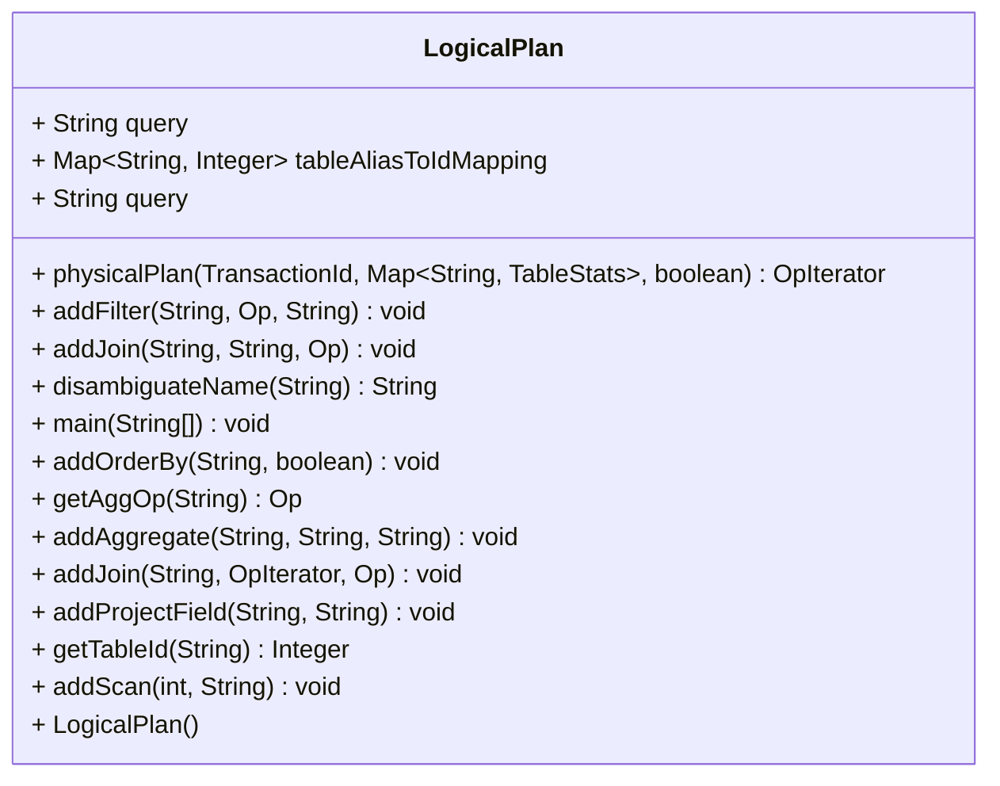

在`parser`中，首先会在`start`中解析命令行参数，`args[0]`是模式，使用

```java
Database.getCatalog().loadSchema(args[o])
```

来载入。然后就在`TableStats`中计算数据了：

```java
TableStats.computeStatistics();
```

然后在非交互式的处理方式中，从一个文件流中读取查询内容。接下来用一个`ZqlParse`解析查询中的各个部分，除了开始事务之外，有三个选项：`ZInset`、`ZDelete`、`ZQuery`。使用对应的`handleXXXXXStatement`来处理，这个函数会将之前解析内容组装成一个`Query`对象并返回。之后就调用这个`query`的执行函数

以`handleQueryStatement`为例：先构造一个`LogicalPlan`，然后结合之前的表数据将逻辑计划转化为物理计划。


```java
query = handleQueryStatement((ZQuery) s, curtrans.getId());
processNextStatement(new FileInputStream(queryFile));
    Query query = new Query(tId);

LogicalPlan lp = parseQueryLogicalPlan(tId, s);
OpIterator physicalPlan = lp.physicalPlan(tId, TableStats.getStatsMap(), explain);

query.setPhysicalPlan(physicalPlan);
query.setLogicalPlan(lp);
```


## Storage

### `Tuple`  

简而言之就是一个表中的一行。

- ```getField(int i)```：得到第$i$个字段的值


### `Field` 

实现如`IntField`和`StringField`  

### `TupleDesc`  

表示每个元组的信息，是一个类型和名字的数字

### `IntField` 


### `DbFile` 

每张表可以用一个DbFile来表示。是数据库访问底层文件的接口。

```DbFile```是用```BufferPool```来访问的。

```DbFile```包含一系列```Page```，可以遍历```Tuple```。


### `Page` 

- 有id，可以用来查询page是不是在缓冲池`BufferPool` 中
- 

`HeapPage` 实现 `DbFile`

- 数据
  - tuple数组
  - 头（header）
  - tupleDesc
  - 


### 表：`HeapFile` （实现```DbFile```）

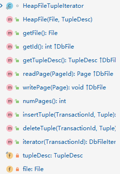

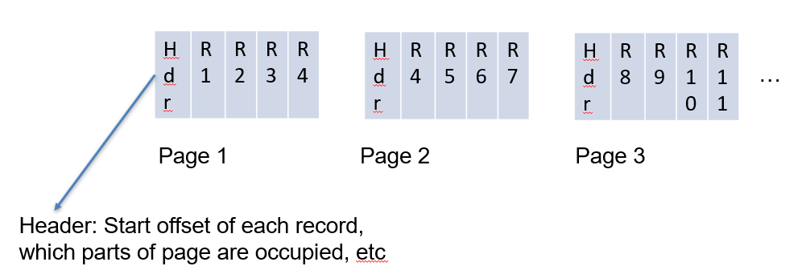 

简而言之，是一个```Page```组成的元组，也就是一张表。但是注意这个结构是在内存中的，它的所有数据来源于某个磁盘上的文件，在初始化过程中，用读到的数据初始化自己。

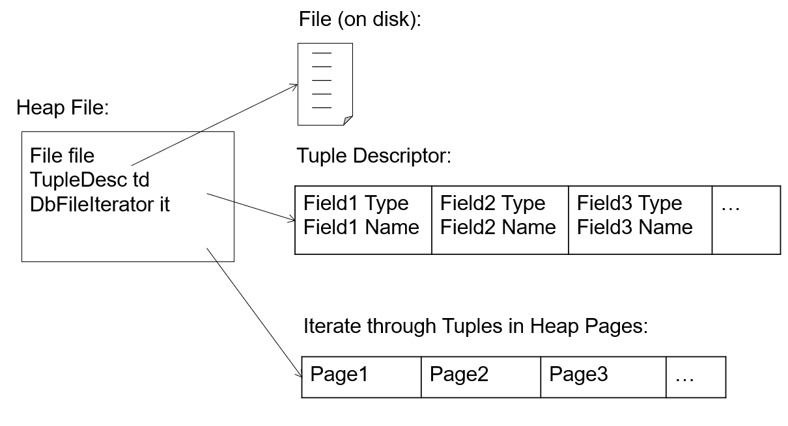

- 根据文件初始自己
  - 遍历自己的所有```Tuple```的```Iterator```	

### 	页：```HeapPage```（实现```Page```）

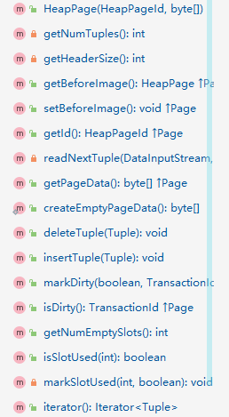

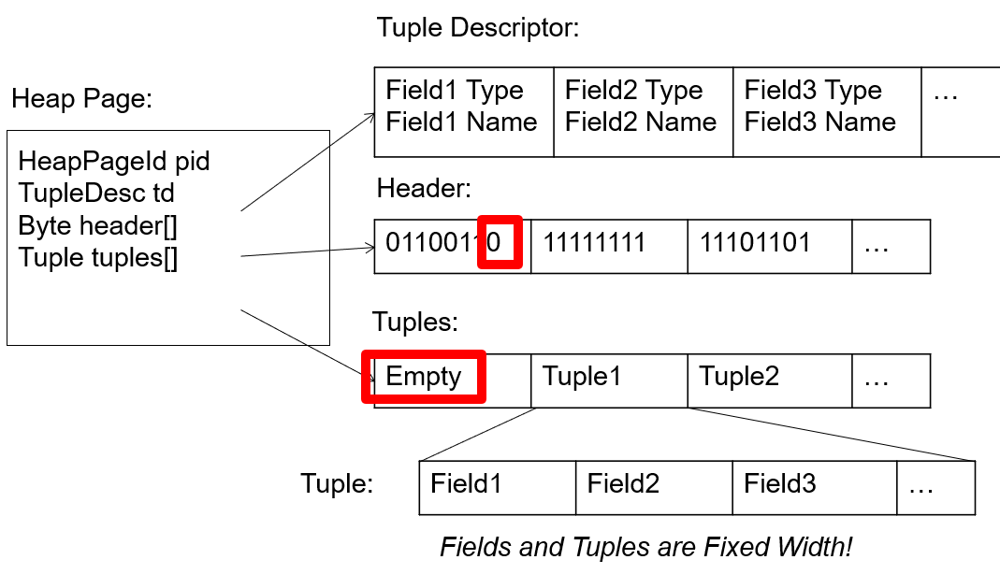

元组数量的计算方法：

```java
int num = (int) Math.floor((BufferPool.getPageSize() * 8) / (td.getSize() * 8 + 1));
```

- 初始化：根据```HeapPageId```和字节数据初始化，根据堆页ID可以得到表ID和页ID，然后从数据中读出header和tuples。
- 信息：
  - headerSize()
  - numTuples()
  - numEmptySlots()
  - getId()
- 修改
  - insertTuple()
  - deleteTuple()
- 生成
  - getPageData()
    - 相当于初始化的逆过程，重新生成字节数据
  - createEmptyPageData()
    - 生成一个新页需要的空字节数组


### 		```HeapPageId```

这个类很关键。每个HeapPage的Id就是HeapPageId，它包含这个页所属的表```tableId```和这个页的```pgNo```。

```tableId```不用多解释，```pgNo```则是页在```Dbfile```中的偏移。

### 	`RecordId`

这是每个元组的ID，包含：

- ```HeapPageId```

- ```tupleno```：这是元组在所在页中的偏移

  

### 	```BufferPool```

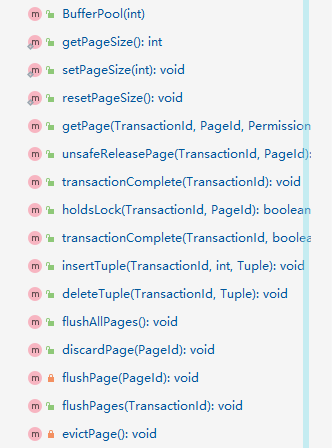


用一个ConcurrentMap缓存最近用到的页。Map的索引是页的ID```PageId```。

#### 	```insertTuple```的实现

调用DbFile中的插入方法，得到修改的页，然后把这些页标记为脏页，放入缓冲池中。

问题：为什么不写入缓冲池，脏页测试中就无法感知到对这些页做的插入修改呢？

```java
    @Test public void handleManyDirtyPages() throws Exception {
    	HeapFileDuplicates hfd = new HeapFileDuplicates(empty.getFile(), empty.getTupleDesc(), 10);
    	Database.getCatalog().addTable(hfd, SystemTestUtil.getUUID());
    	Database.getBufferPool().insertTuple(tid, hfd.getId(), Utility.getHeapTuple(1, 2));
    	
    	// there should now be 10 tuples (on 10 different pages) in the buffer pool
    	DbFileIterator it = hfd.iterator(tid);
    	it.open();
    	
    	int count = 0;
    	while(it.hasNext()) {
    		it.next();
    		count++;7
    	}
    	assertEquals(10, count);
    }
```

这个代码中，我们首先从文件中读出堆文件，然后对其在内存中做了修改。在调用```iterator```的时候，我们使用的是```BufferPool.getPage```来读取每一页的内容。这个方法首先尝试在缓冲池内找，找不到再去原来的文件中找。显然这两个位置的堆文件都是没有被修改的，所以此时的得到的```iterator```还是修改之前的模样。


## 	Common

### 	`Catlog` 

数据库表的列表。

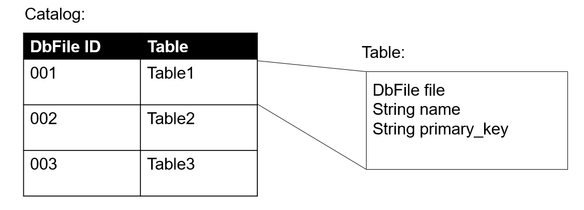

- 表查询
  - 根据表名、表id查到表（```DbFile```）以及表的信息（```TupleDesc```，主键）
- 增加表
- 

### 	`Database` 

- 访问（所有表的）目录
- 访问日志文件
- 访问缓冲池

### 	```BufferPool```

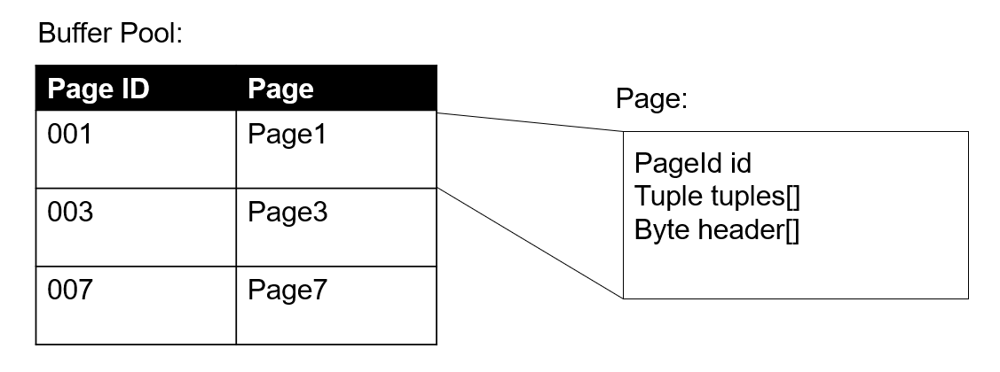

缓存在内存中最近访问的数据库表。

- 信息
  - 页面大小（可修改）

- 初始化：提供它能缓存多少页
- 读给定id的页
  - 如果这个页不在缓冲池中，我们会找到这个页所属的表ID，然后通过```Database```找到这个表属于哪一个文件（```DbFile```），然后把这个文件和它的页读入内存。

- tuple操作：增删查改
- 页的信息


## 	Execution

### 	```Predicate```

给定运算和谓词，对任何行运算得到正确与否。

包含信息：

- 操作的种类
- 要比较的属性的索引
- 比较的对象

### 	```OpIterator```：接口

下面的很多操作都实现了```Operator```这个抽象类，每个操作作用的对象都在```child：OpIterator```这个属性里


### 	```Operator```：抽象类


### 	```Join```

### 	```Filter```

### ```Project```

输入一个```Tuple```，限定需要的字段的子集，输出新的```Tuple```。

```child：OpIterator```：待处理的一系列行。

### ```Aggregator```：接口


## 	Transaction

锁的要求：

- 在事务读一个对象前，它必须拥有一个共享锁
- 在一个事务写一个对象前，它必须有一个排他锁
- 多个事务可以对同一个对象拥有共享锁
- 对于任何对象，只有一个事务可以对他拥有排他锁。
- 如果一个事务式唯一一个拥有某个对象的共享锁的事务，那么他可以讲=将这个共享锁更新为排他锁。


### 	`Transaction`


## 	Optimization

### 	`TableStats`


### 	`IntHistogram`

选择性的计算：	


### 	`JoinOptimizer`

内部类：

`CostCard`：包含一个计划（`List<LogicalJoinNode>`）以及这个计划需要的代价。

`PlanCache`：注意，`Set<LogicalJoinNode>`表示没有决定连接顺序的关系，而`List<LogicalJoinCost>`表示连接顺序以及决定好了。

方法：

`stimateJoinCost()`：如果使用循环嵌套实现连接的话，代价可以如下计算：

```cpp
joincost(t1 join t2) = scancost(t1) + ntups(t1) x scancost(t2) //IO cost
+ ntups(t1) x ntups(t2)  //CPU cost
```

`estimateTableJoinCardinality()`

考虑如下例子：

```sql
select xxx from table1, table2 where f1 = f2
select xxx from table1, table2 where f1 != f2
```

`instantiateJoin()`


`computeCostAndCardOfSubplan()`

给定计划`joinSet`，以及要从中去除的元素`joinToRemove`，计算把`joinToRemove`和剩余的元素连接起来所需的最小代价。

前面所有计算的结果保存`PlanCache`中，也就是目前所有子集的连接的最优顺序和大小。


#### 	Test

```bash
emp: 6 x 100000 x 0.1
dept: 3 x 1000
hobby: 6 x 1000
hobbies: 2 x 200000
(emp x dept) (hobbies x hobby) (emp x hobb)
```


### 	`LogicalPlan`

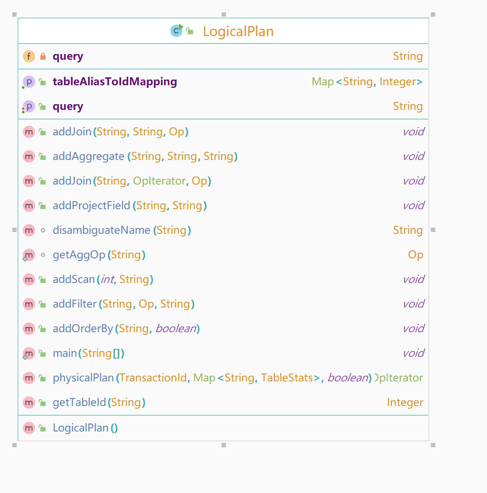

### 	`LogicalScanNode`

这就是查询语句`from`后面的一系列表，每张表作为一个节点。


## 	Index

#### 	`BTreePageId`

包含表的ID。以及页号

这个类不仅只是ID，实际上也标识了页的种类，例如根节点指针、内部节点、页节点、	

#### 	`BTreeHeader`

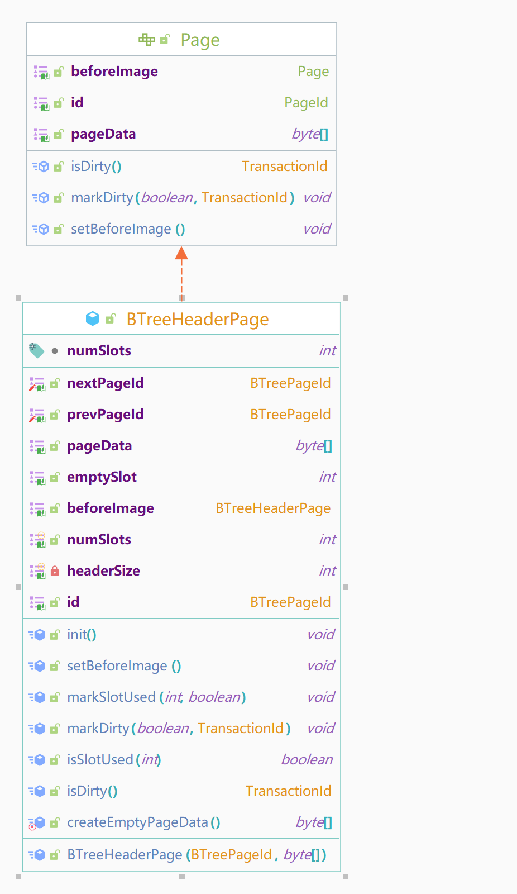

为`BTreeFile`的每一页存数据。`HeaderPage`和`HeaderPage`相连，每个头页存储了它的前一页和后一页的页号`pgNo`。

#### 	`BTreePage`  (abstract class)

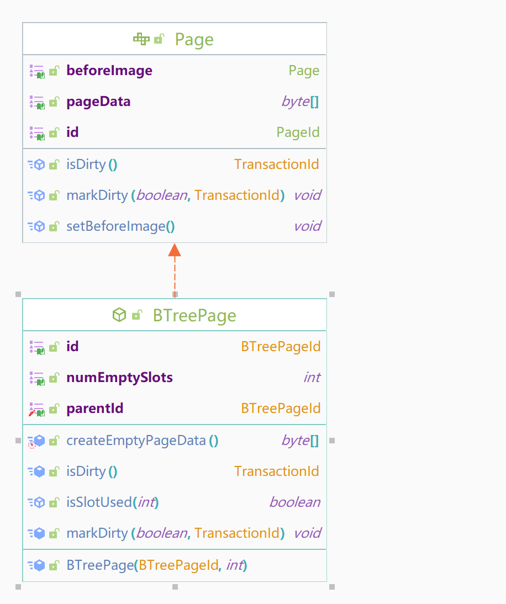

​	


有`BTreePageId`，以及作为键的字段的索引。	

构造函数要从字节数组中在内存中构造出这个B树页对象。

#### 	`BTreeInternalPage(BTreePage)`

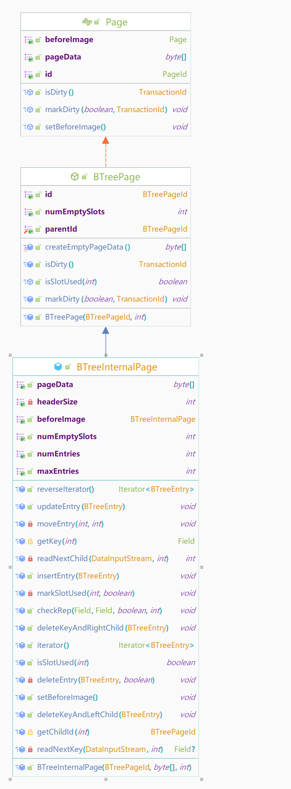

属性：

- 首部：`byte[]`
- 键的数组：`Field[]`
- 子节点的数组：`int[] `
- 槽的数目`numSlots`：`int`
- 子节点的类别：`int`

方法：

- 构造函数
  - 从一个字节流，按照如下的格式求得将文件中的信息转化为内存中的变量。

- `iterator()`
  - 返回一个`BTreeEntry`的迭代器，迭代

- `getChildId()`
  - 

- `reverseIterator()`
- `updateEntry()`
- `moveEntry()`
- `getKey()`
- `readNextKey()`
  - 


#### 	`BTreeLeafPage `

属性：

- 首部：`byte[]`
- 元组的数组：`Tuple[]`
- 子节点的数组：`int[] `
- 前后的节点的索引：`int`

方法：

- ​	`iterator()`：以排好序的顺序返回一个这个页面包含的元组的数组。	
  - `getTuple(int i)`：


#### 	`BTreeEntry`

这是`BTreeInternalPage`使用的一个数据结构，包含一个键值，以及两个指向其他`BTreePage`的指针（这里表示为`BTreePageId`）。所有属于这两个`BTreePageId`的页和元组的键必须满足大小大于或小于条目的键值。

而且修改完`BTreeEntry`之后，需要调用`BTreeInternalPage.updateEntry()`来使改变生效。

#### 	`BTreeRootPtrPage`

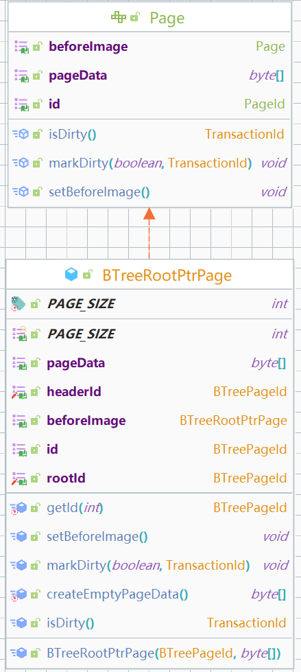

保存指向根节点的指针。它里面关键的是它放了根节点的`BTreePageId`。

#### 	`BTreeFile`

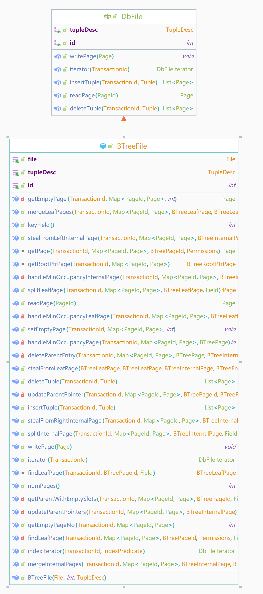


`insertTuple()`

先找到根页面，然后根据这个根调用`findLeafPage()`。如果找到的叶页面没有空的槽，就把这个叶页面分裂`splitLeafPage()`。然后插入返回的

方法：

- `updateParentPointer()`
  - 把`child`的父节点指针指向`pid`

- `updateParentPointers()`
  - 把给定的内部页`page`内部的所有`Entry`中的指针指向的页的父节点指针指向当前页

- `getParentWithEmptySlots()`
  - `splitInternalPage()`实际上是在这个方法里面做的。	
  - 


## Lab 1 Notes


## Lab 2 Notes


## Lab 3 Notes


## Lab 4 Notes


总结

#### Basics

锁的管理应该在哪里进行？这里设计的是一个页级别的锁，而页的获取是交给`BufferPool`去做的（在就直接取出来，不在则由缓冲池读文件）。所以锁的授予在`BufferPool`中的`getPage()`中进行。

何时何处如何撤销锁？在获取完页之后，需要创建事务的自己去调用`TransactionComplete()`。`TransactionComplete()`要做什么？它需要把事务过程中对页做的所有修改写回到磁盘。这个方法涉及到处理所有`BufferPool`中的脏页，所有这个方法也在`BufferPool`中需要去完成。

#### Granting locks

授予锁方面，需要知道每个页对应有哪些锁，所以这里需要一个`ConcurrentMap`，从`PageId`映射到一个数组，数组中含有对这个页持有锁的页。由于锁也有不同的类型，所以设计一个锁对象。

这个Map的管理可以放到`LockManager`这个内部类中，这个类负责锁的授予和撤销。

严格两阶段锁意味着什么？这是避免级联回滚的一个很有效的方法，同时在这里也是使得锁的机制易于实现。在事务的运行过程中，任何时候都只允许授予锁，撤销锁只被允许在事务结束的时候，也就是在`TransactionComplete()`中调用。

撤销锁要做什么？撤销锁涉及到删除所有的从`PageId`到特定`TransactionId`的映射。如果每次都特意去做这样的搜索，显然是十分浪费时间的，所以可以同时维持一个从`TransactionId`到`List<PageId>`的数据结构记录每个事务对哪些页持有锁（需要把哪些页写回磁盘）。注意，如果只是撤销共享锁，那么似乎复杂度是没有简化的，因为你同时还需要一个一个去找第一个map中哪些`PageId`对应着`TransactionId`然后去删除，但是如果是撤销排他锁，直接删除就完了，而不要遍历`keySet`。


## Lab 5 Notes

如何从递归地从`Interal`到`Internal`再到`Leaf`?

得到一个`Internal`的`Entry`的迭代器，然后在迭代器中找到第一个键值大于当前键值的键值，然后找到对应的子节点的指针。

使用什么东西做指针比较合适？`BTreePageId`？这个倒是能判断是不是叶节点。

如何通过`BTreePageId`找到对应的`Page`？`BTreeFile.readPage(PageId pageId)`

### Search

注意

- 如果`f`是空值，就返回最左下角的叶页。
- 理论上`BTreePageId`可能是三种页，不过这里只做`Internal`和`Page`两种区分就行。

问题

- 内部页可不可能是空的？应该不可能。
- 如何处理重复的值？在`indexIterator`这个测试上报错了。发现实际上不是不能处理重复的值。
  - 实验中要求用`BTreeFile.getPage()`，而我用的`BTreeFile.readPage()`。这两个函数的区别是：`readPage()`是从磁盘上读取的文件（这个文件在`BTreeFile`初始化的时候以`File`形式存入内存），而`getPage()`是对`BufferPool.getPage()`的增加锁操作的封装。`indexIterator`测试中增加元组的那个操作大概是只插入了内存中，也就是`BufferPool`中，所以用`readPage()`是读不到这些变化的。
  - 教训：检查代码的时候大多数时候都是凭感觉，或者这一次你只想到了：我的代码逻辑没有错。但这是建立在你调用的函数确实做了你想让它做的事情上的。


### Insert

#### 实现`splitLeafPage()`和`splitInternalPage()`

注意：

- 如果插入父节点的时候父节点满了，可以需要递归地向父节点插入，如果分裂的是根节点，那就需要创建一个新的根节点
- 更新父节点的时候，要使用`READ_WRITE`。`getParentWithEmptySlots()`极其有用。
- 注意更新指针，`updateParentPointers()`也很有用
- 返回新的条目被插入的页
- 使用`getEmptyPage()`创建一个新页或者新的根节点
- 使用`BTreeInternalPage.iterator()`和`BTreeLeafPage.iterator()`以及对应的`reverseIteartor()`与内部页和叶页打交道。这些方法可以把元组或者条目从某个页移动到它的右兄弟去。
- `Entry`本身也有一个`RecordId`，因为它也被存在表中，这个`RecordId`就是`Entry`的位置。要注意，实际的页并没有存了一个`Entry`的列表，而是存了$m$个键和$m+1$个指针的有序链表。
  - 由于`Entry`本身只是一个内存中的结构，所以对它做修改并不会反映在实际的页中。所以你需要使用`BTreeInternalPage.updateEntry()`来使得修改生效。
  - `Entry`的`RecordId`可以用来找到要删除的键和子指针。
  - `BTreeInternalPage.insertEntry()`
- 实现这两个方法的时候都需要更新`dirtyPages`，新创建的页和修改过的页都需要添加到这个集合中去。`getPage()`可以很方便地帮你以`READ`或是`READ_WRITE`的方式拿到页，而不需要自己动手修改`dirtyPages`。
- 注意下面的B+树的性质必须保持：
  - 如果父节点指向某个子节点，子节点必须指向同样的父节点。
  - 叶节点中的前后指向也应该是双向的
  - 第一个和最后一个叶节点的其中一个指针要指向`null`
  - `RecordId`必须与确实匹配他们所在的页
  - 大小顺序需要保持

In Progress:

- `splitLeafPage()`和`splitInternalPage()`应该完成插入算法的哪部分内容？
  - 叶页的判满是通过`getNumEmptyPageSlots()`来做的。如果叶页满了就需要调用分裂叶页的函数，最后返回一个能插入的叶页的指针，然后重新插入。而`splitInternalPage()`应该是在这里面调用的。
- 如何把需要的键值和对应的指针移动到新创建的叶节点中？
  - 思路：先得到`Tuple`的迭代器，然后得到要插入哪些`Tuple`到新的叶页中，而且讲这些页在旧的叶页中删除，并将这个新创建的页加入到`dirtyPage`中
  - 问题：是否需要实验性地插入之后再才能
  - 怎么才能知道是插入第一个还是第二个叶页？在加入`tuples`之后的循环中判断
- 父节点够插入的情况
  - 如何创建`Entry`？
- `BTreeFile.insertTuple()`的逻辑是怎样的？
  - 找到叶页
  - 尝试插入，如果满，调用`splitLeafPage()`
  - 对叶页调用插入元组

- `BTreFile.getParentWithEmptySlots()`的逻辑是怎样的？
  - 如果`parentId`是一个根页，那么就需要将当前表（文件）的<u>根指针页</u>更新为`parentId`，图示如下，在插入12前，节点（9,13,16）是根节点，在插入之后，如果根节点需要分裂，就需要在分裂之后创建一个新的根节点，并且将中间键值13插入到这个新的根节点。所以这个函数返回的也是这个新创建的根节点。在调用它的地方使用`insertEntry()`。
  - 问题：这个函数并不会在创建新的根节点之前判断这个父节点是不是满的，如果不是满的不应该直接插入条目吗？
  
  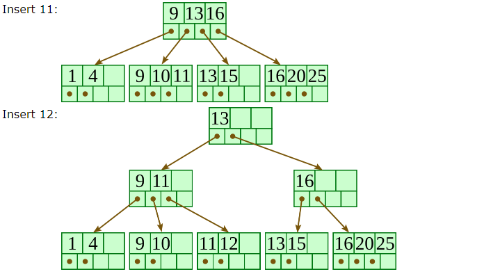


### 逻辑

`splitLeafPage()`

调用前：参考上面的`BTreeFile.insertTuple()`，当叶页槽满时使用，进行分裂：

- 将这个条目插入父节点（内部节点），父节点的获取使用`getParentWithEmptySlots()`。

调用后：在返回的叶页中插入元组

`splitInternalPage()`

调用前：在`getParentWithEmptySlots()`中被调用，如果这个父节点的槽不够，就需要将内部节点分裂。在分裂中找到中间条目，然后继续往父节点插入。

- 找到中间条目
-  尝试拿到当前内部页的父页

调用后：

### 	Bug

#### 插入条目的问题

`child page category INTERNAL mismatch in insertEntry CHILD LEAF`

假设分裂了一个叶节点，如何知道最后插入的条目

## Lab 6 Notes 
