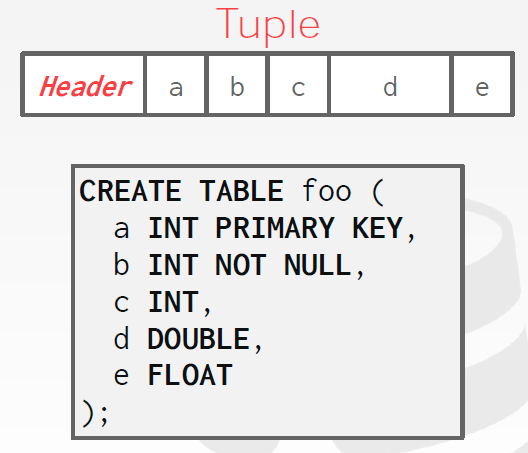

# Storage and Bufferpool

## 	Why not OS?

缓冲池做的事情如下：


这实际上很像是虚拟内存所做的事情，那么为什么不用```mmap```这样的将文件映射到某个进程的地址空间内的函数来做这件事呢？


这个想法在只是读取的时候没什么问题，但是如果多个进程想要写入就麻烦了。可能的解决方案包括：

- ```madvise```
- ```mlock```
- ```msync```

实际上这种将控制权交给操作系统的做法会导致如性能瓶颈和正确性的问题，所以主流的数据库并不会大量使用```mmap```。数据库系统总是希望控制权在自己手上，并且能做得更好。例如：

- 讲脏页以正确的顺序清洗到磁盘
- 更好的缓冲区置换策略
- 更好的线程/进程调度

## 	文件存储

有的数据库将整个系统存为一个文件（如SQLite），绝大多数的系统会存在多个文件上。管理这些文件的是存储管理器（storage manager），维护数据库的文件。它用“页”组成这些文件，并且记录对这些页的读写，以及可用的空间。

## 	页

页就是一块数据，它需要是自包含的（也就是独立的）。例如一个页包含了许多个元组，如果包含这些元组的列的名称和数据类型存在别的地方并丢失了，那么要得知这个页的数据的内容就十分困难了。这样一来，丢失任何一页不会影响到其他的页。	

另一方面，数据库系统赋予每个页一个页id，然后有一个中转层（indirection layer）将这个id转化成某个文件中的某个偏移。

页面大小：

- Hardware Page (usually 4KB)
- OS Page (usually 4KB)
- Database Page (512B-16KB)


页面过大会影响原子性，例如写了4KB就被打扰了。

### 	页存储架构

不同的数据库管理系统在磁盘上管理文件中的页的方式不同：

- 堆文件（Heap file），表示方式有：
  - 链表
  - 页目录
- 顺序/有序文件
- 哈希文件

#### 	堆文件：链表

使用一个头页面（header page）存储两个指针，一个指向空的页的链表，一个指向数据页链表。每个页记录自己有多少个空闲的槽。


这个做法显然是不行的，太慢了。

#### 	堆文件：页目录

数据库管理系统用一些特殊的页（页目录）记录页在数据库文件上的位置，以及每个页面有多少空的元组。


### 	页的结构

每个页有一个首部（header）的页的内容的元数据，如：

- 页面大小
- 校验和（checksum）
- DBMS版本
- 事务可见性
- 压缩信息


在页面内部，组织数据的方法有两种：

- 面向元组

- 记录结构（log-structured）

  

### 	元组的存储

一种方法是，用数组的方式，但是删除元组的时候需要顺序搜索，这种方法不行。


另一种方法是，使用开槽的页面（slotted pages）


头记录了使用中的槽的数量，以及上个使用了的槽对开始位置的偏移。槽数组随着数据的增多向后增长，而元组则向前增长。

DBMS通过Record ID跟踪每个元组，要在数据库中找到任何一个元组，我们需要知道它位于哪一页（page_id），以及在这一页中的那个槽（offset）。

在Postgres中，删除一个元组之后，再插入一个元组不会填充到之前被删除的元组的位置。而是去到了第四个槽。

在运行真空填充之后，空的槽被使用了。

#### 	Tuple Layout

关于元组的结构信息（也就是数据库的模式），一般是不需要存在元组内部的。但是像MogoDB这样每个元组都可能不同的数据库，模式信息需要放在内部。



元组数据的范规范化可以把相关的元组存在同一张表中。这可以潜在地减少I/O的量。但是更新也会变得更费力。


例如，如果我们一直在同时查询foo和bar的信息，就可以通过将它们合成一张表来节省时间。至今依然有一些数据支持个功能。


### 	日志结构的文件组织

DBMS仅仅记录日志记录，对文件添加数据库是如何被修改了的信息。例如插入则存入整个元组，删除则标记这个元组被删除。更新则记录属性被修改的变化。这样做最大的优势在于，使用的是顺序读写。顺序读写无论是在固态硬盘还是机械硬盘上相对于随机读写都是要快得多的。这个想法在最近十年中火了起来，部分原因是在一些分布式文件系统中，不能进行随机的读写，而这种结构就很适合。

此外，可以对每个记录增加索引，使得可以跳到任何记录上。


如上图，读取记录的时候要从最后一条更新的数据往回扫描得到它想找的元组。


## 	数据表示

- INTEGER/BIGINT/SMALLINT/TINYINT
  - C++表示
- FLOAT/REAL vs. NUMERIC/DECIMAL
  - IEEE-754 Standard / Fixed-point Decimals
- VARCHAR/VARBINARY/TEXT/BLOB
  - Header with length, followed by data bytes.
- TIME/DATE/TIMESTAMP
  - 32/64-bit integer of (micro)seconds since Unix epoch

如果我们直接把数据当成C++的类型，处理浮点数之间的运算时，可能会产生一些精确度上的问题：


如果不能接受舍入错误，就需要使用精确度很高的数值数据类型，例如NUMERIC和DECIMAL。也可以通过讲数据存储为字符串，然后用一些其他的元数据来记录应该把字符串如何翻译成数值类型的信息。例如Postgres是这样实现数值类型的：


所以执行起来要更慢一些。

### 	大数值

绝大多数DBMS不允许元组超出单个页面的长度。所以当其中一个属性的大小太大时，可以使用上溢页（overflow page）：


也就是在属性的位置放上一个页的编号，用一页来存过大的数据，同时更多的数据使用指针存到下一页去。而且这种数据可以压缩，因为大多数时候只是读而不去写。 例如：

- Postgres：
- MySQL：
- 

另一种方法是在属性的位置放一个指向文件的指针，用文件来存储：


此时这个值被视为```BLOB```（binary large object）类型。数据库管理系统无法操作<u>外部文件</u>的内容，因为没有持久性和事务保护。而我们可以不经过数据修改这个文件，此时的更行在数据库中也是可见的。这种情形可见与，例如，在网站的数据库中，有一项是视频文件，这时作为外部文件存储是很合适的。

## 	系统目录（System Catlog）

目录相当于数据库的元数据（```INFORMATION_SCHEMA```），存储在数据的内部：

- 表、列、索引和视图
- 用户、权限
- 内部统计


## 	Database Workloads

### 	OLTP(On-line Transaction Processing)

例如在使用购物网站的时候，用户的行为所需的数据库操作是重复的，而且每次做的更新非常少（只更新自己购物车内的商品并结账）。所以查询语句每次都只访问数据库非常小的部分的数据。

### 	OLAP

相对于OLTP，更为复杂的查询语句，需要访问（不用写）大部分的数据，然后得到某些信息。


例如说，Hadoop就属于OLAP，而MongoDB等属于OLTP。

### HTAP（Hybrid Transaction + Analiytical Processing）	

在同一个数据库实例上运行：OLTP + OLAP

## 	Storage Model 

数据库管理系统可以让元组用适应OLTP或OLAP的方式存储。

### 	N-ary Storage Mode(NSM)

行模型：每一行都是对齐的。


在这种模型中，OLTP应用可以通过索引很快的拿到要找到元组。但是在OLAP应用中我们做统计需要的仅仅是其中一些列，而且需要整个数据库所有的元组的列，这样一来为了得到个别需要的列的信息要花费大量的精力去读取无用的数据：


优势：

- 快速的插入，更新以及删除
- 有利于需要整个元组的查询

劣势：

- 不利于需要表的大部分内容，而小部分属性的查询

### 	Decomposition Storage Model(DSM)

也称为列存储（column store）：相比于每一行“连续”着放在文件中，行存储意味着不同元组的属性连续的放在文件中。


由于每个列都是同样的数据类型，我们可以统计存储$\Delta$来做压缩。

优势：

- 减少了浪费的I/O的量
- 查询处理和数据优化更好

劣势：

- 因为涉及到元组的分裂和拼接，对于点查询语句，例如插入、更新和删除很慢。

如今所有的数据都在使用列存储。

#### 	Tuple Identification

要把元组放回到列存储的数据库中，有两种常见的方法：

-  固定长度的偏移：假设所有属性都是固定长度的
- 嵌入元组ID


### 	Bifurcated Environment


在内存中缓存页/索引。要找的页在缓冲池中时，不用从磁盘读取。


## 	Buffer Pool

缓冲池就是用一些固定大小的页组织成的一块内存区域。在内存中，这些页也叫作**页框（frame）**。

同时，我们需要一个中转器来管理这种从磁盘到内存的页的移动，也就是页表。页表是一个哈希表。还需要跟记录每个页的一些元信息，如脏标志和引用计数（有多少个线程或者查询要保持这个页在内存中）。

### 	Locks vs. Latches 

锁：

- 保护数据库的逻辑内容不受其他事物的影响的高级原语
- 在事务持续时间内保持
- 需要能够回滚某些变化

锁存器（latches）：互斥量/自旋锁

- 相对于锁，是一种低级原语。保护数据库管理系统内部数据结构的关键部分不被其他线程影响。
- 在事务持续时间内保持
- 不需要能够回滚某些变化

### 	Buffer Pool Meta-Data

- 页表：记录当前在内存中的页，`unordered_map<PageId, Page>`
- 脏标志（dirty-flag）：任何线程修改一个页时，需要将对应的脏位设为1.
- 引用计数器（pin/reference counter）：每个页有一个这样的数值，记录有多少线程正在访问这个页面（正在读或者修改）。
  - 一个线程在访问一个页之前，先要增加这个计数。
  - 如果一个页的引用计数器大于0，那么就不能在替换时把这个页替换出去。

### 	Allocation Polices

全局策略：选择对于整个工作流程最好的内存分配方法

局部策略：采取对于每个查询或每个事务最优的内存分配方法。

绝大多数系统使用的是这二者的结合体。

## 	Buffer Pool Optimization

### 	Multiple Buffer Pools

数据库管理系统可以为不同的目的维持多个缓冲池（例如每个数据库一个，每种页的类型一个）。

- 多个缓冲池实例
- Pre-database缓冲池
- pre-page type buffer pool

可以减少对锁存器的保持，并且可以改进局部性。

#### 	方法一：Object Id

在record id中嵌入一个对象id，然后维持一个从这些id到特定缓冲池的映射。

#### 	方法二：哈希表

用一个哈希表存储每个页id属于哪个缓冲池。


### 	Pre-Fetching 

数据库管理系统可以基于查询计划预取某些页：

顺序扫描：

索引扫描：

### 	Scan Sharing

查询可以重复使用从存储中

### 	Buffer Pool Bypass


### 	OS Page Cache

## 	Replacement Polices

目标：

- 正确性
- 准确性
- 速度
- 元数据的开销（overhead）

### 	Lesat Recently Used

维持一个每个页面上一次被访问的时间戳。当数据库管理系统需要置换一个页面时，选择最久没有被使用的页。所以可以一直维持所有的页以使用时间的顺序排列，以减少搜索的时间。

### 	Clock


### 	Sequential Flooding

LRU和Clock算法的问题在于，他们面对连续的，对每个页的扫描时性能会很差。在某些工作负担下LRU甚至会返回最不需要的页。

### 	Better Polices: Localization


### Better Polices: Prioriy Hints


### Better Polices: LRU-K


### 	Dirty Pages

如何处理脏页和不脏的页呢？

- 最快的方法：在任何时候，把不脏的页从缓冲池中去除掉。
- 慢一点的方法：把脏页写回磁盘保证一致性

一种避免非必须的页面写出的方法是后台写入（backgrounding writing）。数据库管理系统可以周期性地遍历页表，并将脏页写回磁盘。


### 	Other Memory Pools

- Sorting + Join Buffers
- Query Caches
- Maintenance Buffers
- Dictionary Caches


