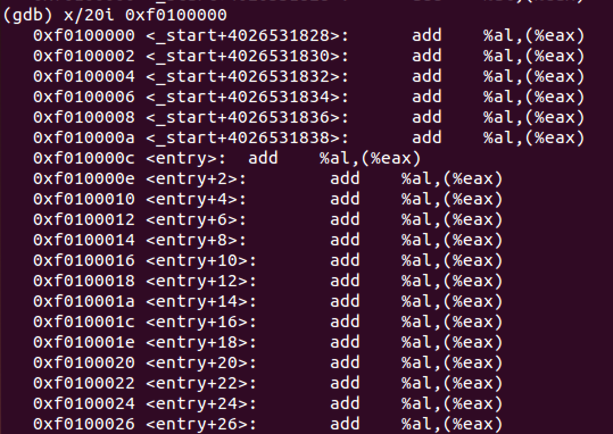
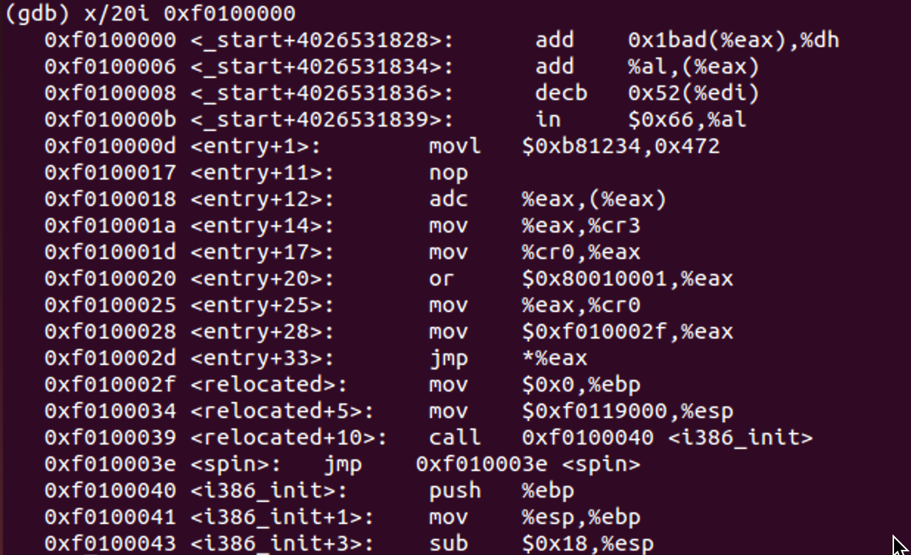
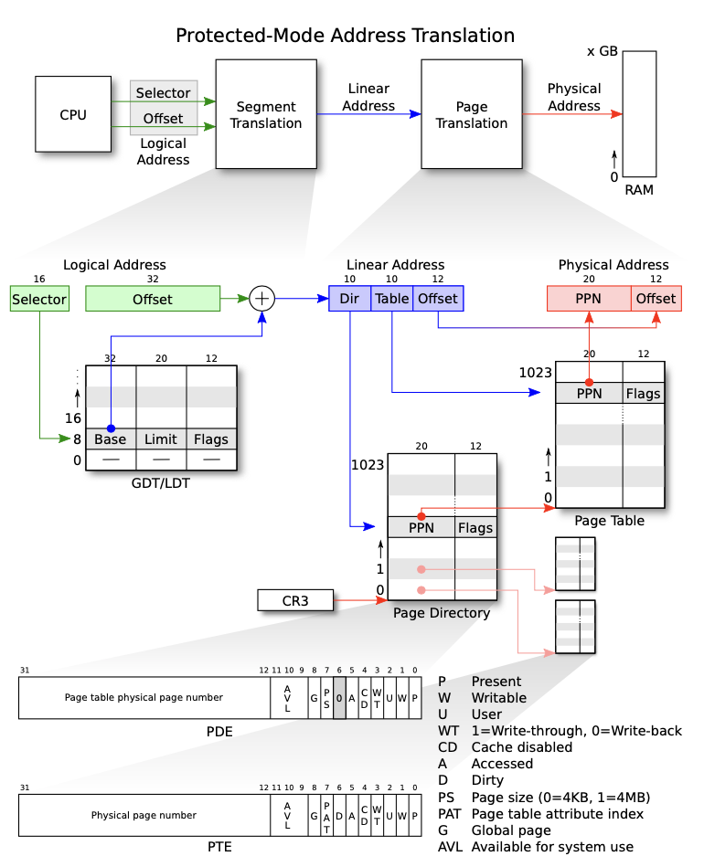
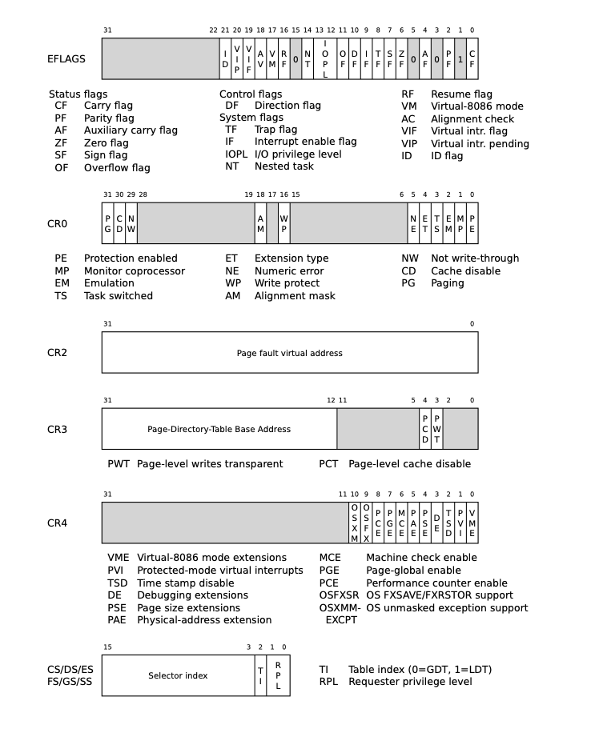
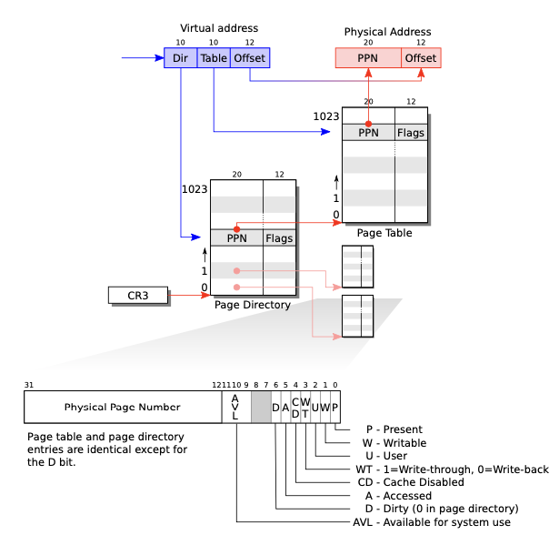
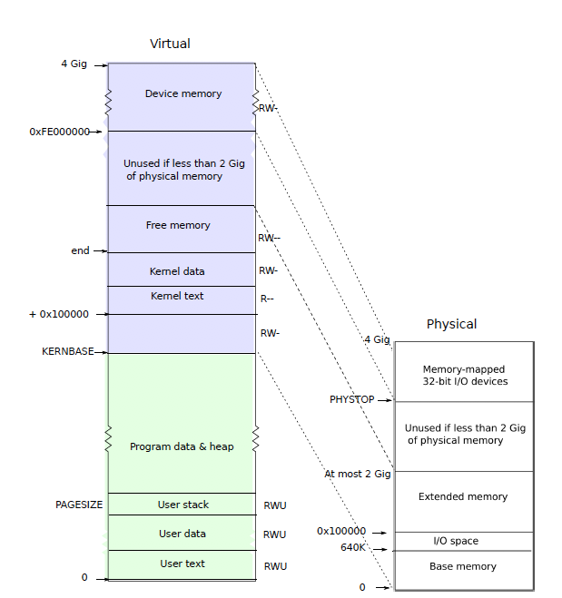

# Architecture 

## Emulation Code Example

### Memory
```c
int32_t regs[8];
#define REG_EAX 1;
#define REG_EAX 2;
#define REG_EAX 3;
// ....
int32_t eip;
int16_t segregs[4];
// ....
char mem[256*1024*1024];

```
最后面这个大小是$2^{28}$，注意一个```char```是1字节（应该）。

### CPU
```c 
for (;;) {
  read_instruction();
  switch(decode_instruction_opcode()) {
    case OPCODE_ADD:
    int src = decode_src_reg();
    int dst = decode_dst_reg();
    regs[dst] = regs[dst] + regs[src];
    break;
    case OPCODE_SUB:
      int src = decode_src_reg();
      int dst = decode_dst_reg();
      reg[dst] -= regs[src];
      break;
    // ....
  }

  eip += instruction_length;
}
```

### Memory
```c
uint8_t read_byte(uint32_t phys_addr) {
  if (phys_addr < LOW_MEMORY)
    return low_mem[phys_addr];
  else if (phys_addr >= 960 * KB && phys_addr < 1 * MB) {
    return rom_bios[phys_addr - 960*KB];
  } else if (phys_addr >= 1 * MB && phys_addr < 1 * MB + EXT)
}

```


# Booting a PC

###### What's BIOS?

BIOS is Basic Input and Output System.

## How to boot a PC?


### 80386 System Memory Organization and Segmentation

a sequence of 8-bit bytes. Each byte is assigned to a unque address that ranges from 0 to $2^{32}-1$(4 GigaBytes)


#### Truth:

```assembly
[f000:fff0] 0xffff0:	ljmp   $0xf000,$0xe05b
```

The IBM PC starts excuting at physical address 0x000ffff0


### boot.s

```assembly
#include <inc/mmu.h>

# Start the CPU: switch to 32-bit protected mode, jump into C.
# The BIOS loads this code from the first sector of the hard disk into
# memory at physical address 0x7c00 and starts executing in real mode
# with %cs=0 %ip=7c00.

.set PROT_MODE_CSEG, 0x8         # kernel code segment selector
.set PROT_MODE_DSEG, 0x10        # kernel data segment selector
.set CR0_PE_ON,      0x1         # protected mode enable flag

.globl start
start:
  .code16                     # Assemble for 16-bit mode
  cli                         # Disable interrupts
  cld                         # String operations increment

  # Set up the important data segment registers (DS, ES, SS).
  xorw    %ax,%ax             # Segment number zero
  movw    %ax,%ds             # -> Data Segment
  movw    %ax,%es             # -> Extra Segment
  movw    %ax,%ss             # -> Stack Segment

  # Enable A20:
  #   For backwards compatibility with the earliest PCs, physical
  #   address line 20 is tied low, so that addresses higher than
  #   1MB wrap around to zero by default.  This code undoes this.
seta20.1:
  inb     $0x64,%al               # Wait for not busy
  testb   $0x2,%al
  jnz     seta20.1

  movb    $0xd1,%al               # 0xd1 -> port 0x64
  outb    %al,$0x64

seta20.2:
  inb     $0x64,%al               # Wait for not busy
  testb   $0x2,%al
  jnz     seta20.2

  movb    $0xdf,%al               # 0xdf -> port 0x60
  outb    %al,$0x60

  # Switch from real to protected mode, using a bootstrap GDT
  # and segment translation that makes virtual addresses 
  # identical to their physical addresses, so that the 
  # effective memory map does not change during the switch.
  lgdt    gdtdesc
  movl    %cr0, %eax
  orl     $CR0_PE_ON, %eax
  movl    %eax, %cr0
  
  # Jump to next instruction, but in 32-bit code segment.
  # Switches processor into 32-bit mode.
  ljmp    $PROT_MODE_CSEG, $protcseg

  .code32                     # Assemble for 32-bit mode
protcseg:
  # Set up the protected-mode data segment registers
  movw    $PROT_MODE_DSEG, %ax    # Our data segment selector
  movw    %ax, %ds                # -> DS: Data Segment
  movw    %ax, %es                # -> ES: Extra Segment
  movw    %ax, %fs                # -> FS
  movw    %ax, %gs                # -> GS
  movw    %ax, %ss                # -> SS: Stack Segment
  
  # Set up the stack pointer and call into C.
  movl    $start, %esp
  call bootmain

  # If bootmain returns (it shouldn't), loop.
spin:
  jmp spin

# Bootstrap GDT
.p2align 2                                # force 4 byte alignment
gdt:
  SEG_NULL				# null seg
  SEG(STA_X|STA_R, 0x0, 0xffffffff)	# code seg
  SEG(STA_W, 0x0, 0xffffffff)	        # data seg

gdtdesc:
  .word   0x17                            # sizeof(gdt) - 1
  .long   gdt                             # address gdt

```

### /boot/main.c

```c

#include <inc/x86.h>
#include <inc/elf.h>

/**********************************************************************
 * This a dirt simple boot loader, whose sole job is to boot
 * an ELF kernel image from the first IDE hard disk.
 *
 * DISK LAYOUT
 *  * This program(boot.S and main.c) is the bootloader.  It should
 *    be stored in the first sector of the disk.
 *
 *  * The 2nd sector onward holds the kernel image.
 *
 *  * The kernel image must be in ELF format.
 *
 * BOOT UP STEPS
 *  * when the CPU boots it loads the BIOS into memory and executes it
 *
 *  * the BIOS intializes devices, sets of the interrupt routines, and
 *    reads the first sector of the boot device(e.g., hard-drive)
 *    into memory and jumps to it.
 *
 *  * Assuming this boot loader is stored in the first sector of the
 *    hard-drive, this code takes over...
 *
 *  * control starts in boot.S -- which sets up protected mode,
 *    and a stack so C code then run, then calls bootmain()
 *
 *  * bootmain() in this file takes over, reads in the kernel and jumps to it.
 **********************************************************************/

#define SECTSIZE	512
#define ELFHDR		((struct Elf *) 0x10000) // scratch space

void readsect(void*, uint32_t);
void readseg(uint32_t, uint32_t, uint32_t);

void
bootmain(void)
{
	struct Proghdr *ph, *eph;

	// read 1st page off disk
	readseg((uint32_t) ELFHDR, SECTSIZE*8, 0);

	// is this a valid ELF?
	if (ELFHDR->e_magic != ELF_MAGIC)
		goto bad;

	// load each program segment (ignores ph flags)
	ph = (struct Proghdr *) ((uint8_t *) ELFHDR + ELFHDR->e_phoff);
	eph = ph + ELFHDR->e_phnum;
	for (; ph < eph; ph++)
		// p_pa is the load address of this segment (as well
		// as the physical address)
		readseg(ph->p_pa, ph->p_memsz, ph->p_offset);

	// call the entry point from the ELF header
	// note: does not return!
	((void (*)(void)) (ELFHDR->e_entry))();

bad:
	outw(0x8A00, 0x8A00);
	outw(0x8A00, 0x8E00);
	while (1)
		/* do nothing */;
}

// Read 'count' bytes at 'offset' from kernel into physical address 'pa'.
// Might copy more than asked
void
readseg(uint32_t pa, uint32_t count, uint32_t offset)
{
	uint32_t end_pa;

	end_pa = pa + count;

	// round down to sector boundary
	pa &= ~(SECTSIZE - 1);

	// translate from bytes to sectors, and kernel starts at sector 1
	offset = (offset / SECTSIZE) + 1;

	// If this is too slow, we could read lots of sectors at a time.
	// We'd write more to memory than asked, but it doesn't matter --
	// we load in increasing order.
	while (pa < end_pa) {
		// Since we haven't enabled paging yet and we're using
		// an identity segment mapping (see boot.S), we can
		// use physical addresses directly.  This won't be the
		// case once JOS enables the MMU.
		readsect((uint8_t*) pa, offset);
		pa += SECTSIZE;
		offset++;
	}
}

void
waitdisk(void)
{
	// wait for disk reaady
	while ((inb(0x1F7) & 0xC0) != 0x40)
		/* do nothing */;
}

void
readsect(void *dst, uint32_t offset)
{
	// wait for disk to be ready
	waitdisk();

	outb(0x1F2, 1);		// count = 1
	outb(0x1F3, offset);
	outb(0x1F4, offset >> 8);
	outb(0x1F5, offset >> 16);
	outb(0x1F6, (offset >> 24) | 0xE0);
	outb(0x1F7, 0x20);	// cmd 0x20 - read sectors

	// wait for disk to be ready
	waitdisk();

	// read a sector
	insl(0x1F0, dst, SECTSIZE/4);
}


```


### Boot Loader

硬盘的每个sector是512B，每一次读写操作必须是sector大小的整数倍。如果硬盘是可启动的，第一个扇区就是boot sector，里面有boot loader。BIOS将其装到物理内存的```0x7dff - 0x7c00```（$0x7DFF - 0x7C00 = 0x1FF = 511_{10}$）。

```assembly
  # Set up the protected-mode data segment registers
  movw    $PROT_MODE_DSEG, %ax    # Our data segment 
```

从16位转化为32位。在内存中的地址是```0x7c32```，```$PROT_MODE_DSEG```的值是```0x10```。

通过```  call bootmain```跳转到```/boot/main.c```中的这个函数```bootmain()```。


### kernel.elf

#### What's elf?

```.c```编译成```.o```然后多个一起变成```.elf```。全称是```Excutable and Linkable Format```，也就是说一个二进制镜像文件。

重要的部分包括：

```.text```：可执行指令。

```.rodata```：例如字符串常量。
```.data```：初始化了的变量，例如```int x = 4```。


  VMA是链接地址（link address），而LMA是装载地址（load address）。LMA显然就是内存中的地址。


在执行这条位于```0x100025```的指令之后，```0xf0100000```后面的位置由



变成了



对比之前```movw %eax, %cr0```的那张图，```0x100000```前后的地址已经被映射过来了。虽然现在我还是不知道原理是怎么回事，但是至少，```0xf0100000```同时也是内核的链接地址（上面内核的ELF图有说明）。这里，物理内存的```0x00000000```到```0x0fffffff(fx7)```映射到虚拟内存的```0xf0000000```到```0xffffffff(fx8)```

#### Output

```c
// console.c

static int serial_proc_data(void);
void serial_intr(void);
static void serial_putc(int c);
static void serial_init(void);
static void lpt_putc(int c);
static void cga_init(void);
static void cga_putc(int c);
static int kbd_proc_data(void);
void kbd_intr(void);
static void kbd_init(void);
static void cons_intr(int (*proc)(void));
int cons_getc(void);


static void cons_putc(int c) {
    serial_putc(c);
    lpt_putc(c);
    cga_putc(c);
}
void cons_init(void);


void cputchar(int c) {
    cons_putchar(c);
}
int getchar(void);
int iscons(int fdnum);


    
```

看文件如果有```.h```一定要先看```.h```！首先这是提供给别的文件的接口。

### Backtrace Function

```read_ebp()```的代码：

```assembly
static __inline uint32_t read_ebp(void) {
	uint32_t ebp;
	__asm __volatile("movl %%ebp, %0" : "=r" (ebp));
	return ebp;   
}
```

总而言之，```ebp```中有上一个```ebp```在内存中位置的地址，而上一个

### Debug 

```c
/* kern/kdebug.h  */

struct Eipdebuginfo {
    const char * eip_file;
    int eip_line;
    const char * eip_fn_name;
    int eip_fn_namelen;
    uintptr_t eip_fn_addr;
    int eip_fn_narg; 
}

int debuginfo_eip(uintptr_t eip, struct Eipdebuginfo * info);
```


### x86 Stack 

假设函数P调用了Q，首先，栈会向下（栈顶地址```%esp```变小）分配空间。调用在汇编中即是```call <Q>```。```call```语句所做的事情是：```purhrq <return address>```>，而这条```pushrq```所做的事情是首先：```%rsp -= 8```，然后把```call <Q>```这条语句后面一条语句的地址（也就是返回地址）存入栈顶```%esp```（到栈的这个地址以上就是Q的全部了），最后跳转到```<Q>```。在Q调用结束的时候，有一句```ret```，```ret```做的事情是：用```pop```取得返回地址，```pop dest```会先取出```%esp```中的值，把```%esp += 8```，然后把这个值存入```dest```，最后跳转到```dest```。

然后还要一条```leave ```让准备栈适于返回，等同于：```movl %ebp, %esp ```然后```popl %ebp ```。

# Memory 

进程所看到的地址空间是这样的：


就这样看来，首先你要有合理的方法来为一个进程增加其所用的空间，

## Cache

我想，对一个Cache最原始的想象应该是一个哈希表，也就是哈希函数$h(\text{addr}) = \text{index}$，然后缓存实际上是一个数组```cache```。```cache[index] = NULL```就是不命中的情况了，缓存的优势体现于，从```cache```这个数组中取出```index```对应的值比较快。这里，虽然是byte-addressing，但是一次要读一个字，在IA32中，就是4个字节。

简而言之就是，有一个比较快的数组```cache[index] = block```，然后```hash(address) = index```，而这个哈希函数无非是取这个地址（也是一个数字）中的其中几位罢了。

```block size```之前一直没看懂，主要是还是一个地址对应着一个字节，然后块的大小为$2^b$字节时，就需要一个```b```位的数来指示是哪个字节。

### Structure & Operations of a Cache


总而言之，Cache就是一个```struct cache_line[S][E]```型的东西。

#### Read/Load

从地址中找到```set index```，确定在哪个集，然后是通过```tag```确定在那条线，同时```valid bit```是否为有效，最后是字节的偏移量。


#### Write/Save


### TLB

这里的```block```应该是另一个地址的局部（也是虚拟地址）。换而言之TLB存了一些常用的虚拟地址。

### Implementtation

```c
typedef struct {
	int valid;
	uint64_t tag;
	int time_stamp;
} cache_line;

int handle(cache_line ** cache, int S, int E, uint64_t tag, result * res) {
	uint64_t least_time = UINT64_MAX;
	uint64_t most_time	= 0;
	uint64_t least_block = UINT64_MAX;
	int hit_flag = 0;

	for (uint64_t i = 0; i < E; i++) {
		if (cache[S][i].tag == tag && cache[S][i].valid) {
			hit_flag = 1;
			res->hit++;
			cache[S][i].time_stamp++;
			break;
		}
	}

	/* evict the least used block(minimum time-stamp ) */

	if (!hit_flag) {
		/* miss */
		res->miss++;

		for (uint16_t i = 0; i < E; i++) {
			/* most used block */
			if (cache[S][i].time_stamp < least_time) {
				least_time = cache[S][i].time_stamp;
				least_block = i;
			}

			/* least used block */
			if (cache[S][i].time_stamp > most_time) {
				most_time = cache[S][i].time_stamp;
			}
		}
	}
  
  
void initialize(cache_line** cache, int E, int S) {
    int i, j;
    if ((cache = malloc(sizeof(cache_line*)*S)) == NULL) {
        printf("Error allocating memory space for cache.\n");
        exit(1);  
    }
    for (i = 0; i < S; i++) {
        if (!(cache[i] = malloc(sizeof(cache_line)))) {
            printf("Error allocating memory space for cache.\n");
            exit(1);     
        }
    }
 
    int i, j;
	for (i = 0; i < S; i++) {
		for (j = 0; j < E; j++) {
			cache[i][j].valid = 0;
			cache[i][j].tag = 0x0;
			cache[i][j].time_stamp = 0;
		}
    }
}
```


## Basic Knowledge
### Main Memory
例如说，IA32有主存有$2^32$个地址单元，每个单元中有一个字，字长为32位。

#### MMU
处理器使用虚拟地址（VA），这样的虚拟地址被硬件MMU（Memory Management Unit）转化成物理地址（PA）。

#### Bits, K,M,G,T,P,E
假设一个地址有$n$位，那么就有$2^n$条地址，最大的地址为$2^{n+1}-1$。

在IA32中，```char```是1字节，```int```是4字节。内存是按字（word）长取址的，

K意味着$2^{10}$，往后的每个字母的大小是K再乘一个$2^{10}$。

#### VM
每个字节（$w^8$）都有一个地址与其对应。注意一点，虚拟地址一般远大于物理地址（数量），也就是虚拟地址在位数上比物理地址长很多。

#### P,PT,PTE
页页表是一个页表项（PTE）的数组。

## Virrtual Memory

假设shell出了个bug，会随机地写一个内存地址，如果要此时保护其不写到内核的区域的话，就要把两个内存空间分开。一个内存空间就可以用一张页表来代表。```%CR3```中包含了当前也页表的物理地址。


用```U```这一位来限制用户的访问权限。

### Protected-Mode Address Tranlation





翻译的主要过程可以看下面这张图：


```PDX```作为PD的索引，```PTX```作为PT的索引。如下：

```c
pd = lcr3();
pt = *(pd + 4*PDX);
page = *(pt + 4*PTX);
```

再结合```offset```就是物理地址了。

### Layout


## Page Table

把同样的内存（内核）映射到好几个地址空间当中去，把同样的内存映射多次映射到一个地址空间中（每个用户页同时也被映射到内核对内存的物理视角中）。而且用未映射的页作为用户栈的边界。

### Paging Hardware
x86的指令，无论是用户的，还是内核级的，都是使用的虚拟地址。而机器的RAM，或者说物理内存，都是用物理地址来做索引的。页表将一个虚拟地址映射为一个物理地址（能不能映射回来？，似乎不能）。

一个x86的页表通常有$2^{20}$个表项，表的内容称为PTE，```pte page_table[N]; page_table[va] = pte;```。每个PTE含有一些标志位和一个20位的PPN（物理页号）。这样一来，就保证了是按照大小为$2^{12}$的块来对齐的，这个块就称为1页。例子如下：

使用两级页表，每个页表的大小为$2^{10} = 1024$，也就是，用输入地址的顶部10位作为索引，每个
```c
#define uint32_t pte;

pte page_dir[1024];
pte page_dir[va[0:10]] = // lower 22 bits of the physical address
pte page_table[1024];
page_table[]
```
PTE = PPN(20 bits) + Flags(12 bits)

这里，页表（此处是二级页表）有$2^{10}$张，要知道在一个只有一级的页表系统中给出一个虚拟地址，得到一页的位置，然后结合偏移offset得到确切的物理地址的值。在xv6中，用0-9位索引得到的是一个页号，这个页号告诉你该使用$2^{10}$个页表中的哪一张（这个PTE中的PPN为22位，也还是给你一个地址，页表的地址）。然后用10-19位作为下一张页表的索引，得到页的地址。还有一点，两级页表的PTE的结构除了某一位以外都是相同的，而且，大部分虚拟地址是没有被映射为物理地址的。

Flags将告知你下一个地址是怎样被允许使用的。例如说```PTE_P```，P代表Present，表示页表是否存在，```PTE_U```表示用户是否允许使用这个页。


### Free List


# Process address space

内核的C代码所需的页表是由```entry```创建的。然后```main```马上就会切换到由```kvmalloc```创建的新页表。

每个进程有一个属于自己的页表，所以当进程切换的时候，page table hardware也要切换页表。

	如上图，用户的内存空间从0到```KERNBASE```，允许一个进程最多用2GB的内存（在```KERNBASE```以下）。这些内存结构的参数在```memlayout.h```中。

如果一个进程要求使用更多的内存的话，xv6首先找到一些空闲的物理页，然后在上一些指向这些页的PTE加在这个页表上，还要设置```PTE_U, PTE_W, PTE_P```这些标志位。不同进程的页表把用户地址翻译到不同的物理页上去，也就保证了每个进程有私有的用户内存空间。每一个进程都以为自己在内存中有连续的、从0开始的地方

xv6把```KERNBASE:KERNBASE+PHYSTOP```映射为```0:PHYSTOP```。内核的大部分并没有自己的页表，而是借用进程的页表。

#### Code: creatingt an address space

```setup-kvm```首先分配了一页的内存来装页目录（page directory）。然后调用```mappages```来安装```kmap```中内核需要的翻译。对于每一个要被映射的虚拟地址，```mappages```调用```walkpagdir```来寻找对应地址的PTE的地址。然后把PTE初始化来装相关的物理页号，此时Flag位设置为valid。

```walkpgdir```用虚拟地址的前十位来找到页目录的条目，如果条目不存在，那么要求的也的页表还没分配内存；如果存在，那么```walkpgdir```把它的物理地址放在页目录里；然后再用下10位来找到相应的页表页（page table page）。

#### Physical Memory allocation

分配和释放是以4KB大小的页为单位的，而分配要链表的最后移除一页，释放意味着加上一页。

分配器的数据结构是一个物理页的```free list```。链表的每个元素都是一个```struct run```。

##### pmap.h

```c
// /kern/pmap.h

extern char bootstacktop[], bootstack[];

extern struct PageInfo *pages;
extern size_t npages;
extern pde_t *kern_pgdir;

#define PADDR(kva) _paddr(__FILE__, __LINE__, kva)

/*  * physical address = kernel virtual address - KERNBASE  */
static inline physaddr_t
_paddr(const char *file, int line, void *kva)
{
	if ((uint32_t)kva < KERNBASE)
		_panic(file, line, "PADDR called with invalid kva %08lx", kva);
	return (physaddr_t)kva - KERNBASE;
}

#define KADDR(pa) _kaddr(__FILE__, __LINE__, pa)

static inline void*
_kaddr(const char *file, int line, physaddr_t pa)
{
	if (PGNUM(pa) >= npages)
		_panic(file, line, "KADDR called with invalid pa %08lx", pa);
	return (void *)(pa + KERNBASE);
}


static inline physaddr_t
page2pa(struct PageInfo *pp)
{
	return (pp - pages) << PGSHIFT;
}

static inline struct PageInfo*
pa2page(physaddr_t pa)
{
	if (PGNUM(pa) >= npages)
		panic("pa2page called with invalid pa");
	return &pages[PGNUM(pa)];
}

static inline void*
page2kva(struct PageInfo *pp) {
	return KADDR(page2pa(pp));
}

pte_t *pgdir_walk(pde_t *pgdir, const void *va, int create);
// /kern/pmap.h
```

所以在这里：物理地址 = 内核虚拟地址 $-$ ```KERNBASE```  	

##### pmap.c

```c
/* See COPYRIGHT for copyright information. */

#include <inc/x86.h>
#include <inc/mmu.h>
#include <inc/error.h>
#include <inc/string.h>
#include <inc/assert.h>

#include <kern/pmap.h>
#include <kern/kclock.h>

// These variables are set by i386_detect_memory()
size_t npages;			// Amount of physical memory (in pages)
static size_t npages_basemem;	// Amount of base memory (in pages)

// These variables are set in mem_init()
pde_t *kern_pgdir;		// Kernel's initial page directory
struct PageInfo *pages;		// Physical page state array
static struct PageInfo *page_free_list;	// Free list of physical pages


// --------------------------------------------------------------
// Detect machine's physical memory setup.
// --------------------------------------------------------------

static int
nvram_read(int r)
{
	return mc146818_read(r) | (mc146818_read(r + 1) << 8);
}

static void
i386_detect_memory(void)
{
	size_t npages_extmem;

	// Use CMOS calls to measure available base & extended memory.
	// (CMOS calls return results in kilobytes.)
	npages_basemem = (nvram_read(NVRAM_BASELO) * 1024) / PGSIZE;
	npages_extmem = (nvram_read(NVRAM_EXTLO) * 1024) / PGSIZE;

	// Calculate the number of physical pages available in both base
	// and extended memory.
	if (npages_extmem)
		npages = (EXTPHYSMEM / PGSIZE) + npages_extmem;
	else
		npages = npages_basemem;

	cprintf("Physical memory: %uK available, base = %uK, extended = %uK\n",
		npages * PGSIZE / 1024,
		npages_basemem * PGSIZE / 1024,
		npages_extmem * PGSIZE / 1024);
}


// --------------------------------------------------------------
// Set up memory mappings above UTOP.
// --------------------------------------------------------------

static void boot_map_region(pde_t *pgdir, uintptr_t va, size_t size, physaddr_t pa, int perm);
static void check_page_free_list(bool only_low_memory);
static void check_page_alloc(void);
static void check_kern_pgdir(void);
static physaddr_t check_va2pa(pde_t *pgdir, uintptr_t va);
static void check_page(void);
static void check_page_installed_pgdir(void);

// This simple physical memory allocator is used only while JOS is setting
// up its virtual memory system.  page_alloc() is the real allocator.
//
// If n>0, allocates enough pages of contiguous physical memory to hold 'n'
// bytes.  Doesn't initialize the memory.  Returns a kernel virtual address.
//
// If n==0, returns the address of the next free page without allocating
// anything.
//
// If we're out of memory, boot_alloc should panic.
// This function may ONLY be used during initialization,
// before the page_free_list list has been set up.
static void *
boot_alloc(uint32_t n)
{
	static char *nextfree;	// virtual address of next byte of free memory
	char *result;

	// Initialize nextfree if this is the first time.
	// 'end' is a magic symbol automatically generated by the linker,
	// which points to the end of the kernel's bss segment:
	// the first virtual address that the linker did *not* assign
	// to any kernel code or global variables.
	if (!nextfree) {
		extern char end[];
		nextfree = ROUNDUP((char *) end, PGSIZE);
	}

	// Allocate a chunk large enough to hold 'n' bytes, then update
	// nextfree.  Make sure nextfree is kept aligned
	// to a multiple of PGSIZE.
	//
	// LAB 2: Your code here.
	cprintf("boot_alloc memory at %x\n", nextfree);
	cprintf("Next memory at %x\n", ROUNDUP((char *) (nextfree+n), PGSIZE));
	if (n != 0) {
		char *next = nextfree;
		nextfree = ROUNDUP((char *) (nextfree+n), PGSIZE);
		return next;
	} else return nextfree;

	return NULL;
}

// Set up a two-level page table:
//    kern_pgdir is its linear (virtual) address of the root
//
// This function only sets up the kernel part of the address space
// (ie. addresses >= UTOP).  The user part of the address space
// will be setup later.
//
// From UTOP to ULIM, the user is allowed to read but not write.
// Above ULIM the user cannot read or write.
void
mem_init(void)
{
	uint32_t cr0;
	size_t n;

	// Find out how much memory the machine has (npages & npages_basemem).
	i386_detect_memory();

	// Remove this line when you're ready to test this function.
	// panic("mem_init: This function is not finished\n");

	//////////////////////////////////////////////////////////////////////
	// create initial page directory.

	kern_pgdir = (pde_t *) boot_alloc(PGSIZE);
	memset(kern_pgdir, 0, PGSIZE);

	//////////////////////////////////////////////////////////////////////
	// Recursively insert PD in itself as a page table, to form
	// a virtual page table at virtual address UVPT.
	// (For now, you don't have understand the greater purpose of the
	// following line.)

	// Permissions: kernel R, user R
	kern_pgdir[PDX(UVPT)] = PADDR(kern_pgdir) | PTE_U | PTE_P;

	//////////////////////////////////////////////////////////////////////
	// Allocate an array of npages 'struct PageInfo's and store it in 'pages'.
	// The kernel uses this array to keep track of physical pages: for
	// each physical page, there is a corresponding struct PageInfo in this
	// array.  'npages' is the number of physical pages in memory.
	// Your code goes here:
	pages = (struct PageInfo *) boot_alloc(sizeof(struct PageInfo) * npages);

	cprintf("npages: %d\n", npages);
	cprintf("npages_basemem: %d\n", npages_basemem);
	cprintf("pages: %x\n", pages);

	//////////////////////////////////////////////////////////////////////
	// Now that we've allocated the initial kernel data structures, we set
	// up the list of free physical pages. Once we've done so, all further
	// memory management will go through the page_* functions. In
	// particular, we can now map memory using boot_map_region
	// or page_insert
	page_init();

	check_page_free_list(1);
	check_page_alloc();
	cprintf("so far so good\n");
	check_page();

	//////////////////////////////////////////////////////////////////////
	// Now we set up virtual memory

	//////////////////////////////////////////////////////////////////////
	// Map 'pages' read-only by the user at linear address UPAGES
	// Permissions:
	//    - the new image at UPAGES -- kernel R, user R
	//      (ie. perm = PTE_U | PTE_P)
	//    - pages itself -- kernel RW, user NONE
	// Your code goes here:
	boot_map_region(kern_pgdir, 
		UPAGES, 
		PTSIZE, 
		PADDR(pages), 
		PTE_U);
	cprintf("PADDR(pages) %x\n", PADDR(pages));
	//////////////////////////////////////////////////////////////////////
	// Use the physical memory that 'bootstack' refers to as the kernel
	// stack.  The kernel stack grows down from virtual address KSTACKTOP.
	// We consider the entire range from [KSTACKTOP-PTSIZE, KSTACKTOP)
	// to be the kernel stack, but break this into two pieces:
	//     * [KSTACKTOP-KSTKSIZE, KSTACKTOP) -- backed by physical memory
	//     * [KSTACKTOP-PTSIZE, KSTACKTOP-KSTKSIZE) -- not backed; so if
	//       the kernel overflows its stack, it will fault rather than
	//       overwrite memory.  Known as a "guard page".
	//     Permissions: kernel RW, user NONE
	// Your code goes here:

	boot_map_region(kern_pgdir, 
		KSTACKTOP-KSTKSIZE, 
		KSTKSIZE, 
		PADDR(bootstack), 
		PTE_W);
	cprintf("PADDR(bootstack) %x\n", PADDR(bootstack));

	//////////////////////////////////////////////////////////////////////
	// Map all of physical memory at KERNBASE.
	// Ie.  the VA range [KERNBASE, 2^32) should map to
	//      the PA range [0, 2^32 - KERNBASE)
	// We might not have 2^32 - KERNBASE bytes of physical memory, but
	// we just set up the mapping anyway.
	// Permissions: kernel RW, user NONE
	// Your code goes here:

	boot_map_region(kern_pgdir, 
		KERNBASE, 
		-KERNBASE, 
		0, 
		PTE_W);


	// Check that the initial page directory has been set up correctly.
	check_kern_pgdir();

	// Switch from the minimal entry page directory to the full kern_pgdir
	// page table we just created.	Our instruction pointer should be
	// somewhere between KERNBASE and KERNBASE+4MB right now, which is
	// mapped the same way by both page tables.
	//
	// If the machine reboots at this point, you've probably set up your
	// kern_pgdir wrong.
	lcr3(PADDR(kern_pgdir));

	check_page_free_list(0);

	// entry.S set the really important flags in cr0 (including enabling
	// paging).  Here we configure the rest of the flags that we care about.
	cr0 = rcr0();
	cr0 |= CR0_PE|CR0_PG|CR0_AM|CR0_WP|CR0_NE|CR0_MP;
	cr0 &= ~(CR0_TS|CR0_EM);
	lcr0(cr0);

	// Some more checks, only possible after kern_pgdir is installed.
	check_page_installed_pgdir();
}

// --------------------------------------------------------------
// Tracking of physical pages.
// The 'pages' array has one 'struct PageInfo' entry per physical page.
// Pages are reference counted, and free pages are kept on a linked list.
// --------------------------------------------------------------

//
// Initialize page structure and memory free list.
// After this is done, NEVER use boot_alloc again.  ONLY use the page
// allocator functions below to allocate and deallocate physical
// memory via the page_free_list.
//
void
page_init(void)
{
	// The example code here marks all physical pages as free.
	// However this is not truly the case.  What memory is free?
	//  1) Mark physical page 0 as in use.
	//     This way we preserve the real-mode IDT and BIOS structures
	//     in case we ever need them.  (Currently we don't, but...)
	//  2) The rest of base memory, [PGSIZE, npages_basemem * PGSIZE)
	//     is free.
	//  3) Then comes the IO hole [IOPHYSMEM, EXTPHYSMEM), which must
	//     never be allocated.
	//  4) Then extended memory [EXTPHYSMEM, ...).
	//     Some of it is in use, some is free. Where is the kernel
	//     in physical memory?  Which pages are already in use for
	//     page tables and other data structures?
	// 
	// Change the code to reflect this.
	// NB: DO NOT actually touch the physical memory corresponding to
	// free pages!
	size_t i;
	for (i = 1; i < npages_basemem; i++) {
		pages[i].pp_ref = 0;
		pages[i].pp_link = page_free_list;
		page_free_list = &pages[i];
	}
	int med = (int)ROUNDUP(((char*)pages) + (sizeof(struct PageInfo) * npages) - 0xf0000000, PGSIZE)/PGSIZE;
	cprintf("pageinfo size: %d\n", sizeof(struct PageInfo));
	cprintf("%x\n", ((char*)pages) + (sizeof(struct PageInfo) * npages));
	cprintf("med=%d\n", med);
	for (i = med; i < npages; i++) {
		pages[i].pp_ref = 0;
		pages[i].pp_link = page_free_list;
		page_free_list = &pages[i];
	}
}

//
// Allocates a physical page.  If (alloc_flags & ALLOC_ZERO), fills the entire
// returned physical page with '\0' bytes.  Does NOT increment the reference
// count of the page - the caller must do these if necessary (either explicitly
// or via page_insert).
//
// Returns NULL if out of free memory.
//
// Hint: use page2kva and memset
struct PageInfo *
page_alloc(int alloc_flags)
{
	if (page_free_list) {
		struct PageInfo *ret = page_free_list;
		page_free_list = page_free_list->pp_link;
		if (alloc_flags & ALLOC_ZERO) 
			memset(page2kva(ret), 0, PGSIZE);
		return ret;
	}
	return NULL;
}

//
// Return a page to the free list.
// (This function should only be called when pp->pp_ref reaches 0.)
//
void
page_free(struct PageInfo *pp)
{
	pp->pp_link = page_free_list;
	page_free_list = pp;
}

//
// Decrement the reference count on a page,
// freeing it if there are no more refs.
//
void
page_decref(struct PageInfo* pp)
{
	if (--pp->pp_ref == 0)
		page_free(pp);
}

// Given 'pgdir', a pointer to a page directory, pgdir_walk returns
// a pointer to the page table entry (PTE) for linear address 'va'.
// This requires walking the two-level page table structure.
//
// The relevant page table page might not exist yet.
// If this is true, and create == false, then pgdir_walk returns NULL.
// Otherwise, pgdir_walk allocates a new page table page with page_alloc.
//    - If the allocation fails, pgdir_walk returns NULL.
//    - Otherwise, the new page's reference count is incremented,
//	the page is cleared,
//	and pgdir_walk returns a pointer into the new page table page.
//
// Hint 1: you can turn a Page * into the physical address of the
// page it refers to with page2pa() from kern/pmap.h.
//
// Hint 2: the x86 MMU checks permission bits in both the page directory
// and the page table, so it's safe to leave permissions in the page
// more permissive than strictly necessary.
//
// Hint 3: look at inc/mmu.h for useful macros that mainipulate page
// table and page directory entries.
//
pte_t *
pgdir_walk(pde_t *pgdir, const void *va, int create)
{
	int dindex = PDX(va), tindex = PTX(va);
	//dir index, table index
	if (!(pgdir[dindex] & PTE_P)) {	//if pde not exist
		if (create) {
			struct PageInfo *pg = page_alloc(ALLOC_ZERO);	//alloc a zero page
			if (!pg) return NULL;	//allocation fails
			pg->pp_ref++;
			pgdir[dindex] = page2pa(pg) | PTE_P | PTE_U | PTE_W;
		} else return NULL;
	}
	pte_t *p = KADDR(PTE_ADDR(pgdir[dindex]));

	//THESE CODE COMMENTED IS NOT NEEDED 
	// if (!(p[tindex] & PTE_P))	//if pte not exist
	// 	if (create) {
	// 		struct PageInfo *pg = page_alloc(ALLOC_ZERO);	//alloc a zero page
	// 		pg->pp_ref++;
	// 		p[tindex] = page2pa(pg) | PTE_P;
	// 	} else return NULL;

	return p+tindex;
}

//
// Map [va, va+size) of virtual address space to physical [pa, pa+size)
// in the page table rooted at pgdir.  Size is a multiple of PGSIZE.
// Use permission bits perm|PTE_P for the entries.
//
// This function is only intended to set up the ``static'' mappings
// above UTOP. As such, it should *not* change the pp_ref field on the
// mapped pages.
//
// Hint: the TA solution uses pgdir_walk
static void
boot_map_region(pde_t *pgdir, uintptr_t va, size_t size, physaddr_t pa, int perm)
{
	int i;
	cprintf("Virtual Address %x mapped to Physical Address %x\n", va, pa);
	for (i = 0; i < size/PGSIZE; ++i, va += PGSIZE, pa += PGSIZE) {
		pte_t *pte = pgdir_walk(pgdir, (void *) va, 1);	//create
		if (!pte) panic("boot_map_region panic, out of memory");
		*pte = pa | perm | PTE_P;
	}
	cprintf("Virtual Address %x mapped to Physical Address %x\n", va, pa);
}

//
// Map the physical page 'pp' at virtual address 'va'.
// The permissions (the low 12 bits) of the page table entry
// should be set to 'perm|PTE_P'.
//
// Requirements
//   - If there is already a page mapped at 'va', it should be page_remove()d.
//   - If necessary, on demand, a page table should be allocated and inserted
//     into 'pgdir'.
//   - pp->pp_ref should be incremented if the insertion succeeds.
//   - The TLB must be invalidated if a page was formerly present at 'va'.
//
// Corner-case hint: Make sure to consider what happens when the same
// pp is re-inserted at the same virtual address in the same pgdir.
// However, try not to distinguish this case in your code, as this
// frequently leads to subtle bugs; there's an elegant way to handle
// everything in one code path.
//
// RETURNS:
//   0 on success
//   -E_NO_MEM, if page table couldn't be allocated
//
// Hint: The TA solution is implemented using pgdir_walk, page_remove,
// and page2pa.
//
int
page_insert(pde_t *pgdir, struct PageInfo *pp, void *va, int perm)
{
	pte_t *pte = pgdir_walk(pgdir, va, 1);	//create on demand
	if (!pte) 	//page table not allocated
		return -E_NO_MEM;	
	//increase ref count to avoid the corner case that pp is freed before it is inserted.
	pp->pp_ref++;	
	if (*pte & PTE_P) 	//page colides, tle is invalidated in page_remove
		page_remove(pgdir, va);
	*pte = page2pa(pp) | perm | PTE_P;
	return 0;
}

//
// Return the page mapped at virtual address 'va'.
// If pte_store is not zero, then we store in it the address
// of the pte for this page.  This is used by page_remove and
// can be used to verify page permissions for syscall arguments,
// but should not be used by most callers.
//
// Return NULL if there is no page mapped at va.
//
// Hint: the TA solution uses pgdir_walk and pa2page.
//
struct PageInfo *
page_lookup(pde_t *pgdir, void *va, pte_t **pte_store)
{
	pte_t *pte = pgdir_walk(pgdir, va, 0);	//not create
	if (!pte || !(*pte & PTE_P)) return NULL;	//page not found
	if (pte_store)
		*pte_store = pte;	//found and set
	return pa2page(PTE_ADDR(*pte));		
}

//
// Unmaps the physical page at virtual address 'va'.
// If there is no physical page at that address, silently does nothing.
//
// Details:
//   - The ref count on the physical page should decrement.
//   - The physical page should be freed if the refcount reaches 0.
//   - The pg table entry corresponding to 'va' should be set to 0.
//     (if such a PTE exists)
//   - The TLB must be invalidated if you remove an entry from
//     the page table.
//
// Hint: The TA solution is implemented using page_lookup,
// 	tlb_invalidate, and page_decref.
//
void
page_remove(pde_t *pgdir, void *va)
{
	pte_t *pte;
	struct PageInfo *pg = page_lookup(pgdir, va, &pte);
	if (!pg || !(*pte & PTE_P)) return;	//page not exist
//   - The ref count on the physical page should decrement.
//   - The physical page should be freed if the refcount reaches 0.
	page_decref(pg);
//   - The pg table entry corresponding to 'va' should be set to 0.
	*pte = 0;
//   - The TLB must be invalidated if you remove an entry from
//     the page table.
	tlb_invalidate(pgdir, va);
}

//
// Invalidate a TLB entry, but only if the page tables being
// edited are the ones currently in use by the processor.
//
void
tlb_invalidate(pde_t *pgdir, void *va)
{
	// Flush the entry only if we're modifying the current address space.
	// For now, there is only one address space, so always invalidate.
	invlpg(va);
}


// --------------------------------------------------------------
// Checking functions.
// --------------------------------------------------------------

//
// Check that the pages on the page_free_list are reasonable.
//
static void
check_page_free_list(bool only_low_memory)
{
	struct PageInfo *pp;
	unsigned pdx_limit = only_low_memory ? 1 : NPDENTRIES;
	int nfree_basemem = 0, nfree_extmem = 0;
	char *first_free_page;

	if (!page_free_list)
		panic("'page_free_list' is a null pointer!");

	if (only_low_memory) {
		// Move pages with lower addresses first in the free
		// list, since entry_pgdir does not map all pages.
		struct PageInfo *pp1, *pp2;
		struct PageInfo **tp[2] = { &pp1, &pp2 };
		for (pp = page_free_list; pp; pp = pp->pp_link) {
			int pagetype = PDX(page2pa(pp)) >= pdx_limit;
			*tp[pagetype] = pp;
			tp[pagetype] = &pp->pp_link;
		}
		*tp[1] = 0;
		*tp[0] = pp2;
		page_free_list = pp1;
	}

	// if there's a page that shouldn't be on the free list,
	// try to make sure it eventually causes trouble.
	for (pp = page_free_list; pp; pp = pp->pp_link)
		if (PDX(page2pa(pp)) < pdx_limit)
			memset(page2kva(pp), 0x97, 128);

	first_free_page = (char *) boot_alloc(0);
	for (pp = page_free_list; pp; pp = pp->pp_link) {
		// check that we didn't corrupt the free list itself
		assert(pp >= pages);
		assert(pp < pages + npages);
		assert(((char *) pp - (char *) pages) % sizeof(*pp) == 0);

		// check a few pages that shouldn't be on the free list
		assert(page2pa(pp) != 0);
		assert(page2pa(pp) != IOPHYSMEM);
		assert(page2pa(pp) != EXTPHYSMEM - PGSIZE);
		assert(page2pa(pp) != EXTPHYSMEM);
		assert(page2pa(pp) < EXTPHYSMEM || (char *) page2kva(pp) >= first_free_page);

		if (page2pa(pp) < EXTPHYSMEM)
			++nfree_basemem;
		else
			++nfree_extmem;
	}

	assert(nfree_basemem > 0);
	assert(nfree_extmem > 0);
	cprintf("check_page_free_list done\n");
}

//
// Check the physical page allocator (page_alloc(), page_free(),
// and page_init()).
//
static void
check_page_alloc(void)
{
	struct PageInfo *pp, *pp0, *pp1, *pp2;
	int nfree;
	struct PageInfo *fl;
	char *c;
	int i;

	if (!pages)
		panic("'pages' is a null pointer!");

	// check number of free pages
	for (pp = page_free_list, nfree = 0; pp; pp = pp->pp_link)
		++nfree;

	// should be able to allocate three pages
	pp0 = pp1 = pp2 = 0;
	assert((pp0 = page_alloc(0)));
	assert((pp1 = page_alloc(0)));
	assert((pp2 = page_alloc(0)));

	assert(pp0);
	assert(pp1 && pp1 != pp0);
	assert(pp2 && pp2 != pp1 && pp2 != pp0);
	assert(page2pa(pp0) < npages*PGSIZE);
	assert(page2pa(pp1) < npages*PGSIZE);
	assert(page2pa(pp2) < npages*PGSIZE);


	// temporarily steal the rest of the free pages
	fl = page_free_list;
	page_free_list = 0;

	// should be no free memory
	assert(!page_alloc(0));

	// free and re-allocate?
	page_free(pp0);
	page_free(pp1);
	page_free(pp2);
	pp0 = pp1 = pp2 = 0;
	assert((pp0 = page_alloc(0)));
	assert((pp1 = page_alloc(0)));
	assert((pp2 = page_alloc(0)));
	assert(pp0);
	assert(pp1 && pp1 != pp0);
	assert(pp2 && pp2 != pp1 && pp2 != pp0);
	assert(!page_alloc(0));

	// test flags
	memset(page2kva(pp0), 1, PGSIZE);
	page_free(pp0);
	assert((pp = page_alloc(ALLOC_ZERO)));
	assert(pp && pp0 == pp);
	c = page2kva(pp);
	for (i = 0; i < PGSIZE; i++)
		assert(c[i] == 0);

	// give free list back
	page_free_list = fl;

	// free the pages we took
	page_free(pp0);
	page_free(pp1);
	page_free(pp2);

	// number of free pages should be the same
	for (pp = page_free_list; pp; pp = pp->pp_link)
		--nfree;
	assert(nfree == 0);

	cprintf("check_page_alloc() succeeded!\n");
}

//
// Checks that the kernel part of virtual address space
// has been setup roughly correctly (by mem_init()).
//
// This function doesn't test every corner case,
// but it is a pretty good sanity check.
//

static void
check_kern_pgdir(void)
{
	uint32_t i, n;
	pde_t *pgdir;

	pgdir = kern_pgdir;

	// check pages array
	n = ROUNDUP(npages*sizeof(struct PageInfo), PGSIZE);
	for (i = 0; i < n; i += PGSIZE)
		assert(check_va2pa(pgdir, UPAGES + i) == PADDR(pages) + i);

	// check phys mem
	for (i = 0; i < npages * PGSIZE; i += PGSIZE)
		assert(check_va2pa(pgdir, KERNBASE + i) == i);

	// check kernel stack
	for (i = 0; i < KSTKSIZE; i += PGSIZE)
		assert(check_va2pa(pgdir, KSTACKTOP - KSTKSIZE + i) == PADDR(bootstack) + i);
	assert(check_va2pa(pgdir, KSTACKTOP - PTSIZE) == ~0);

	// check PDE permissions
	for (i = 0; i < NPDENTRIES; i++) {
		switch (i) {
		case PDX(UVPT):
		case PDX(KSTACKTOP-1):
		case PDX(UPAGES):
			assert(pgdir[i] & PTE_P);
			break;
		default:
			if (i >= PDX(KERNBASE)) {
				assert(pgdir[i] & PTE_P);
				assert(pgdir[i] & PTE_W);
			} else
				assert(pgdir[i] == 0);
			break;
		}
	}
	cprintf("check_kern_pgdir() succeeded!\n");
}

// This function returns the physical address of the page containing 'va',
// defined by the page directory 'pgdir'.  The hardware normally performs
// this functionality for us!  We define our own version to help check
// the check_kern_pgdir() function; it shouldn't be used elsewhere.

static physaddr_t
check_va2pa(pde_t *pgdir, uintptr_t va)
{
	pte_t *p;

	pgdir = &pgdir[PDX(va)];
	if (!(*pgdir & PTE_P))
		return ~0;
	p = (pte_t*) KADDR(PTE_ADDR(*pgdir));
	if (!(p[PTX(va)] & PTE_P))
		return ~0;
	return PTE_ADDR(p[PTX(va)]);
}


// check page_insert, page_remove, &c
static void
check_page(void)
{
	struct PageInfo *pp, *pp0, *pp1, *pp2;
	struct PageInfo *fl;
	pte_t *ptep, *ptep1;
	void *va;
	int i;
	extern pde_t entry_pgdir[];

	// should be able to allocate three pages
	pp0 = pp1 = pp2 = 0;
	assert((pp0 = page_alloc(0)));
	assert((pp1 = page_alloc(0)));
	assert((pp2 = page_alloc(0)));

	assert(pp0);
	assert(pp1 && pp1 != pp0);
	assert(pp2 && pp2 != pp1 && pp2 != pp0);

	// temporarily steal the rest of the free pages
	fl = page_free_list;
	page_free_list = 0;

	// should be no free memory
	assert(!page_alloc(0));

	// there is no page allocated at address 0
	assert(page_lookup(kern_pgdir, (void *) 0x0, &ptep) == NULL);

	// there is no free memory, so we can't allocate a page table
	assert(page_insert(kern_pgdir, pp1, 0x0, PTE_W) < 0);

	// free pp0 and try again: pp0 should be used for page table
	page_free(pp0);
	assert(page_insert(kern_pgdir, pp1, 0x0, PTE_W) == 0);
	assert(PTE_ADDR(kern_pgdir[0]) == page2pa(pp0));
	assert(check_va2pa(kern_pgdir, 0x0) == page2pa(pp1));
	assert(pp1->pp_ref == 1);
	assert(pp0->pp_ref == 1);

	// should be able to map pp2 at PGSIZE because pp0 is already allocated for page table
	assert(page_insert(kern_pgdir, pp2, (void*) PGSIZE, PTE_W) == 0);
	assert(check_va2pa(kern_pgdir, PGSIZE) == page2pa(pp2));
	assert(pp2->pp_ref == 1);

	// should be no free memory
	assert(!page_alloc(0));

	// should be able to map pp2 at PGSIZE because it's already there
	assert(page_insert(kern_pgdir, pp2, (void*) PGSIZE, PTE_W) == 0);
	assert(check_va2pa(kern_pgdir, PGSIZE) == page2pa(pp2));
	assert(pp2->pp_ref == 1);

	// pp2 should NOT be on the free list
	// could happen in ref counts are handled sloppily in page_insert
	assert(!page_alloc(0));

	// check that pgdir_walk returns a pointer to the pte
	ptep = (pte_t *) KADDR(PTE_ADDR(kern_pgdir[PDX(PGSIZE)]));
	assert(pgdir_walk(kern_pgdir, (void*)PGSIZE, 0) == ptep+PTX(PGSIZE));

	// should be able to change permissions too.
	assert(page_insert(kern_pgdir, pp2, (void*) PGSIZE, PTE_W|PTE_U) == 0);
	assert(check_va2pa(kern_pgdir, PGSIZE) == page2pa(pp2));
	assert(pp2->pp_ref == 1);
	assert(*pgdir_walk(kern_pgdir, (void*) PGSIZE, 0) & PTE_U);
	cprintf("pp2 %x\n", pp2);
	cprintf("kern_pgdir %x\n", kern_pgdir);
	cprintf("kern_pgdir[0] is %x\n", kern_pgdir[0]);
	assert(kern_pgdir[0] & PTE_U);

	// should be able to remap with fewer permissions
	assert(page_insert(kern_pgdir, pp2, (void*) PGSIZE, PTE_W) == 0);
	assert(*pgdir_walk(kern_pgdir, (void*) PGSIZE, 0) & PTE_W);
	assert(!(*pgdir_walk(kern_pgdir, (void*) PGSIZE, 0) & PTE_U));

	// should not be able to map at PTSIZE because need free page for page table
	assert(page_insert(kern_pgdir, pp0, (void*) PTSIZE, PTE_W) < 0);

	// insert pp1 at PGSIZE (replacing pp2)
	assert(page_insert(kern_pgdir, pp1, (void*) PGSIZE, PTE_W) == 0);
	assert(!(*pgdir_walk(kern_pgdir, (void*) PGSIZE, 0) & PTE_U));

	// should have pp1 at both 0 and PGSIZE, pp2 nowhere, ...
	assert(check_va2pa(kern_pgdir, 0) == page2pa(pp1));
	assert(check_va2pa(kern_pgdir, PGSIZE) == page2pa(pp1));
	// ... and ref counts should reflect this
	assert(pp1->pp_ref == 2);
	assert(pp2->pp_ref == 0);

	// pp2 should be returned by page_alloc
	assert((pp = page_alloc(0)) && pp == pp2);

	// unmapping pp1 at 0 should keep pp1 at PGSIZE
	page_remove(kern_pgdir, 0x0);
	assert(check_va2pa(kern_pgdir, 0x0) == ~0);
	assert(check_va2pa(kern_pgdir, PGSIZE) == page2pa(pp1));
	assert(pp1->pp_ref == 1);
	assert(pp2->pp_ref == 0);

	// unmapping pp1 at PGSIZE should free it
	page_remove(kern_pgdir, (void*) PGSIZE);
	assert(check_va2pa(kern_pgdir, 0x0) == ~0);
	assert(check_va2pa(kern_pgdir, PGSIZE) == ~0);
	assert(pp1->pp_ref == 0);
	assert(pp2->pp_ref == 0);

	// so it should be returned by page_alloc
	assert((pp = page_alloc(0)) && pp == pp1);

	// should be no free memory
	assert(!page_alloc(0));

	// forcibly take pp0 back
	assert(PTE_ADDR(kern_pgdir[0]) == page2pa(pp0));
	kern_pgdir[0] = 0;
	assert(pp0->pp_ref == 1);
	pp0->pp_ref = 0;

	// check pointer arithmetic in pgdir_walk
	page_free(pp0);
	va = (void*)(PGSIZE * NPDENTRIES + PGSIZE);
	ptep = pgdir_walk(kern_pgdir, va, 1);
	ptep1 = (pte_t *) KADDR(PTE_ADDR(kern_pgdir[PDX(va)]));
	assert(ptep == ptep1 + PTX(va));
	kern_pgdir[PDX(va)] = 0;
	pp0->pp_ref = 0;

	// check that new page tables get cleared
	memset(page2kva(pp0), 0xFF, PGSIZE);
	page_free(pp0);
	pgdir_walk(kern_pgdir, 0x0, 1);
	ptep = (pte_t *) page2kva(pp0);
	for(i=0; i<NPTENTRIES; i++)
		assert((ptep[i] & PTE_P) == 0);
	kern_pgdir[0] = 0;
	pp0->pp_ref = 0;

	// give free list back
	page_free_list = fl;

	// free the pages we took
	page_free(pp0);
	page_free(pp1);
	page_free(pp2);

	cprintf("check_page() succeeded!\n");
}

// check page_insert, page_remove, &c, with an installed kern_pgdir
static void
check_page_installed_pgdir(void)
{
	struct PageInfo *pp, *pp0, *pp1, *pp2;
	struct PageInfo *fl;
	pte_t *ptep, *ptep1;
	uintptr_t va;
	int i;

	// check that we can read and write installed pages
	pp1 = pp2 = 0;
	assert((pp0 = page_alloc(0)));
	assert((pp1 = page_alloc(0)));
	assert((pp2 = page_alloc(0)));
	page_free(pp0);
	memset(page2kva(pp1), 1, PGSIZE);
	memset(page2kva(pp2), 2, PGSIZE);
	page_insert(kern_pgdir, pp1, (void*) PGSIZE, PTE_W);
	assert(pp1->pp_ref == 1);
	assert(*(uint32_t *)PGSIZE == 0x01010101U);
	page_insert(kern_pgdir, pp2, (void*) PGSIZE, PTE_W);
	assert(*(uint32_t *)PGSIZE == 0x02020202U);
	assert(pp2->pp_ref == 1);
	assert(pp1->pp_ref == 0);
	*(uint32_t *)PGSIZE = 0x03030303U;
	assert(*(uint32_t *)page2kva(pp2) == 0x03030303U);
	page_remove(kern_pgdir, (void*) PGSIZE);
	assert(pp2->pp_ref == 0);

	// forcibly take pp0 back
	assert(PTE_ADDR(kern_pgdir[0]) == page2pa(pp0));
	kern_pgdir[0] = 0;
	assert(pp0->pp_ref == 1);
	pp0->pp_ref = 0;

	// free the pages we took
	page_free(pp0);

	cprintf("check_page_installed_pgdir() succeeded!\n");
}

```


### Memory Layout and Implementation


```pmap.h```提供的接口如下：
```c
void	mem_init(void);
void	page_init(void);
struct PageInfo *page_alloc(int alloc_flags);
void	page_free(struct PageInfo *pp);
int	page_insert(pde_t *pgdir, struct PageInfo *pp, void *va, int perm);
void	page_remove(pde_t *pgdir, void *va);
struct PageInfo *page_lookup(pde_t *pgdir, void *va, pte_t **pte_store);
void	page_decref(struct PageInfo *pp);
void	tlb_invalidate(pde_t *pgdir, void *va);
```
关于页的操作有分配内存，初始化，释放，插入，查找，反索引，移除。

```c
struct PageInfo {
  struct PageInfo * pp_link;
  uint16_t pp_ref;
}

```
#### PTE和PDE是什么？


## Answers for labs
## Lab 1

### Assignment 1: Shell

#### runcmd

*   If there is executable file for the command in the "/bin" directory, you execute it, the path is  

## Lab 2

### Question 1


<hr>
<br>

# C Selected Notes
### Pointers
#### 试问不同类型的指针之间有什么“真正” 的区别？

因为当你要对指针使用*操作符时，你必须知道这个东西到底有多大。

#### 数组和指针之间有何种关系？
首先，有一些指针的操作可以通过数组的符号完成，比如```*(p+i)```就不如使用```p[i]```。
数组的名字就是其首个元素的地址。

##### ```void *```

这是一个“可以是很多类型”的类型的指针。用法如：当你不确定一个函数的输入的指针是什么类型的时候用它代替确定类型的指针。


#### Inputs & outputs

### Functions Expained

##### ```void memset(void* ptr, int x, size_t n);```

把从```ptr```以后的```n```个字节填充为值```x```。

## String Functions

###### ```strchr```

```c
char *strchr( const char *str, int ch );

#include <stdio.h>
#include <string.h>
 
int main(void)
{
  const char *str = "Try not. Do, or do not. There is no try.";
  char target = 'T';
  const char *result = str;
 
  while((result = strchr(result, target)) != NULL) {
    printf("Found '%c' starting at '%s'\n", target, result);
    ++result; // Increment result, otherwise we'll find target at the same location
  }
}

/*

Found 'T' starting at 'Try not. Do, or do not. There is no try.'
Found 'T' starting at 'There is no try.'

*/
```

从```str```中找出第一个```ch```出现的位置，返回的是从这个位置开始的一个字符串。

## System Calls

### Files

##### ```Open```

```c
#include <fcntl.h>
int open(const char *path, int oflag, ... /* mode_t mode */ );
```


### Basics

```c
#define stdin 0
#define stdout 1
#define stderr 2
```


```fd = dup(1)```意味着其它地方```fd```的效果和```1```相同，但```fd```不是```1```，只是指向```1```。

### Indirection


```close(0)```会让接下来```open```的文件的```fd```变成```0```。这就是```fork + close(fd) + open + exec```的组合吗。

注意```child```和```parent```之间打开的文件的偏移```offset```也是一样的，这意味着，比如，子进程对一个文件写了一些东西，父进程可以马上在后面接着写。

### Pipes

```c
int p[2]; // 这相当于两个管道的入口的标识（中文汉字意义上的）
char * argv[2];

argv[0] = "wc";
argv[1] = 0;

pipe(p);  // 完成了上面了那层意义：现在这是两个数字，fd
if (fork() == 0) {
	close(0);
  dup(p[0])
  // 现在p[0]就是stdin了
 		close(p[0]);
  close(p[1]); // 关闭
  exec("bin/wc", argv); // 从p[0]读入数据
} else {
  close(p[0]); // 关闭读数据的管口
  write(p[1], "hello world\n", 12);
  close(p[1]);
}

```

这里要点之一在于在父进程写入```hello world\n```之前，子进程会一直等待下去。

### Implement a pipe command in shell
```c
main(){
    int p[2];
    pipe(p); // Creates a pipe with file descriptors Eg. input = 3 and output = 4 (Since, 0,1 and 2 are not available)

    if (fork() == 0) {
    // Child process
        close(0); // Release fd no - 0
        close(p[0]); // Close pipe fds since useful one is duplicated
        close(p[1]);
        dup(p[0]); // Create duplicate of fd - 3 (pipe read end) with fd 0.
        exec("cmd2");
    } else {
        //Parent process
        close(1); // Release fd no - 1
        close(p[0]); // Close pipe fds since useful one is duplicated
        close(p[1]);
        dup(p[1]); // Create duplicate of fd - 4 (pipe write end) with fd 1.
        exec("cmd1");
    }
}
```


# Questions

## Paging 

#### 1

```pa```，```pp```，```kva```具体是什么含义？转换的详细过程解释一下：

*   ```pa```和```kva```之间：只有```KERNBASE```的差距。
*   ```pa```和```pp```之间：```pa```是指```physical address```，```pp```是指的```page pointer```（我感觉```physical page```也行）。页的类型是```struct PageInfo```。主要是这两个东西都是物理地址。关键是```page_table[page_number] = page_table_entry```。这是对```pp```转化为```pa```的理解。
*   而```pa```转化为```pp```，首先```pp - pages = page_table_index```。（所以```pages```也是物理地址？）（我现在觉得这些物理地址都还没有算```offset```位），然后再左移```12```位。也就是说，先算这是第几页，然后把这个页数移动到高位去。
*   如果要把```pp```转化为```kva```，必须先找到这个页所需要映射的物理地址，也就是转化成```pa```，然后在将其变为虚拟地址。反之亦然。


