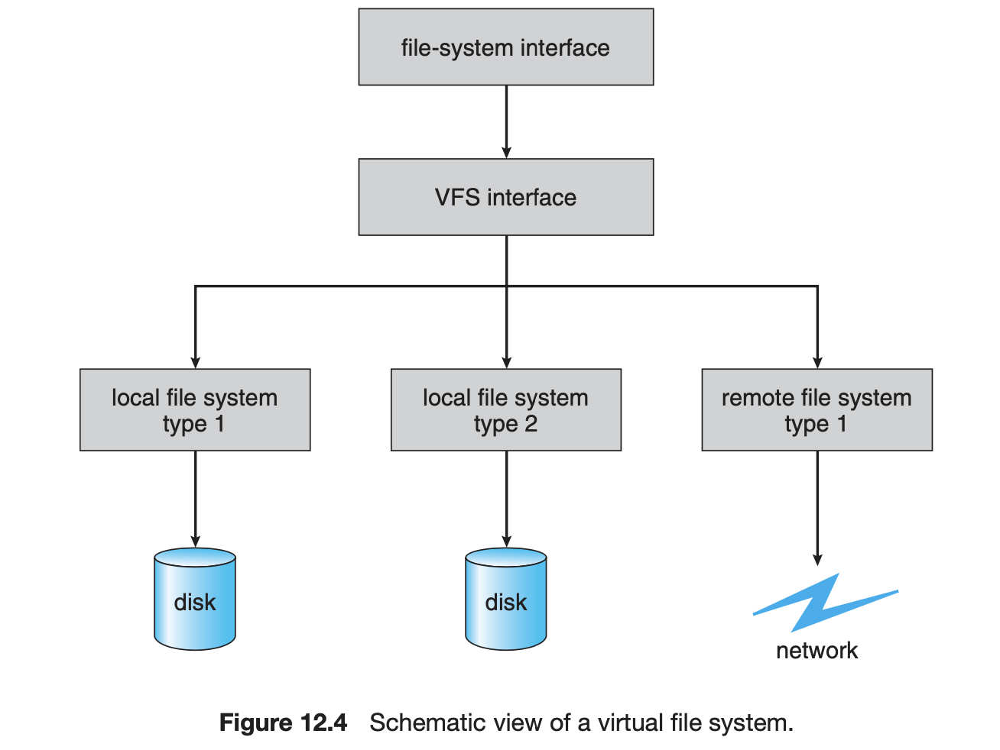
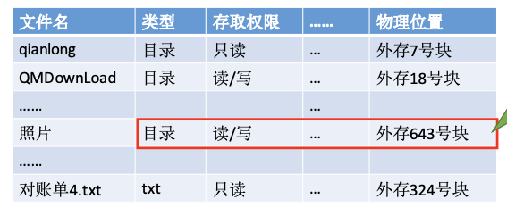

# File System

## 存储设备

### 磁盘（Magnetic Disk）

结构如图

#### 基本组成

- 磁道（track）；每个盘面有一个个圈，每个圈十一个磁道

- 磁盘：表面有一些磁性物质，可以用其来记录二进制数据

	- 分类

		- 根据盘片是否可以更换

			- 可换盘磁盘
			- 固定盘磁盘

		- 磁头是否可以移动

			- 活动磁盘
			- 固定磁盘

- 扇区（sector）：每个磁道（半径不一的圆环）被等分为不同的扇区

	- 每个扇区的容量是一样的，因此越靠里面的数据越密

- 柱面（cylinder）：同一磁臂位置的磁道集合

- 磁头

	- 活动头磁盘
	- 固定磁盘

- 磁臂（disk arm）：来回缩动带动磁头的位置

#### 磁盘的访问及性能

如果在磁盘中读写数据

- 把磁头移动到读/写的扇区所在的磁道（沿半径方向）

	- 根据柱面号

- 转动磁盘，读取所有的与磁头接触的盘面

	- 盘面的数量：
	- 从某一个盘面（由盘面号确定），划过的地方接触的由扇区号确定的扇区被读写

一次磁盘读/写时间为三段：

- 寻找（道）时间

  - 启动磁头臂时间s，一般为2ms

  - 移动磁头的时间：每跨过一个磁道的时间为m，总共为n道，现在m约为0.2ms
  
- 总时间为$s + m\times n$
-  延迟时间
	- 通过旋转磁盘，使得磁头定位到目标扇区所用的时间
	- 假设磁盘的转速为r(转/秒)，则平均延迟时间为$T_R = \frac{1}{2r}$
	- 1/r是转一圈的时间，平均转半圈
- 传输时间
	- 从磁盘读出或写入数据所用的时间
	- 设读写b个字节，每个磁道上的字节数为N，$T_t = \frac{b}{rN}$

- 显然这三段时间都只与硬件的参数有关，所以操作系统无法优化这些时间
- 案例：东芝MK3254GSY

#### 磁盘调度（disk scheduling）算法

作为系统调用的磁盘IO，要求的信息有：

- 操作使是I还是O？
- 磁盘地址是多少？
- 内存地址是多少？
- 要传输多少个扇区？

##### 先来先服务FCFS

- 根据进程请求磁盘的先后顺序进行调度
- 优点：如果请求访问的进程访问的
- 缺点：如果有大量进程金正使用磁盘，请求的的磁道分散，性能就会很差
- 图示

	- 

##### 最短寻找时间优先SSTF

- 优点处理离磁盘最近的磁道，可以保证每次寻道时间最短
- 缺点：可能产生饥饿

##### 扫描算法SCAN

- 只有磁头地洞到最外侧（不是最外的要求磁道）的时候才能往内移动，到最内才能往最外移动，也称为电梯算法
- 好处：性能还不错，不会有饥饿现象
- 缺点：对各个位置的磁道响应的频率不平均

##### 循环扫描算法C-SCAN

改变方向（最内侧或者最外侧）的时候直接从起点/终点开始

##### LOOK算法

上面的算法的改进，如果一个方向以后没有要访问的了，就改变方向

##### C-LOOK算法

##### 调度算法的选择

磁盘的服务请求很大程度上受文件的分配方法的影响

#### 磁盘管理

##### 磁盘格式化（formatting）

- 一块新如白板的磁盘需要做些什么才能开始存数据？

	- 1. 物理格式化（低级格式化） 

		- 将磁盘分为扇区以便控制器能对其进行读写
		- ECC

	- 2. 分区

		- 把磁盘分为一个由多个柱面组成的分区，每个分区可以作为一个独立的磁盘。例如说，一个分区用来存OS的可执行代码，一个分区用来存用户数据

	- 3. 逻辑格式化（创建文件系统）

		- OS把初始文件系统的数据结构（FAT or inode和一个初始为空的目录）写到磁盘上

- 簇（cluster）
- 生IO（raw I/O）

	- 将磁盘视为一个大数组（raw disk），而没有任何文件系统
	- 避开了所有的文件系统的服务：缓冲、文件锁、提前获取、空间分配、文件和目录
	- 应用：某些数据库系统

##### 引导块（boot block)

- 从按下电源的那一刻起，计算机如何启动？
- 自举（bootstrap）程序

	- 初始化CPU寄存器、设备控制器、内存、找到磁盘上的操作系统内核，将其装入内存，转到起始位置开始执行
	- 保存在ROM中（大部分情况），大部分系统将一个很小的自举程序放在ROM中，而将完整的自举程序放在磁盘中。完整的自举程序的启动位置是固定的

		- 拥有启动分区的磁盘称为启动磁盘（boot disk）或系统盘（system disk）

- 在装入设备驱动程序之前，ROM中的代码就会引导磁盘控制器将启动块读入内存并执行
- 例子：Windows

	- 图示

		- 

##### 坏块

- 典型的坏扇区事务逻辑	

#### 交换空间管理

#### RAID结构

#### 计算机访问磁盘存储的方式

- I/O端口，或称主机负数存储（host attached storage）

	- 典型的台式机使用I/O总线结构，如IDA和ATA
	- 其他结构

		- SATA
		- SCSI
		- FC

	- 存储设备

		- 磁盘驱动器、RAID阵列、CD、DVD

- 分布式文件系统的远程主机，或称网络附属存储（Network attached storage, NAS）

	- 
	- 存储区域网络（storage area network）

		- 图示

			- 

		- 服务器与存储单元之间的私有网络

### 闪存（Flash）

闪存是一种固态存储（solid state storage），它没有移动的部件，而用电路来储存数据；也因此相较于磁盘有更好的随机IO性能

#### 结构与原理

- 每个闪存存储单元是一个浮栅晶体管，它在电路上没有连接任何东西，而且被整个地包裹在绝缘体里头，所以可以几个月几年都保持着电荷。同时，可以通过电子隧道效应（在它旁边提供足够高的电压）充电或防电

	- a floating gate transistor

		- 

- 在单级闪存存储中，一个浮栅晶体管保存一位（充电或者没充），多级则保存多位。

#### 闪存的访问和性能

闪存的访问有三个操作

- Erase erasure block

	- 在写入之前，闪存内存需要以擦除块（128KB~512KB）为单位，把每个单元擦除成逻辑“1”。这个操作很慢，通常需要几微秒。这也是闪存名字的由来，因为类似照相机。

- Write page

	- 擦除之后，NAND Flash内存可以被一页一页写，页的大小为2KB~4KB，通常需要几十微秒

- Read page

	- 类似写页，也可以一页一页读，花的时间类似写页

关于FTL：

- 要写一页，它的整个擦除块要先被擦除，这是一个很有挑战的操作，因此闪存盘（flash drive）实现了FTL（flash translation layer）,把逻辑闪存页映射为物理页。
- 这样一来，当一个逻辑页被覆盖时，……

#### 耐用性

多次读写造成的问题

- 反复的刷新和写入会降解闪存内部的电路，在几百万次的程序擦除周期后单元可能就磨损了
- 同时，反复的读也可能造成周围单元的电荷被扰乱，也就是reading disturb error

应对方法：

- 错误纠正吗
- 坏页和坏擦除块的管理

	- 把坏了东西标出来不用了

- 磨损均衡（wear leveling）

	- 如上FTL所说，这种重新映射能够保证一个反复被覆盖的热页不会被过早的磨损，因为它不会被原地覆盖，而是写在由FTL给它映射的一个新的已经擦除过的页上

- 空闲页和擦除块

	- 空闲的这些东西可以给磨损均衡提供额外的空间，即使设备逻辑上是满的，这些空闲空间也可以使用
	- 在坏页和坏块出现的时候，可以在不让总容量缩水的情况下管理它们

#### 案例：Intel 710 Series 固态硬盘

## 文件的逻辑结构

### 无结构文件：有二进制流或字符流组成，无明显的逻辑结构

### 有结构文件

- 又称记录式文件。由记录组成，分为定长记录，可变长记录。每个记录有一个数据项作为关键字。
- 记录

	- 定长记录
	- 变长记录

- 逻辑结构

	- 顺序文件

		- 物理结构

			- 串结构（链式）

				- 顺序记录与关键字无关
				- 无论是变长/可变长记录，都无法实现随机存取

			- 顺序结构（顺序存储）

				- 记录之间的顺序按关键字顺序排列
				- 定长记录

					- 可实现随机存取
					- 可以快速找到某关机字对应的记录

				- 可变长记录

					- 无法实现随机存取，只能从头依次寻找，

				- 最大的缺点：不方便增加/删除 记录

	- 索引文件

		- 为逻辑文件建立一张索引表，每个记录对应一个表项。各记录不用保持顺序，方便增加/删除。
		- 图示
		- 索引表本身就是定长记录的顺序文件
		- 简而言之，这就是一个Hashtable
		- 优点

			- 解决了顺序文件不方便增/删记录的问题
			- 用于对信息处理及时性要求比较高的场合
			- 让不定长文件实现了随机存取

		- 缺点

			- 可能会占用很多空间

	- 索引顺序文件

		- 为顺序文件建立一张索引表，用一组记录对应一个索引表项

		  - 例子

		- 检索的效率分析

		  - 结论

		    - 要为N个记录的文件建立K级索引，最优的分组是每组下面个数个记录$N^{1/(k+1)}$
		    - 比如说，两级，就是1/2次方，平均查找次数为$\sqrt{N}$
		    - 检索一个记录的平均查找次数为$\frac{(k+1)N^{1/(k+1)}}{2}$
		  - 注意这里的平均搜索次数是长度的一半
		  - 检索记录时，先顺序查索引表，找到分组，再顺序查找分组
		  - 当记录过多时，采用多级多级索引表
		- 直接文件或散列文件

## 文件系统的实现

### 简介

- 文件名——目录——>文件数——索引结构——>存储块
- 空闲空间映射
- 局部性
- 实现的细节

### 文件系统的实现

#### 要素

- 可能包含的信息
- 引导控制块

	- 包含引导OS所需的信息，如果没有OS则为空，一般为卷的第一块。UFS称其为引导块，而NTFS称其为引导扇区
- 卷控制块

	- 包括该卷（或分区）的各种信息，UFS称之为超级块，NTFS称之为主控文件表

		- 分区的块数
		- 块的大小
		- 空闲块数量和指针
- 目录结构

	- UFS中，目录是一个文件名和索引节点（inode）号对应的表，NTFS则使用主控文件表（关系数据库结构）存这些信息
- FCB

	- 保存文件的详细信息，UFS称之为inode
- 
- 内存中的安装表

	- 包括所有安转卷的信息
- 目录结构缓存

	- 近来访问过的目录信息
- 系统范围的打开文件表

	- 每个打开文件的FCB副本和其他信息
- 单个进程的打开文件表

	- 包含指向上面表的某些条目的指针

#### 一个文件的创建、打开和关闭

- 打开

	- 
- open()返回一个指向单个进程打开文件表的条目的指针。至于打开文件表的索引，Unix称之为文件描述符，而Windows称之为句柄（file handler）
- 读取

	- 

#### 分区和挂载

- 一个磁盘可以划分为多个分区，引导程序可以保存在各个分区中。但由于引导时没有文件系统设备的驱动程序，引导信息是作为镜像文件读入内存，从第一个字节开始执行。
- 分区的种类

	- 生的（raw）
	- 熟的（cooked）

- 双引导

	- 引导程序除了加载操作系统外，还有其他指令
	- 一个启动加载器（boot loader）能够知道位于引导区的多个文件系统和操作系统，这些东西可以被分在不同的分区，然后被引导。

- 根分区（root partition）

	- 这个分区包含OS的内核和其他系统文件。随后OS会验证设备上的文件系统是否有效，然后在内存中的打开表中注明这个类型的文件系统已装入

- Windows

	- ……

- Unix可以将文件系统挂载到任何目录上，通过在目录inode上加一个标记注明这是挂载点实现。一个字段指向挂载表上一个条目，指明挂载的设备。而这个条目则包含一个指针，指向这个设备的文件系统的超级块

	- 这样操作系统可以在无需切换文件系统也能遍历它的目录

#### 虚拟文件系统（VFS）

- 操作系统如何把多个文件系统整合到一个目录下？例如，某个目录下同时有坚果云的目录和U盘的目录

	- 图示

		- 

- 文件系统将接口层：文件操作函数、文件描述符
- VFS接口层

	- 目的

		- 将通用操作和具体实现分开
		- VFS基于vnode的文件表示结构，这个结构包含网络上每一个文件的唯一的标识符。内核中为每个活动节点（文件或是目录）保存一个vnode

	- 因此VFS可以区分本地文件和远程文件

- 系统调用

	- 本地文件照常
	- 网络文件通过调用NFS协议程序，文件句柄可以从vnode中得到，并传递给程序

- Linux VFS

	- 4种主要对象

		- 索引节点对象

			- 一个单独的文件

		- 文件对象

			- 一个打开的文件

		- 超级块对象

			- 整个文件系统

		- 目录条对象

			- 单独的目录条目

### 文件目录：给数据名字

- 一个从文件名到文件号的映射
- 目录API

	- 写操作的函数无法直接用来操作目录，因为可能造成严重得多的后果（影响到其他的文件）
	- 对于读操作来说，没有什么问题
	- mkdir
	- link
	- unlink

- 实现映射：目录的内部结构

	- 链表
	- B+树

- 多重文件名：硬链接和软链接

	- 允许同一个文件有多个名字
	- 硬链接

		- 多个文件目录项指向同一个文件数
		- 为了方便实现垃圾收集，只要有硬链接链接在一个文件上，就不能把这个文件删除（引用计数不为0）

	- 软链接

		- 一个文件名到文件名的映射，作为文件目录项

### 文件：找到数据

文件的元数据（metadata）存在哪里？

显然，如果一股脑的全部存在文件目录里是不妥当的

各种文件系统的文件设计如下：

#### FAT(Microsoft File Allocation Table)：链表

- 索引结构

	- 图示

		- 

- FAT是一张文件分配表，每个文件对应着一个FAT条目中的一个链表，每个FAT条目含有一个指向另一个FAT条目的指针，或是一个“end of file”的特殊值。每个文件在FAT中有一个入口值。这些条目的编号就是文件所包含块的编号。
- FAT的缺点

	- 局部性垃圾
	- 随机访问垃圾
	- 元数据和访问控制数据有限
	- 不支持硬链接

		- 因为文件数据存在目录条目里，导致每个文件都只能从唯一的目录条目中访问

#### FFS(Unix Fast File System)

- 索引结构：多级索引（multi-level index），每个文件的树（一颗固定大小的树）被保存在文件的inode里

	- 图示

		- 

- 访问控制

	- 用户
	- 操作

- 特点

	- 高出度

		- 使用高出度的节点可以减少在树中搜索的时间

	- 树结构
	- 固定结构
	- 反对称

- 稀疏文件
- 空闲空间管理：位图
- 局部性

	- Block group placement

		- 图示

			- 

	- 预留空间reserved space

#### NTFS(Microsoft New Technology File System)

索引结构：可变树 

#### COW(copy-on-write) File System

### 效率与性能

### 恢复

### 日志结构文件系统

### 文件的实现：文件的物理结构

- 文件块和物理块

	- 类似内存分页，磁盘中的存储单元被分为块/磁盘块/物理块
	- 联系分页

		- 因此，文件的逻辑地址空间被分为一个个块
		- 文件的逻辑地址：（逻辑块号，块内地址）

- 目录的实现

	- 实现方法

		- 线性列表
		- 哈希表

- 文件物理块存放方式

	- 连续分配

		- 含义：每个文件在磁盘上占有一组连续的块
		- 地址翻译

			- 物理块号 = 起始块号 + 逻辑块号

				- 

			- 检查：逻辑块号 >= 长度时，逻辑块号不合法

		- 支持

			- 顺序访问
			- 直接访问（随机访问）

		- 读写速度

			- 连续分配的文件在顺序读/写时速度最快：因为读取某个磁块时，需要移动磁头，磁盘块相距越远，移动磁头就要花越多的时间

		- 缺点

			- 不方便拓展：无论增删，都需要移动所有其他的文件的位置
			- 因此，物理上采用磁盘分配，会产生难以利用的磁盘碎片

				- 可以通过紧凑来处理

	- 链接分配

		- 隐式链接

			- 实现：除了最后一个文件的磁盘块，其他所有的磁盘块都包含指向下一个磁盘块的指针
			- 支持

				- 顺序访问

					- 不支持随机访问
					- 查找的效率低
					- 少量的空间消耗：指针域

				- 方便拓展
				- 不会有碎片问题：因此外存的利用率高

		- 显示链接

			- 实现

				- 目录中仅仅记录文件的起始块号

					- 图示

				- FAT（File Allocation Table）每一个文件的每一个块的下一块显式地存放在这张表中。

					- 图示
					- 开机时，FAT被读入内存，并常驻内存

			- 支持

				- 顺序访问
				- 随机访问：显然，每个块想访问就访问，这个块的下个块也可以直接访问

			- 优点

				- 不会产生外部碎片
				- 拓展文件很方便

			- 缺点

				- FAT整张表都需要被放在内存中，很占空间

	- 索引分配/inode

		- 实现

			- 为每个文件建立一张索引表，这张索引表记录每个逻辑块对应的物理块号
			- 索引块：存放索引表的块
			- 数据块：存放文件数据的块

		- 动机：一个磁盘块存放能存放的索引表项是有限的，因此文件的大小也是有限的，如何解决？
		- 链接方案

			- 实现

				- 把多个索引块链接起来存放

			- 图示

				- 

			- 缺陷

				- 如果要找到下一个索引块对应那些块，需要把前一个索引表遍历完

		- 多层索引

			- 图示

				- 

			- 实现

				- 每一个上级索引表的表项指向下一级的索引表

			- 访存次数：如果顶级索引表未调入内存，k层索引结构读取一个数据块需要k+1次读磁盘操作

		- 混合索引

			- 动机
			- Subtopic 2

- 文件存储的空闲空间的管理

	- 存储空间的划分初始化

		- 文件卷：例如，C盘，D盘，E盘
		- 目录区与文件区：每个文件卷被分为这两个区

			- 目录区：存放文件目录信息（FCB）和磁盘管理信息

		- 此外

			- 在支持超大型文件的系统，可以由多个物理磁盘组成一个文件卷

	- 空闲表法

		- 记录每个空闲快的启示位置和长度
		- 使用哪个空闲块

			- 首次适应
			- 最坏适应
			- 最佳适应

		- 适用于连续分配
		- 如何回收磁盘块（三种情况）

	- 空闲链表法

		- 空闲盘块链

			- 以盘块为单位组成一条空闲链
			- 分配

				- 从链头开始取k个盘块分配

			- 回收

				- 回收的盘块依次挂到链尾，并修改空闲指针

		- 空闲盘区链

			- 以盘区为单位组成一条空闲链，盘区的第一个盘块记录盘区的长度和下一个盘区的指针
			- 盘区：被非空闲块分隔开的一堆盘块
			- 图示

				- 

			- 操作系统保存链头和链尾的指针

				- 

			- 分配

				- 如果找不到大小为k个的连续的盘区，可以把不同的盘区分配

			- 回收
			- 由于这种算法可以一次分配多个盘块，效率相对上面那个要更高

	- 位示图法

		- 连续和离散分配都适用
		- 用一个二维数组储存所有的块是否空闲的信息（一个二进制位）
		- 注意

			- 下标是从1开始还是从0开始
			- 行号和列号的确定，有时从给出的数据就直接得到，不要自己想着转化成总容量再去推算

	- 成组链接法

		- 简介

			- Unix采用的策略，适合大型文件系统。

## 文件系统的接口

### 文件系统的层次结构

- 用户应用程序

	- 用户接口
	- 文件目录系统
	- 存取控制模块
	- 逻辑文件系统和文件信息缓冲区
	- 物理文件系统
	- 设备管理模块

		- 设备

	- 辅助分配模块

### 文件和文件的接口

- 文件的定义
- 文件的属性

	- 文件名
	- 标识符
	- 类型
	- 位置
	- 大小
	- 保护信息

- 文件的操作

	- 创建

		- 1.在文件系统中找到空间
		- 2.在目录中为文件创立表项

	- 写文件
	- 读文件
	- 文件重定位
	- 阶段文件
	- 打开文件

		- 实际上是一个open函数的系统调用

			- open()所需的参数

				- 文件路径
				- 文件名
				- 操作类型

		- 打开文件的过程

			- 根据文件路径找到对应的目录，从目录中找到相应的目录项
			- 检查用户是否有相应的操作权限
			- 将目录项复制到内存中的打开文件表中，并返回对应表目的编号个用户
			- 用户接下来使用这个编号来指明要操作的文件

		- 每个用户有一张打开文件表
		- 系统有一张打开文件表

			- 其中也有打开的文件的表项
			- 这个打开的文件中有一个打开计数器属性

		- 打开文件的信息

			- 文件指针
			- 文件打开计数器
			- 文件磁盘位置
			- 访问权限

	- 关闭文件

- 文件的类型

	- 类型表格

		- 可执行文件

			- 子主题 1
			- 子主题 2

		- 目标文件
		- 源文件
		- 批处理文件
		- 文本文件
		- 文字处理文件
		- 库文件
		- 打印或视图文件
		- 档案文件
		- 多媒体文件

- 文件的结构

### 访问文件的方法

- 顺序访问
- 直接访问
- 其他访问方式

### 文件目录

- 文件控制块（FCB）

	- 图示

		- 

	- FCB的有序集合成为文件目录，一个FCB就是一个文件目录项，每一个目录项对应着一个文件
	- FCB包含的信息

		- 基本信息

			- 文件名
			- 物理地址
			- 逻辑结构
			- 物理结构

		- 使用信息

			- 建立时间
			- 修改时间

	- 由FCB实现的目录的操作

		- 搜索
		- 创建文件：新建目录项
		- 删除文件：删除目录项
		- 显示目录
		- 修改目录

- 目录结构

	- 单级目录结构

		- 整个系统中只有一张目录表
		- 缺点

			- 不允许文件重名
			- 不支持多用户操作系统

	- 两级目录结构

		- 在一张表中包含每个用户，然后每个用户设置一张表

			- 于是现在允许对不同的用户有不同的文件命名了

		- 两级

			- 主文件目录（MFD, Master File Directory）：记录用户名和用户文件目录存放点位置
			- 用户文件目录（UFD, User File Directory）

				- 由用户文件的FCB组成
				- 因为对于每个用户有不同的表，访问控制就容易实现了

	- 多及目录结构（树形目录结构）

		- 图示
		- 当前目录的设置

			- 如果不设置的话，每次查询/打开一个偏下方的目录都需要从顶层开始寻找，设置当前目录的话就可以使用相对路径来找了

		- 每次打开一个页表都要访问一次内存
		- 缺点：不方便文件的共享
		- 优点：文件的管理和保护方便

	- 无环图目录结构

		- 为每个共享节点设置一个共享计数器，记录有多少个地方在共享这个节点

			- 如果用户提出删除文件，只是删除对应的FCB，并让共享计数器减1
			- 只有共享计数减为0时，才删除这个节点

		- 于是此时形成一个有向无环图
		- 图示

			- 

- 索引节点（对文件控制的优化）

	- 动机

		- FCB的这张表上实在是包含了很多暂时用不到的信息。大多数时候，我们只是要找到一个目录中的一个文件，而这个目录由于包含了很多其他文件的信息而显得庞大无比，所以
		- 考虑把文件的其他无关索引的信息分离出来，只有需要的时候才用到，也就是形成一个索引节点指针，放在FCB中
		- 这样的话，由于减小了目录的大小，也就酱烧了I/O的次数，提升了检索速度

	- 图示

		- 改进前
		- 改进后

	- 状态

		- 磁盘索引节点：放在外存中
		- 内存索引节点：放入内存

### 文件系统的挂载（mounting）

### 文件共享

- 概述

	- 如果共享的是一份文件
	- 如果是复制了多份相同的文件

- （两种）实现

	- 基于索引节点（硬链接）

		- 不同用户的目录项指向同一个索引节点

			- 图示

		- 删除

			- 删除一个用户的文件：删除目录项，count--
			- 如果count值为0，那么物理上删除这个文件

	- 基于符号链的共享方式（软链接）

		- 解释

			- 索引节点指向一个Link型的文件，其保存了要共享的文件的路径，类似于windows的快捷方式
			- 如果要访问这个文件，则需要先从这个文件提供的路径一层一层目录来找，也就是导致多次磁盘I/O

		- 如果原本的文件的物理文件已被删除，那么就无法找到共享文件了

- 远程文件系统
- 一致性语义

### 文件保护

- 口令保护

	- 一般需要存在FCB中的口令进行验证
	- 缺点

		- 口令文件存在系统内部，不安全

- 加密保护

	- 用密码加密，保存的是加密之后的数据

- 访问控制

	- 在每个文件的FCB（或者索引节点）中增加一个访问控制表（Access-Control List, ACL）记录用户可以对文件执行哪些操作

		- 图示

	- 访问类型

		- 读
		- 写
		- 执行
		- 添加
		- 删除
		- 列表清单

	- 精简的访问控制表：用户组，然后给每个组说明语允许的操作

