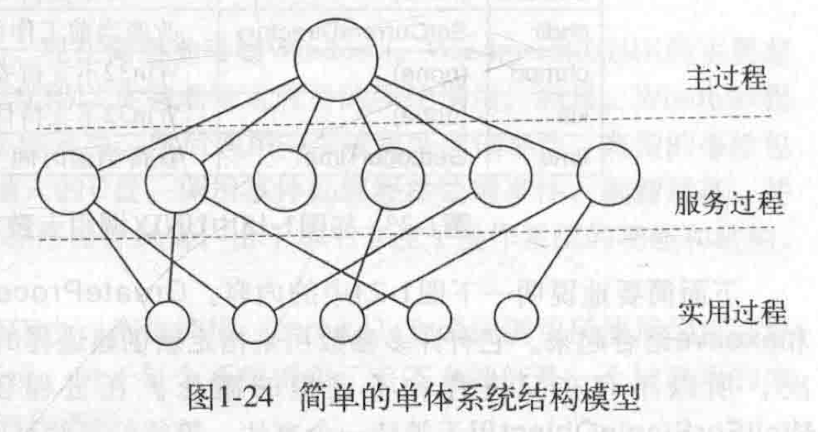
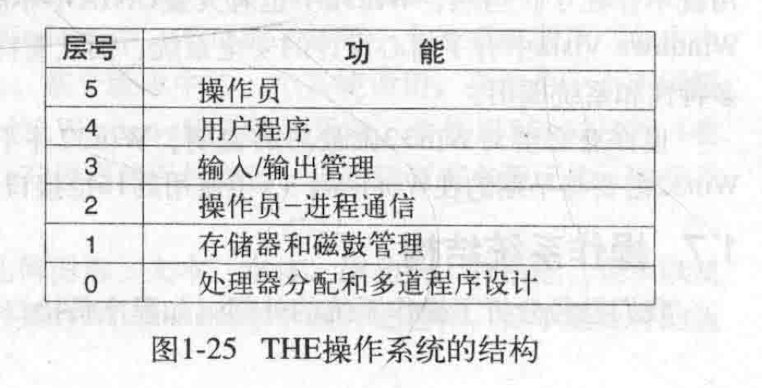
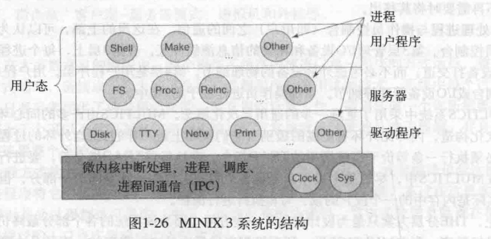
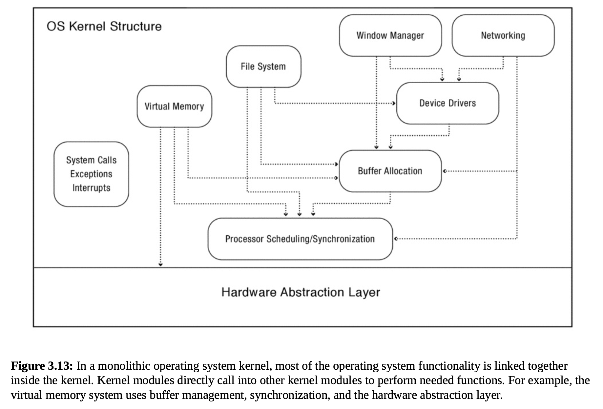

# Operating System

## Structure of Operating System

### 单体系统

- 把操作系统编译成一个大的二进制文件，作为一个应用程序来执行
- 结构模型

	- 图示

		- 

	- 主程序用来处理服务请求
	- 服务过程执行系统调用
	- 实用过程辅助系统调用

- 可装载的拓展

	- 例如I/O设备驱动和文件系统
	- 在Unix中称为共享库，Windows中称为动态链接库（dynamic link library）

### 层次式系统

- 图示

	- 

- 子主题 2

### 微内核（microkernel）

- 动机：如果操作系统作为一个整体运行，一些小的错误必然会对整体产生不小的麻烦
- 把OS划分成小的模块，只有其中一个模块，也就是微内核，运行在内核态。而其余的模块则运行在用户态。
- 例如MINX

	- 图示

		- 

### 宏内核（monolithic kernel）

- 图示

	- 

- 绝大多数商用OS都是此类结构，如Linux，Windos，MacOS
- 大多数功能都运行在内核里，也就是运行在内核模式
- 硬件抽象层（HAL）

	- 便携性对于操作系统来说是十分重要的，也就是说对于不同的硬件平台，例如x86或者ARM，OS需要一些与硬件特性相关的代码

- 动态安装的设备驱动（Dynamic Installed Device Driver）

	- OS中70%都是设备驱动代码
	- 动态加载的设备驱动

### 客户端-服务机模式

- 这是微内核思想的变体，将进程划分为服务器（提供服务）和客户端（使用服务）
- 通信：使用消息传递

### 虚拟机

### 外核（exokernel）

## 系统调用

### 类型

- 进程控制
- 文件管理
- 设备管理
- 信息维护
- 通信

## Booting an OS kernel

## Booting an OS kernel

### 在绝大部分x86 PC上，OS启动程序被称为BIOS（basic input output system）

### 不能将整个内核全部放在ROM中，因为这导致OS在更新的时候非常危险，如果此时发生错误，机器可能就永远无法使用了

## Virtual Machines

### 图示

- 

## Hardware Support for OS

### 特权等级（privilege levels）

- 用户和内核模式

### 特权指令

### 内存翻译

### 处理器异常

### 计时器异常

### 设备中断

### 处理器内部中断

### Interrupt making

### 系统调用

### 中断返回

### 启动ROM

### 原子读改写指令（atomic read-modify-write instruction）

## 分支主题 6

## What is an operating system?

## History of Operating System

## 内核的抽象

## 编程接口

