# I/O系统

## I/O控制器

实现I/O设备机械部件和CPU之间的中介，实现CPU对IO设备的控制，又称设备控制器

### 功能

- 接受和识别CPU发出的命令：控制寄存器

- 向CPU报告设备的状态：状态寄存器

- 数据交换：数据寄存器

- 地址识别：由I/O逻辑实现

### 组成

- CPU和控制器的接口

	- 包含

		- 数据寄存器
		- 控制寄存器
		- 状态寄存器

- I/O逻辑

	- 作用：识别CPU发出的命令，并向设备发出命令

- 控制机器与设备的接口

	- 传输
	- 一个I/O控制器可能对应多个设备

- 地址

	- 内存映像I/O

	- 寄存器独立编址

### I/O的构成

- I/O设备的机械部件
- I/O设备的电子部件

## I/O硬件

### I/O硬件原理

- I/O设备
- I/O设备控制器
- 内存映射I/O
- I/O设备的基本概念和分类

	- 什么是I/O设备

		- 用来输入或者输出数据的外部设备，Unix将其抽象为文件，所以用户可以用于文件相同的方式对外部设备进行操作

	- 按使用特性分类

		- 人机交互类外部设备：比如鼠标、键盘、打印机，速度较慢
		- 存储设备：移动硬盘、光盘，数据传输速度较快
		- 网络通信设备：调制调节器，速度介于二者之间

	- 按传输速率分类

		- 低速设备
		- 中速设备
		- 高速设备 

	- 按信息交换的单位分类

		- 块设备（传输快、可寻址，可以随机地读写任意一块），比如移动硬盘

			- 蓝光光盘
			- USB盘

		- 字符串设备（传输慢、不可寻址、中断驱动），鼠标、键盘，数据传输的基本单位是字符

- 重温中断

	- 图示

		- 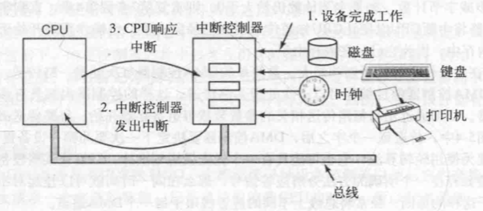

	- 基本步骤

		- 1.I/O设备执行I/O
		- 2.I/O设备完成I/O
		- 3.中断控制器发生中断
		- 4.CPU响应中断，执行中断服务程序

	- 中断的基本步骤

		- 1.保存没有被中断硬件报错的所有寄存器
		- 2.为中断服务过程设置上下文，可能包括设置TLB，MMU和页表
		- 3.为中断服务过程设置堆栈
		- 4.应答中断控制器，如果不存在集中的中断控制器，则再次放开中断
		- 5.将寄存器从它们被保存的地方（可能是某个堆栈）复制到进程表中
		- 6.运行中断服务程序，从发出中断的设备控制器的寄存器中提取信息
		- 7.选择下一次运行哪个进程，如果中断导致某个被阻塞的高优先级进程变为就绪，则可能选择它现在运行
		- 8.为下一次要运行的进程设置MMU上下文，也许还要设置某个TLB
		- 9.装入新进程的寄存器，包括其PSW
		- 10.开始运行新进程

			- 子主题 1

	- 多个中断

### I/O控制方式

- 背景

  - IO设备的速度比CPU慢很多
- 四种

#### 程序直接控制方式

#### 直接驱动方式

#### 中断控制方式

- 过程简介

  - 在CPU发出读写命令之后，将等待I/O的进程阻塞，切换到别的进程执行
  - 等待I/O完成之后，I/O控制器向处理器发送一个中断信号
  - 这个信号被CPU检测到之后，保存当前进程的运行环境信息，去处理这个中断处理程序处理中断
  - 处理中断的过程中，CPU从I/O控制器中读取一个字传入CPU寄存器，把这个字写入主存
  - CPU恢复等待I/O的其他进程的环境，继续执行
- 流程图示

  - 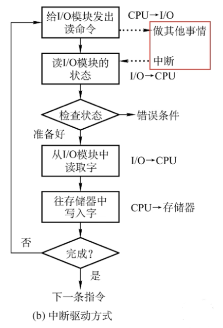
- 特点

  - 数据传送的单位：每次只能读写一个字
  - 并行：引入中断之后，I/O设备和CPU是并行工作的，CPU利用率提升，但是中断处理会消耗很多时间
  - 数据流向

    - 读：I/O设备-->CPU-->内存
    - 写：内存-->CPU-->I/O设备

#### DMA方式

- 解释

	- Direct Memory Access，数据传输的单位是块，直接访问内存，不需要经过CPU，仅在一个或多个数据块开始传送开始或者结束还是才需要CPU干预
	- 过程：在中断控制方式的基础上修改读写的单位和相关的命令的部分

- DMA控制器的结构

	- DR(Data Register)

		- 暂存设备和内存之间的数据

	- MAR(Memory Address Register)

		- 内存地址寄存器表示输入或输出是数据的位置

	- DC(Data Counter)

		- 数据计数器表示剩余的要读/写的字节数

	- CR(Command Register)

		- 命令/状态寄存器，用于存放CPU发来的I/O命令，或设备的转态信息

- 特点

	- 也是以字节为单位读写的，但是会把读到的字节先放在DR中，直到读完一个块再发送
	- 每次读写的必须是连续的块，而且这些块读入内存后也是连续的
	- 数据传输的效率进一步提升，并行性提高
	- 缺点：只能读写连续的块，离散不行

- 通道控制方式

  - 解释

  	- 一种弱化版的CPU（硬件），可以识别一系列通道指令，这些指令放在内存当中

  - 特点

  	- 数据传输的单位为数据块
  	- 数据流向：直接在I/O设备和内存之间流动
  	- CPU干预的频率很低

## I/O软件层次结构

### 用户

#### 用户层软件

- 实现了与用户交互的接口
- 系统调用将用户请求翻译成格式化的I/O请求，通过其请求内核的服务
- 假脱机技术（SPOOLing）

	- 脱机技术

		- 简介

			- 由于CPU的速度比I/O设备的速度要快很多，所以要花很多时间等待I/O设备
			- 此时在批处理阶段引入一个更快速的中介，有外围控制机把慢速的输入设备的数据传输到更快速的设备上
			- 输出时类似

	- 结构

		- Subtopic 1
		- Subtopic 2

	- 解释

		- 用输入/输出进程模拟外围/

	- 举例：独占式打印机改造成共享打印机

### 设备独立性软件

- 实现与设备的硬件特性无关的功能，也称设备无关性软件
- I/O调度：用某种算法确定一个好的顺序来处理各个I/O请求
- 实现设备的保护：由于设备可以被视为文件，等同于文件保护
- 差错处理
- 设备的分配和回收（很多设备都是一种临界资源）

  - 设备分配时考虑的因素

  	- 设备的固有属性

  		- 独占设备
  		- 共享设备
  		- 虚拟设备

  	- 设备分配算法

  		- 先来先服务
  		- 短任务优先
  		- .....

  	- 设备分配中的安全性

  		- 安全分配方式：为进程分配一个设备后就将其阻塞，完成I/O后才将其唤醒

  			- 优点：破坏了请求和保持条件，不会死锁
  			- 缺点对于一个进程来说，CPU和I/O只能串行工作

  		- 不安全分配方式：进程发出I/O请求后，为其分配I/O设备，然后继续执行，只有I/O请求得不到满足时才将其阻塞

  			- 优点：一个进程可以同时使用多个设备
  			- 缺点：可能导致死锁，但是可以采用其他算法（比如银行家算法）来避免死锁

#### 静态分配与动态分配

- 静态分配：进程运行前为其分配全部所需的资源，运行结束后归还资源
- 动态分配：进程运行过程中动态申请设备资源

#### 设备分配管理中的数据结构

- 通道：一个通道可以控制多个控制器，一个控制器可以控制多个设备（树形）
- 设备控制表CDT

	- 系统给每个设备配置一张CDT，用于记录设备情况
	- 字段

		- 设备类型
		- 设备标识符
		- 设备状态
		- 指向COCT的指针
		- 等待队列的指针

- 设备控制器表COCT

	- 字段

		- 状态
		- 指向CHCT的指针
		- 等待队列指针

- 通道控制表CHCT

	- 字段

		- 状态
		- 指向CHCT的指针

- 系统设备表SDT

	- 记录兄台你中全部的设别的情况，每个设备对应一个表目
	- 关键

		- 设备类型
		- 标识符
		- DCT
		- 驱动程序入口

#### 层次结构关系

#### 设备分配的步骤

- 1.根据进程请求的物理设备名查找SDT
- 2.根据SDT找到DCT
- 3.根据DCT找到COCT并分配控制器
- 4.根据COCT找到CHCT

#### 设备分配步骤的改进算法

- 上述步骤的缺点
- 改进算法

#### 建立逻辑设备名到物理设备名的物理映射关系

- 通过逻辑设备表（Logical Unit Table）在两种名称中转换，并找到相应的驱动程序
- 图示

	- 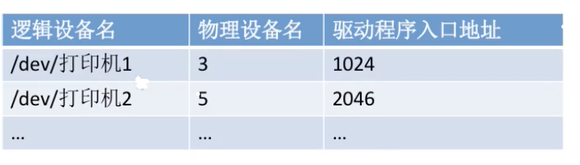

- 管理方式

	- 整个系统设置一张LUT：只适用于单用户
	- 每个用户设置一张LUT

#### 设备驱动程序

负责对硬件设备的具体控制，将上层的一些列命令（read/write）转化为特定设备能理解的一系列操作

#### 中断处理程序

- I/O任务完成后，I/O控制器发送一个中断信号，系统根据中断信号的类型找到相应的中断处理程序并执行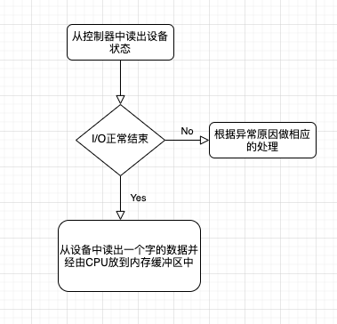

#### 硬件

- 执行I/O操作
- 由于不同I/O设备的一年特性不一样，需要使用厂家提供的驱动程序

## I/O软件原理

### I/O软件目标

- 设备独立性

	- 程序在输入或者输出的时候不需要为特定的设备做出修改，

- 统一命名
- 错误处理
- 同步传输（阻塞）和异步传输（中断驱动）
- 缓冲

	- 数据离开一个设备之后不能直接存放在目的地，必须先放到缓冲区

- 共享/独占设备

## I/O应用接口

### 如何使得I/O设备可以以统一的方式对待？

- 设备间的差异

	- 图示

		- 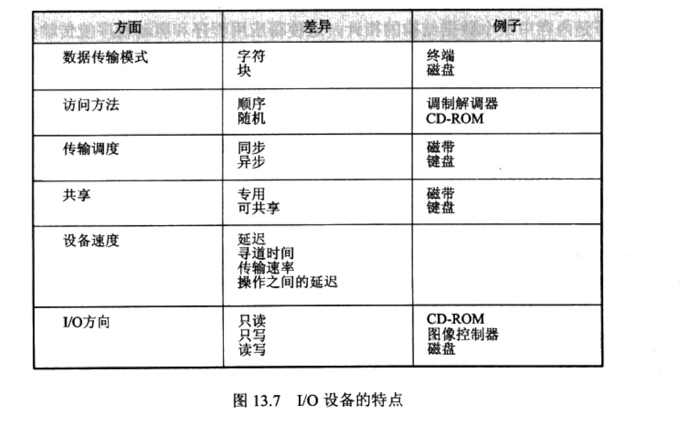

- 解决方案包括：抽象、封装、软件分层
- 从不同的I/O设备中抽象出通用的类型，每个类型可以通过一个标准的的接口访问（一组函数）
- 设备间的差别被内核模块，或称设备驱动程序封装

	- 图示

		- 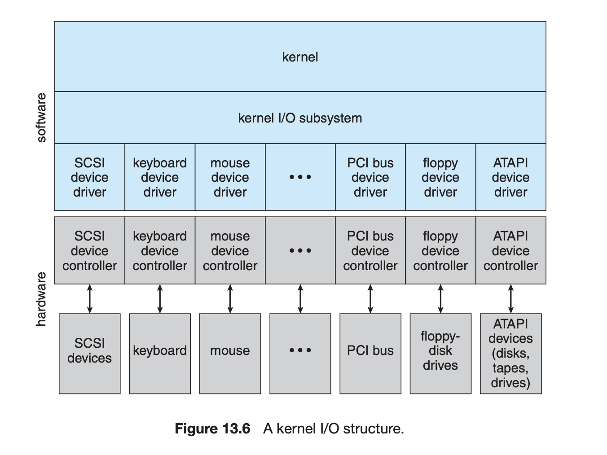

- 后门（escape, or back door）

	- 将任何命令透明地传到设备控制器，如unix的ioctl()

### 块设备

- 例如磁盘、磁带、CD-ROM
- 按块访问数据
- 命令包括open()，read()，write()，seek()
- 使用原生I/O或文件系统

	- 例如说，如果应用程序提供自己的缓冲和锁，那么此时文件系统的缓冲和锁就显得不必要了，甚至可能造成冲突。在Unix中，禁止缓存和加锁的I/O模式称为直接I/O（direct I/O）
	- 内存映射文件的访问

		- 这个映射操作的系统调用返回一个字节数组的虚拟内存地址，这个数组便是文件的一个副本，传输满足了请求按页分配，比较高效

### 字符设备

- 例如键盘、鼠标、串行端口（serial port）、一些USB设备
- 一次一个字符
- 命令包括get()，put()

### 网络设备

- 例如以太网、无线、蓝牙
- 与块设备和字符设备不同，有自己的接口：socket

	- 把网络协议和网络操作分开了
	- 包括select()功能

- 用途：管道、FIFOs，流，队列，邮箱

### 时钟与定时器

- 硬件时钟提供的三个基本函数

	- 获取当前时间
	- 获取已经逝去的时间
	- 设置定时器，在时间T触发操作X

- 可编程间隔定时器（programmable interval timer）

	- 设置为等待一定时间，然后触发中断，也可以产生周期性中断
	- 调度程序（scheduler）可以使用这种机制产生中断，然后抢占时间片用完的进程
	- 磁盘I/O子系统用它来定期清理已经改变的缓冲区
	- 网络子系统用它来取消一些阻塞太久的操作
	- OS为用户程序停供的定时器：OS通过模拟时钟，可以支持更多个数量的定时器，为此内核（或定时器驱动程序）需要按时间先后维护一个中断请求表

## I/O模型

### 阻塞I/O

- 暂停运行，也不去干别的，就等I/O完成
- 应用程序发出阻塞的系统调用时，其执行将被挂起，被OS移动到等待队列里。待系统调用完成后，再回到运行队列，在适当的时候收到系统调用返回的值
- I/O设别通常是异步的，所以这个时间通常不可估计
- 绝大部分系统为应用程序接口使用阻塞的系统调用
- 图示

	- 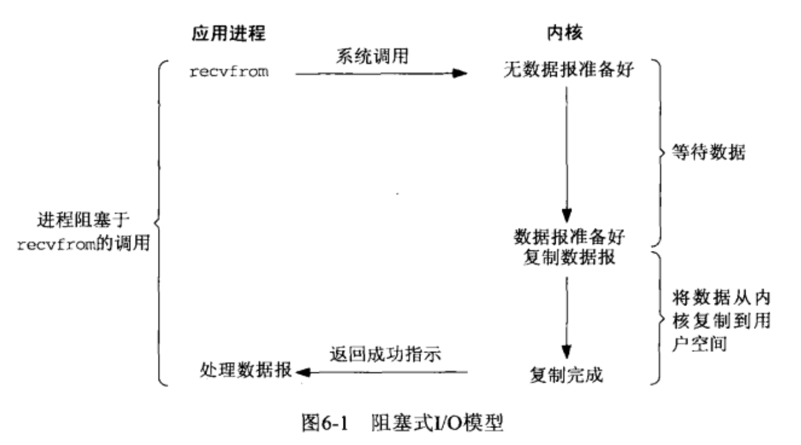

### 非阻塞（nonblocking）I/O

- 运行不会暂停
- 例如，用户接口在接收键盘和鼠标输入的同时，还要再显示器上显示数据。也就是说，执行I/O的同时不会被挂起
- 图示

	- 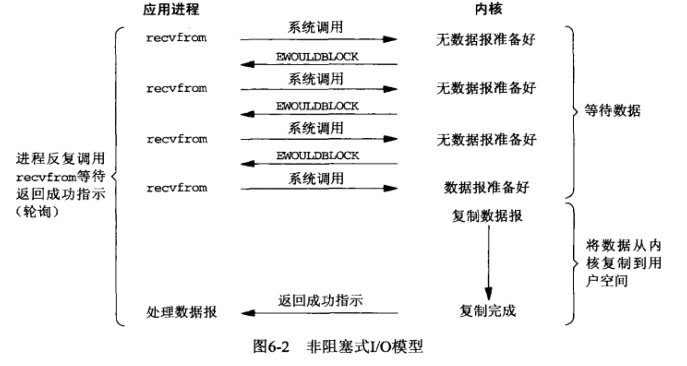

### 重叠I/O执行

### 异步（asynchronous）系统调用

- 继续执行，等I/O完成了再通知
- 通知方式

	- 变量
	- 信号
	- 软件中断
	- 执行流程之外的回调函数
- 同非阻塞I/O的差别（以read()为例）

	- 非阻塞I/O的read()读到数据就返回，所以它得到的数据可能是0，等于或少于所要求的数据
	- 异步I/O的read()的数据传输是完整的，但是是在将来的特定时间执行的
	- 图示

		- 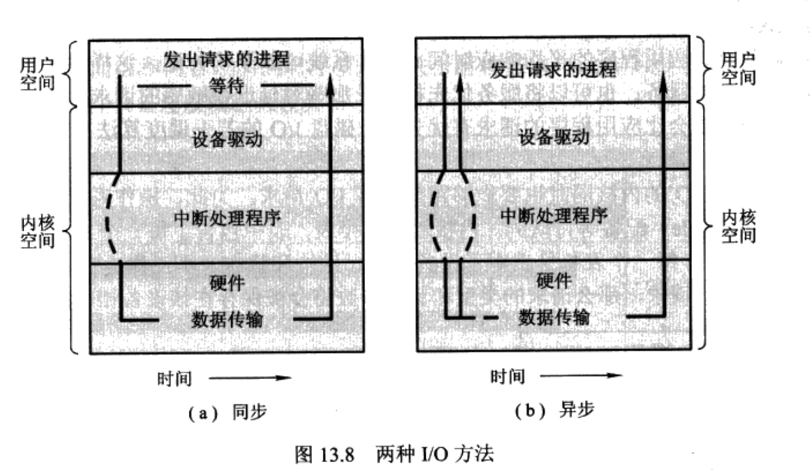

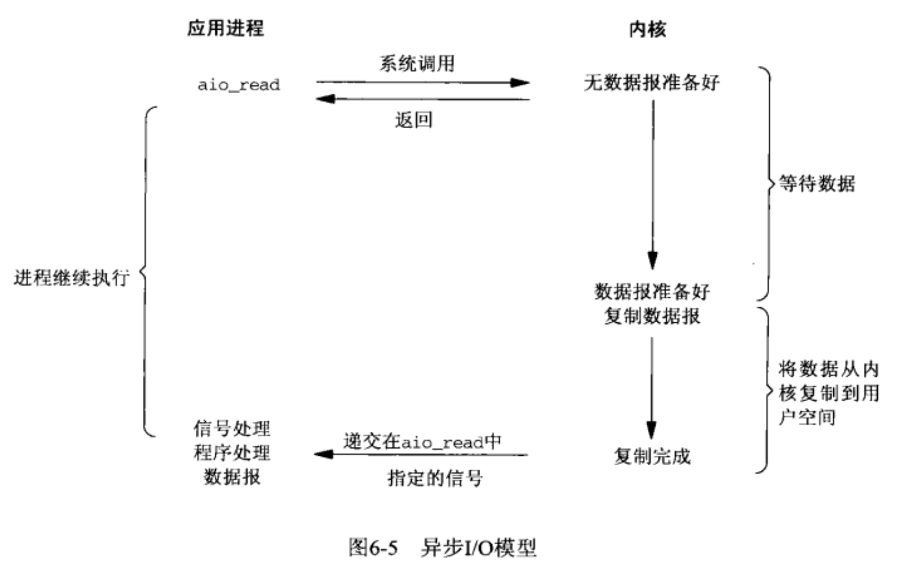

### I/O多路复用（multiplexing）

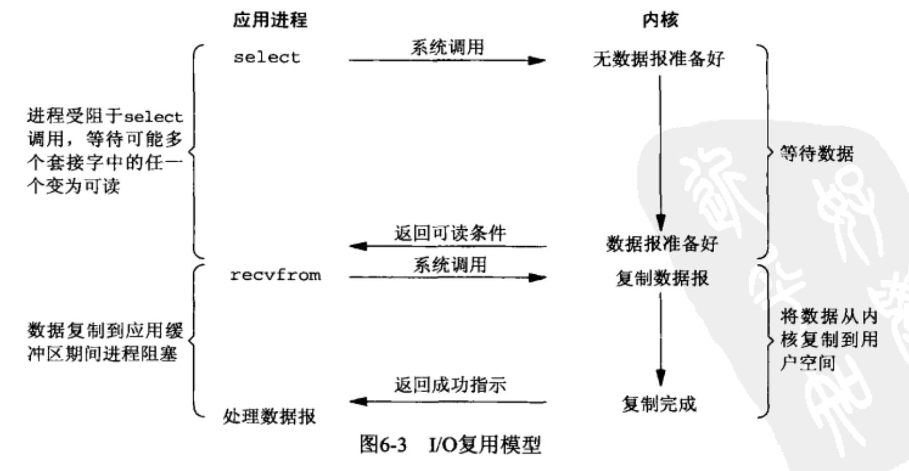

### 信号驱动式I/O

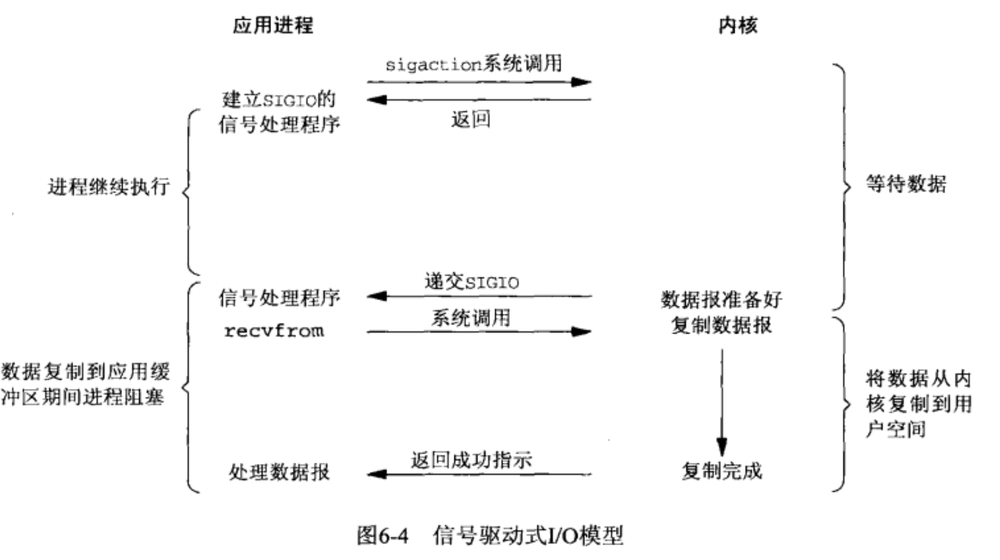

### Vectored I/O

## 内核I/O子系统

### I/O调度

- 对于支持异步I/O的内核来说，它需要跟踪许多I/O请求，因此它需要维护一个设备状态表
- 设备状态表（device status table）

	- I/O调度程序通过重新排布这个表来提高I/O效率，例如说对于某些调用，应当给予其更高的优先权
	- 图示

		- 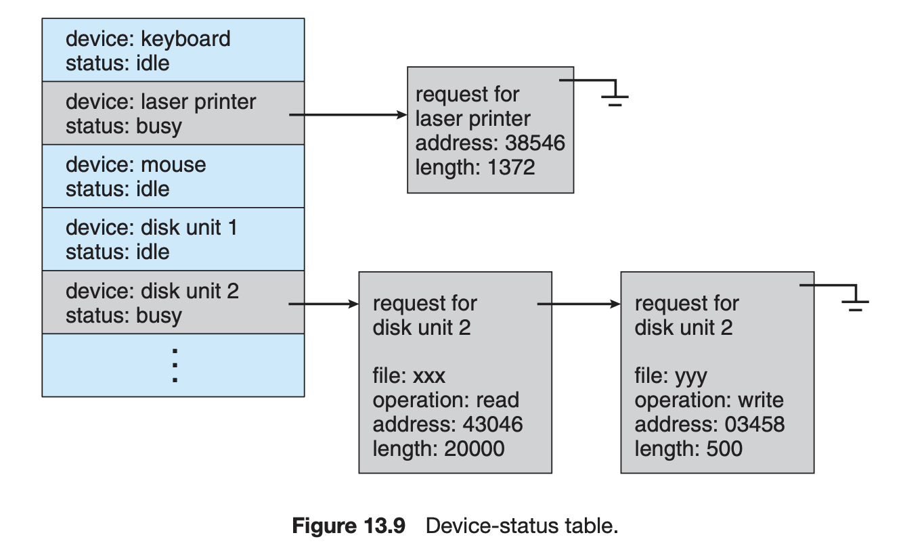

### 缓冲（buffering）

- （1）处理数据流的生产者和消费者的速度差异

	- 例如说，调制调解器的速度比硬盘写入的速度慢很多。如果使用一个缓冲区，等调制调解器生产了很多数据之后再一次写入硬盘，效率就会跟高
	- 双缓冲区：这里的缓冲区并不能对其进行同时的读和写。所以需要两个缓冲区
	- 差异图示

		- 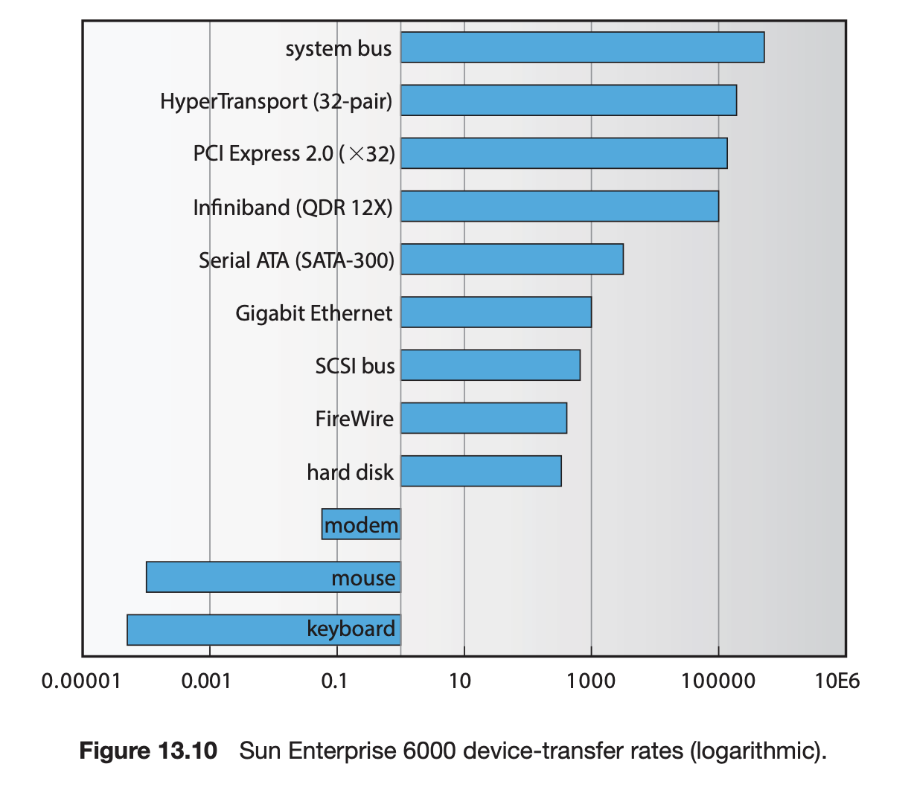

- （2）协调传输数据大小不一致的设备

	- 常见于计算机网络中，缓冲用于处理消息的分段和分组，一个大的报文在发送端被分组，而在接收端被重组

- （3）支持应用程序I/O的复制语义

### 高速缓存（caching）

- 一块内存区域既可以用于缓冲，也可用于高速缓存，用作cache时，可以用来改善对某些反复被读写的文件的效率。当内核收到I/O请求时，先检查这个文件是否在cache中

### 假脱机（spooling）与设备预留

- 当多个应用程序想输出数据到打印机上打印时怎么办？
- 把应用程序的输出写到一个磁盘的文件上，并对这些文件进行排队。

### 错误处理

### I/O保护

### 内核数据结构

- 图示

	- 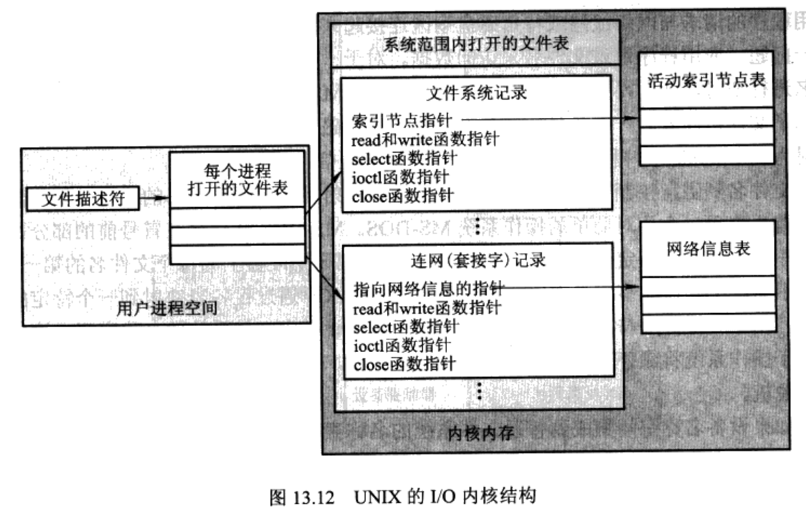

## 流

## 性能

## 用户界面：键盘、鼠标和显示器

