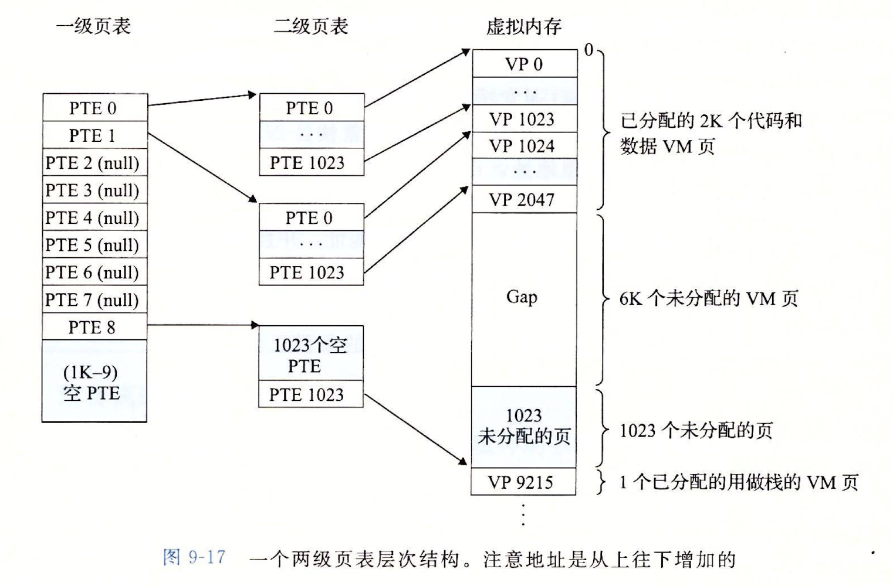

# 内存管理

## 内存管理的概念

### 内存空间的分配和回收

- 连续分配方式

	- 单一连续分配

		- 缺点

			- 有内部碎片（）

		- 分为系统区和用户区
		- 只有一个分区，这个分区用不满的话，就是内部碎片

	- 固定分区分配

		- 缺点

			- 有内部碎片

		- 优点

			- 无外部碎片

		- 分为一定数量的固定分区，因此分区外是不可能有碎片的，仅有内部碎片

	- 动态分区分配

		- 缺点

			- 有外部碎片

				- 可以用紧凑技术解决

		- 有点

			- 无内部碎片

		- 显然，这个的分区大小是根据分配进来的进程来说的，分区内就不可能有碎片，而分区外经过不断地换入和换出会产生外部碎片

- 非连续分配方式

### 内存空间的扩充

- 覆盖技术
- 交换技术

	- 内存空间紧张时，把一些暂时不用的进程从内存换出到外存。把外存中的某些进程换入内存
	- 挂起状态

		- 被换出的外存的状态被称为挂起状态
		- 可以被分为阻塞挂起和就绪挂起
		- 图示
		- 换出的位置

			- 磁盘分为文件区和对换区，换出的进程放在对换区

- 虚拟存储技术

### 地址转换

### 存储保护

## 运行一个程序（CALL）

### 概述

- CALL（Compiling Assembling Linking Loading）
- 硬件

	- 寄存器

		- 访问寄存器通常可以在一个时钟周期内完成

	- 内存

		- 通常需要多个时钟周期

- 解释器

	- 解释器是一个执行其他程序的程序，越难解释的程序越好编译

		- 

	- 如何运行一个用源语言写的程序？

		- 解释器

			- 直接用源语言执行

		- 翻译器

			- 将源语言转化为另一种语言

	- 解释器对比翻译器

- 地址绑定（address binding）

	- 程序是一个二进制文件，可以被放置在内存的任意位置中
	- 指令和数据如何绑定到内存的某个地址上？

		- （1）编译时

			- 如果编译时就知道进程最后在内存中的位置，就可以生成绝对代码。

		- （2）加载时

			- 如果编译时不知道进程会被放到什么位置，就要生成可重定位代码（relocatable code）

		- （3）运行时

			- 如果进程在运行时可以从一个内存段移到另一个内存段，那么绑定必须延迟到运行时再进行

	- 逻辑地址空间和物理地址空间

		- 逻辑地址

			- CPU生成的地址
			- 子主题 2

		- 内存管理单元（MMU）

			- 完成从逻辑地址到物理地址的映射
			- 实现方式

				- 简单方式：基地址寄存器

	- 动态加载（dynamic loading）

		- 从前，一个进程的整个程序和数据都放在内存中，然而使用动态加载时，子程序只有在被调用时才被加载，其余时候以可重定位的方式保存在磁盘中。

	- 动态加载库

- 交换

	- 子主题 1

### 编译（Compiling）

### 链接

- 静态链接
- 装入时动态链接

	- 边装入边链接

- 运行时动态链接

### 装入

- （1）绝对装入

	- 只适用于单道程序环境
	- 程序采用符号地址，汇编或编译时转化为绝对地址

- （2）可重定位装入

	- 在多道程序的环境下，多个目标模块的地址是从0开始，而且相对于起始地址的。
	- 装入过程中丢指令和数据的修改

- （3）动态运行时装入
- 装入的时机

## 分段与段页式

### 分段

- 动机
- 缺点

	- 有外部碎片

- 概述

	- 例子

		- 内存中一个进程可以分为：程序段、数据段、

	- 对程序员是可见的，用户编程更方便，程序可读性更高

- VA--段表-->PA

	- 图示

		- 

	- 描述

		- VA的高位是段号，在段表中能根据段号找到对应端的基址
		- 检查这个段是否合法（V/N位）
		- 检查Offset是否合法（Offset + Base n >= Limit n即为非法）
		- 否则PA = Base N + Offset

- 段表

	- 段表储存在处理器中

- 实例：Intel 80386

	- 图示

		- 
		- 

### 段页式

- 简要方法：先分段，再分页。把段内地址拆分成页号和页内地址。
- 动机

	- 结合页式的优点（内存利用率高）和段式的优点（能反映程序的结构并有利于段的共享）

- 内部碎片
- 具体实现

	- 每个进程有一张段表
	- 每个分段有一张页表
	- 段表表项包括：断号，页表长度，页表始址
	- 页表表项最少包括：页号和块号
	- 存在段表寄存器

## 虚拟内存

### 动机

- 传统存储管理的缺陷

	- 一次性：作业必须一次性全部装入内存才能运行，会导致大作业无法运行，如果大作业运行，则只有少量作业能运行，导致多道程序并发度下降
	- 驻留性：一旦作业被装入内存，就会一直驻留在内存中，而事实上只需要访问一小部分数据就能正常运行
	- 总之，内存的利用率不高

- 局部性原理

	- 数据值连续存放的
	- 指令也是连续存放的

### 基础知识

- 物理内存（physical memory），主存，也就是DRAM，一般为4GB~64GB
- CPU能直接访问主存，对于一个进程来说，最好是能一直保持在主存里，这样能最快速的运行下去。我们可以看到某时刻电脑中有非常多的进程，这些进程不可能全部存在于物理内存，也就是主存之中。所以要把放不下东西放在磁盘当中
- 虚拟内存

	- 每个进程都可以有一个自己的地址空间，这里先忽略这一点。概念上说虚拟内存存在于磁盘当中。但是其中某些页可以被换入DRAM，这个空间显然比物理内存要大得多
	- 特征

		- 多次性：无需作业运行时一次性全部装入内存，而是允许分成多次装入内存，连续的分配无法实现，必须离散地分配
		- 对换性：作业运行时无需一直常驻内存，而是允许在作业运行的过程中将其换入和换出
		- 虚拟性：从逻辑上扩充了内存的容量，使得用户所看到的容量远大于实际的容量

	- 大小

		- 最大容量：由地址结构确定
		- 实际容量：min(内外存的容量之和，CPU的寻址范围)

- 分页（paging）

	- 概念

		- 算数说明（k进制）

			- 取低r位

				- 例如：61 % 10 = 1 
				- 5021 % 10^2 = 20

					- r = 2

				- 5021 % 10 = 1

					- r = 1

			- 取高n - r位

				- 61 / 10 = 6
				- 5021 / 10^3 = 5

					- r = 1

		- 页（page）

			- 页号

				- 一个进程最多有2^p页，其中p = 32 - w，每一页有一个页号，也就是这个p
				- 计算方法： 逻辑地址/页面大小
				- 看出来：取高位
				- 作为页表的index，可以得到对应的物理地址

			- 一页的大小为2^w B

		- 逻辑（虚拟）地址（VA）

			- 计算方法：页号*页面大小 + 页内偏移量

		- 页内偏移量（PO）

			- = 逻辑地址 % 页面长度
			- 取逻辑地址的低位

		- 页框（VF）

			- 页框就是物理页表，也称物理块

		- 页表（PD）

			- 页表是一个数组，描述页号（逻辑地址的高位）和页框号（物理地址的高位）之间的对应关系

				- 这里的页框号也叫块号

			- 在页表中，页号是隐含的，是数组的Index
			- 页表的各表项可以连续的存储在内存中
			- 如果每个页表的大小合适，那么页表存储在页框中就不会有碎片
			- 页表的大小 = 页的数量x页表项的大小

		- 页表项（PTE）

			- 页表的内容
			- 大小：物理内存的块号（页框号）的长度
			- 注意：以字节编址的话要补到8bit的整数倍
			- 物理地址 = 页表始址 + PTE大小  x PTE序号

		- 页目录号（PDN）

	- 页的共享

		- 图示

			- 

		- 不同进程的不同页表将不同的虚拟地址映射到同一个物理地址
		- 用途

			- 内核区域
			- 用同一个二进制文件打开多个进程（例如打开5个Chrome）
			- 用户级系统库
			- 共享内存段

	- 页表的大小

		- 单级页表的缺陷：以32位4KB页，4B长度的物理地址（页表项大小）为例：有2^20=1M页，

	- 缺点

		- 没有外部碎片，只有少量内部碎片

	- 实例

		- 图示

			- 

- 多级页表

	- 动机

		- 单级页表存在的问题

			- 所有页表必须连续存放，页表过大时需要很大的连续空间
			- 当一个页表过于大时（比如已经远远超过了一个页的大小），就可以把这个页划分成2^p个页。然后为这些页建立页表。

		- 在一段时间内并非所有的页面都用得到，没必要让所有的页表常驻内存

	- 两级页表

		- 结构
		- 两级页表的地址翻译
		- 计算题

			- 页目录中表项个数的计算

				- 即除了页目录表之外有多少张页表
				- 设逻辑空间大小为2^k页，则需要二级页表一共有2^k个页表项
				- 一页可以放2^p个页表项，则有2^{k-p}页

	- 注意

### 主存作为磁盘的Cache

- 虚页的三种状态

	- 1. 未分配的

		- VM还没有使得任何数据和这些页面关联，因此这些页面不占任何磁盘空间

	- 2. 缓存的

		- 在物理内存中缓存了的

	- 3. 未缓存的

		- 在物理内存没有缓存的

	- 图示

		- 

- 页表

	- 图示

		- 

- 命中
- 不命中

	- 页面置换算法

		- 目标：更少的缺页率

			- 缺页率：缺页中断次数/访问次数

		- 最佳置换算法（OPT）

			- 换出之后最长时间内不会被访问的页面：往后寻找，最后一个出现的就是要淘汰的页面
			- 是无法实现的

		- 先进先出置换算法（FIFO）

			- 换出最早进入内存的页面（队头的页面）

		- LRU
		- CLOCK算法

			- 简单CLOCK算法

				- 如何找到最近未使用的帧？
				- 每个帧有一个使用位，页面首次装入主存时，使用位为1（显然都装入了，必然使用了）
				- 所有的用于替换的帧组成一个循环缓冲区
				- 需要替换时，查照未使用的帧（使用位为0）

					- 如果所有的帧的使用位都是1，怎么办？
					- 循环扫描，每遇到一个使用位为1的帧，就将其置为0，然后扫描下一帧，那么扫描一周后，所有帧都为0，取第一个遇到的帧。

			- 改进CLOCK算法

				- 增加一个修改位

					- 替换的优先级：未访问 > 未修改

						- 显然，如果都没有访问过，更谈不上修改了

				- 优先级：1未访问未修改 > 2未访问被修改 > 3被访问未修改 > 4被访问被修改
				- 循环扫描

					- 第一周：找(0, 0)的帧（1）
					- 若的第一周没找到，则扫描第二周
					- 第二周：找未访问被修改的帧，同时将所有的访问位置0，下一步找访问位为0的帧
					- 若第二周失败，则此时再重复1，

- 页面分配
- 工作集

	- 原理：局部性

### 虚拟内存的内存管理功能

### 虚拟内存的内存保护功能

### 三个分配模式下的管理

- 请求分页存储管理

	- 页表机制

		- 页面是否在内存中，在什么位置
		- 页表记录
		- 页面

	- 缺页中断机构

		- 过程

			- 起因：访问的页面不在内存中（缺页），产生缺页中断，
			- 当前进程被阻塞
			- 是否有空闲块

				- 有

					- 分配一个块，将要调入的页装入这个块，并修改页表中相应的表项

				- 无

					- 决定置换哪个块

						- 如果这个块被修改过，要将其写回外存

			- 把这个块写回TLB

		- 注意

			- 一条指令的执行期间可能产生多次中断
			- 缺失的页面也需要装入快表

	- 地址变换机构

		- 页面调入内存后，需要修改相应的页表项
		- 找到页表项是需要检查页面是否在内存中
		- 若页面不在内存中，则要请求调页
		- 页面调入内存后，需要修改相应的页表项

- 请求分段存储管理
- 请求段页式存储管理

### 实现

- 两个功能

	- 如果访问的信息不再内存中，就把所需的信息调入内存
	- 内存空间不够的时候，将内存中用不到的信息换到内存外

- 页面分配策略

	- 驻留集

		- 解释：指请求分页储存管理中给进程分配的物理块的集合
		- 驻留集一般小于进程的总大小，
		- 如果驻留集太小，会导致缺页频繁；
		- 如果驻留集太大，会导致多道程序并发度下降，而这个进程的错误率则没有明显影响

	- 页面分配、置换策略

		- 置换和分配策略

			- 固定分配

				- 为每个进程分配一组固定数目的物理块，在运行的过程中大小不变

			- 可变分配

				- 先为每个进程分配一定数目的物理块，在程序运行过程中，驻留集大小可变

			- 局部置换

				- 发生缺页时，只能选进程自己的物理块进行置换

			- 全局置换

				- 可以将操作系统保留的空闲物理块分给分给缺页进程，也可以把别的进程持有的物理块换到外存，再分给缺页进程
				- 这意味一个进程拥有的物理块数量必然会改变，因此必然不是固定分配

		- 策略的搭配

			- 固定分配局部置换

				- 发生缺页，只能在已在内存中的页面替换
				- 问题：每个进程需要多少块是难以确定的

			- 可变分配全局置换

				- 最易实现，操作系统有一个空物理块队列，缺页时，从这个队列中取出一块分配各进程。
				- 问题：满目的给一个进程增加分配的块数会导致并发性能下降

			- 可变分配局部置换

				- 缺页时，先在自己的内存中块中取出一块来置换，反复缺页时再向操作系统索要空闲块
				- 问题：没有上述两种分配的问题，但实现开销略大

			- 固定分配全局置换

	- 调入页面的时机

		- 预调页策略

			- 解释：根据局部性原理，一次调入多个页面可能比一次调入一个页面更加高效，但也可能预先调入的页面之后用不到，成功率只有50%
			- 所以主要用于进程的首次调入

				- 由程序员指出应该先调入

		- 请求调页策略

	- 从何处调页

		- 把磁盘分为两部分

			- 对换区

				- 读写速度更快，采用连续分配的方式

			- 文件区

				- 读写速度更慢，采用离散分配的方式

		- 使用

			- 程序运行之前，需要把进程相关的数据从文件区复制到对换区
			- 然后，主要的交换就在对换区和内存之间进行了

		- 如果对换区的空间不够

			- 不会被修改的数据：直接从文件区调入，因为不会被修改，所以换出是不必写回磁盘
			- 可能被修改的数据：写回对换区，下次需要的时候再调入

		- Unix不同的策略：运行之前所有的数据放在文件区，如果要换出，就换出到对换区

	- 抖动（颠簸）现象

		- 解释：进程刚刚换出的页面马上就要换入，刚刚换入的马上就要换出
		- 主要原因：分配给进程的物理块数量不够，或，驻留集的大小小于工作集

	- 工作集

		- 与驻留集的区别：它是在某段时间内，实际访问的页面的集合，因此，工作集的大小可能小于窗口尺寸
		- 找到某一时刻的工作集：从前时刻开始，至多窗口尺寸个数个不同的页，现在必然全都在工作集当中

## 概述

### 内存管理的功能

- 内存空间的分配与回收
- 地址转换
- 内存空间的扩充
- 存储保护

### 程序对内存的需求

- 程序运行的步骤
- 内存保护
- 地址空间

### 存储分级

- Subtopic 1

	- 名称

		- 1级缓存/1级TLB
		- 2级缓存/2级TLB
		- 3级缓存
		- 主存（DRAM）
		- 数据中心主存（DRAM）
		- Local non-volatile memory
		- 本地磁盘
		- 数据中心磁盘
		- Subtopic 9

	- 命中所需的时间

		- 1ns

	- 大小

		- 64 KB

### 寻址

- 什么是地址

	- 主存是一个长度为M的连续的以字节大小为单位的数组，每一个字节的序号称为这个字节的地址

- 虚拟内存的寻址

### 碎片

- 内部碎片

	- 分配给某些进程的内存区域中，有些部分没有用上

- 外部碎片：内存中的某些空闲分区太小而难以利用

## 地址翻译

### 单级页表

- 图示

	- 

### 多级页表

- 图示

	- 
	- 

### 地址翻译的过程

- 无快表（TLB）

	- 存在一个页表寄存器（PTR），储存着页表的启示地址和页表的长度
	- 检查页号是否合法：页号是否超过页表长度，不合法则发生越界中断
	- 找到对应的页表项中对应的块号
	- 用块号和页内偏移量拼成物理地址

- 有快表

	- 在向页表查询之前，先向快表查询
	- 先查询快表

		- 快表命中：一次访存
		- 快表未命中：两次访存

	- 同时查询

		- 如果要查询内存，就不用先查快表

## Linux的虚拟内存系统

### Linux进程的虚拟内存空间

- Linux将虚拟内存组织成一些段（或称area）的集合

	- 段的记录

		- 

	- mm_struct

		- 记录当前任务的虚存状态
		- pgd

			- 指向第一级页表（也即是全局页表）的基址

	- vm_area_struct

		- 当前虚存中一个区域的状态
		- vm_start
		- vm_end
		- vm_prot

			- 读写权限

		- vf_flags

			- 描述这个段是这个进程私有的还是被共享的（以及其他信息）

		- vm_next

- 图示

	- 

- 内核虚拟内存

	- 将一组连续的虚拟内存映射到连续的物理内存

### Linux的缺页异常处理

- 此时MMU发现一个虚拟地址A发生缺页
- 1.地址是合法的吗？

	- A如果要合法，就必须属于任何一个段
	- 把A与vm_start和vm_end比较

- 2.地址想访问的内存是合法的吗？（进程是否有读写这个内存区域的权限）

	- 如果不是，进程将被终止

## 内存映射（memory mapping）

### 把虚拟内存和一个磁盘上的对象关联以初始化这块内存区域的就是内存映射

### 对象的分类

- Linux文件系统中的普通文件

	- 一个区域可以映射到一个文件的连续部分
	- 文件区被划分为页大小的片

- 匿名文件

	- 请求二进制零的页（demand-zero page）

### 交换（swap）空间

- 限制着当前运行进程所能分配的虚拟页面的总数

### 共享对象

- 图示

	- 

- 如上所示，共享对象可以放在共享area中

### 私有对象与写时复制（COW）

- 写时复制（copy-on-write）

	- 子主题 1

- 动机：以fork为例，如果我们要fork一个进程，就要完整地复制它的整个地址空间，这样做的效率非常低。一个可行的想法是：子进程如果大部分时候只是在读取父进程的内容，那么有什么必要把同样的内容在磁盘中复制两份呢？我们可以把这些共享的页标记为写时复制页，只有当子进程对这些页面进行写操作时，将被写的页面复制一份就可以了
- 图示

	- 

### 再谈进程管理函数

- fork

	- 一个进程调用了fork
	- 内核为这个新进程分配pid，创建数据结构
	- 新进程的虚拟内存分配：直接复制原来进程的mm_struct，vm_area_struct和页表

- execve

	- 图示

		- 

### mmap()

## 动态内存分配

### 动机

- 有些数据的大小只有在运行时才知道

### 基本概念

- 堆（heap）

	- 图示

		- 

- 分配器

	- 显示分配器（explicit allocator）
	- 隐式分配器（implicit allocator）

### malloc和free

### 设计一个分配器

- 约束条件
- 目标
- 碎片

### 隐式空闲链表

- 结构

	- 图示

		- 

- 
- 改进：边界标记

	- 图示

		- 

	- 空闲合并

		- 图示

			- 

- 代码实现

### 显式空闲列表

- 结构

	- 图示

		- 

## 垃圾收集

### 基本知识

- 有向图

	- 图示

		- 

## 案例：虚拟内存

## 高级内存管理

### zero-copy I/O

### 虚拟机

### Fault Tolerance

### 安全

### 用户级内存管理

