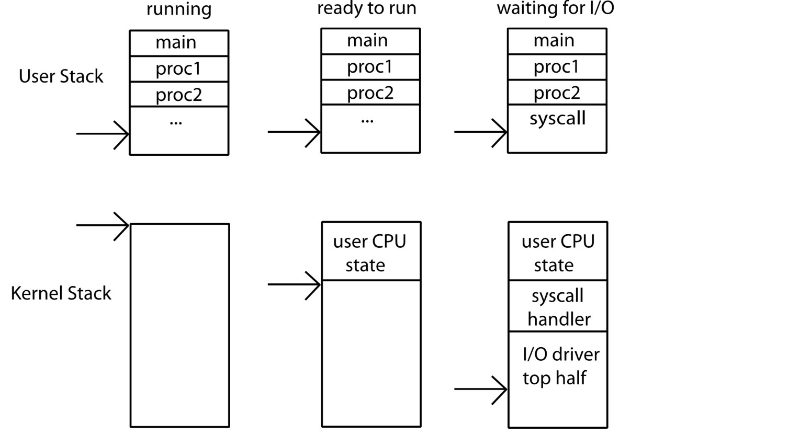
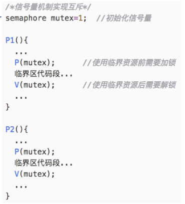
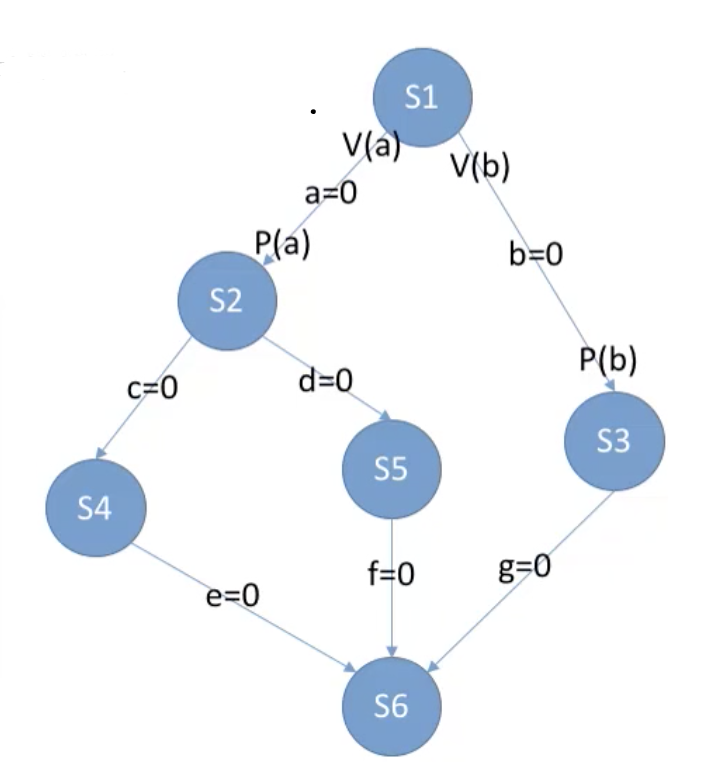

# 进程和线程

## 进程

### 进程模型

- 进程与程序的关系

	- 一个程序的被运行两次算作两个进程（只是代码区域有可能共享）
	- 进程是某种类型的一个活动，有程序，输入，输出以及状态

- 进程的概念

	- 定义

		- 有限制条件的执行环境execution environment with restricted rights

	- 计算机中所有“用户”的任务由进程完成
	- 为强调进程完成的是用户的任务，通常将进程称为用户进程
	- 计算机系统中的任务通常就是指进程

		- Linux内核中通常把进程称为任务，每个进程主要通过一个称为 进程描述符(process descriptor)的结构来描述，其结构类型 定义为task_struct，包含了一个进程的所有信息
		- 所有进程通过一个双向循环链表实现的任务列表(task list)来 描述，任务列表中每个元素是一个进程描述符
		- IA-32中的任务状态段(TSS)、任务门(task gate)等概念中 所称的任务，实际上也是指进程

- 一个进程拥有哪些资源？
- 包含哪些概念？
- 为什么需要进程？

	- 互相保护
	- 并发执行
	- OS的基本单元

- 特性

	- 并发

		- 线程的概念包含了并发

	- 进程保护

		- 通过地址空间防止有害的进程祸害其他的进程

			- 

### 进程的状态

### 进程的实现

### 引入“进程”的好处

- “进程”的引入为应用程序提供了以下两方面的抽象

	- 一个独立的逻辑控制流

		- 每个进程拥有一个独立的逻辑控制流，使得程序员以 为自己的程序在执行过程中独占使用处理器

	- 一个私有的虚拟地址空间

		- 每个进程拥有一个私有的虚拟地址空间，使得程序员
		-     以为自己的程序在执行过程中独占使用存储器

- 进程”的引入简化了程序员的编程以及语言处理系统的处理，即简化了编程、编译、链接、共享和加载等整个过程

## 内核与进程

### 双模式dual mode operation/Protection

- 硬件支持：一位bit来表示状态
- 模式转换

	- 图示
	- 两个方向

		- 用户 => 内核

			- 引起转换的原因

				- 1. 系统调用

					- 进程请求系统服务

				- 2. 中断

					- 外部的异步时间引起上下文切换
					- 例如时钟，I/O设备
					- 独立于用户进程

				- 3. Trap

					- e.g. Protection violation (segmentation fault), divided by zero

			- 怎么回到原来的状态

				- “return from interrupt”指令
				- 切换模式
				- 恢复用户PC

		- 内核 => 用户

			- 引起转换的原因

	- 模式切换的实质是....在内存的不同的区域上反复横跳，每跳一次就要修改寄存器的内容

		- 

- 特权操作

	- 

### 系统调用

- 内核系统调用处理程序
- 过程

	- 1. 传递系统调用参数
	- 2. 执行陷入指令
	- 3. 执行系统调用相应服务程序
	- 4. 返回用户程序

- 系统调用和库函数的区别

	- 系统调用是操作系统向上提供的借口
	- 有的库函数是对系统调用的进一步封装
	- 当今编写的程序大部分是通过高级语言提供的库函数间接地进行系统调用

### 内核栈

- 动机

	- 中断处理需要一个栈
	- 系统调用需要一个栈
	- 但是不能使用用户栈，为什么？

- 双栈模型

	- 每个内核线程有一个用户栈（位于用户内存）和一个内核栈（位于内核内存）
	- 
	- 用于保存中断时的用户寄存器

### 异常控制流

- 简介

	- 控制流的概念

		- CPU控制流

			- 程序正常的执行顺序

				- 按顺序读取下一条指令执行
				- 转移（RET）

		- 异常控制流

			- 引起正常的程序执行被打断了

		- 逻辑控制流

- 发生的原因

	- 中断

		- 内部异常
		- 外部中断

	- 进程的上下文切换
	- 一个进程直接发送信号给另一个进程（应用软件层）

- 子主题 3

### 中断

## 线程

### 线程的实现

### 与线程的关系

- 一个多进程的线程

	- 
	- 在一个进程内进行的线程切换显然是很简单的
	- 但是在切换线程块的时候需要更换内存和IO的地址表

- 子主题 2

### 与内核的关系

- 内核调度进程还是线程？

	- 首先要注意，切换进程还是切换线程的代价是完全不同的，切换线程需要保存和恢复寄存器，而切换进程在这个基础上还要切换整个当前的地址空间

		- 显然，切换进程相当的昂贵，而且会扰乱cache

- 用户级线程：多进程可以完全在用户级上实现吗？

	- 虚拟化

- 内核支持的线程kernel-supported threads

	- 线程互相独立地运行和阻塞
	- 一个进程有多个正在等待不同的东西的线程
	- 每次的上下文切换要在用户模式和内核模式下切换，代价很高
	- 通过系统调用创建线程

- 用户级线程User-Mode threads

	- 特点

		- 用户程序有自己的调度器
		- 多个用户级线程对应一个内核线程
		- 上下文切换更加廉价

			- 复制寄存器并跳转

	- 问题

		- 一个用户线程被IO阻塞，其他所有的对应于同一个内核进程（可以把内核看做进程吗？）也会被阻塞
		- 即使采用多核，也不可以完全避免这种情况
		- 一个解决方案是：Scheduler Activations，一个线程阻塞时，让内核通知线程调度器

## 操作系统和进程

### 操作系统作为一个中断处理程序

### 三类系统调用

- 进程（状态机）管理：fork, execve,  exit
- 存储（地址空间）管理

	- mmap：对进程虚拟空间的的一部分进行映射
	- brk：虚拟地址空间的管理

- 文件（数据对象）管理

	- open, close
	- read, write
	- mkdir, link, unlink

## 调度

### 调度算法

- 先来先服务（FCFS）

	- 不会导致饥饿

		- 饥饿：长作业长期不被调度

	- 对CPU繁忙型友好，而不利于IO繁忙型
	- 对长作业有利，对短作业不利

- 短作业优先（SJF）

	- 平均等待时间、平均周转时间最少
	- 长作业可能长期得不到执行，导致饥饿现象

- 最短剩余时间优先（SRTN）

	- 抢占式的短作业优先算法

		- 根据到到达时间，该时刻的作业的时长来决定是否抢占

- 高响应比优先HRRN

	- 由于要求服务的时间就是运行时间，所以短作业会先执行，而长作业的响应比会随着等待时间的变长而升高，所以避免了饥饿
	- 响应比 = (等待时间+要求服务时间)/要求服务时间
	- 每次都选出响应比最高的作业先执行

- 时间片轮转（RR）

	- 用于进程调度
	- 抢占式，由时钟装置来发出中断提醒进程
	- 常用于分时操作系统，更注重”响应时间“

- 多级反馈队列算法

	- 特点

		- 抢占式

	- 思路

		- 用多个队列， 采用不同的优先级设置方式

- 优先级调度算法

	- 特点

		- 有抢占式也有非抢占式
		- 缺点：如果一直来的是高优先级的任务，可能导致饥饿

	- 一般的优先级

		- 系统进程高于用户进程
		- 前台进程高于后台进程

			- 或者交互型进程>非交互型进程

		- 更偏好IO繁忙型进程

			- 在IO的时候去做计算，提高系统的整体效率

	- 分类

		- 根据有优先级可否被改变分为

			- 静态优先级
			- 动态优先级

		- 根据抢占与否

### 调度算法的评价指标

- CPU利用率
- 系统吞吐量：单位之间内CPU完成作业的数量

	- 长作业需要的时间比较多，所以会降低系统的吞吐量

- 到达时间
- 运行时间
- 周转时间 = 完成时间 - 到达时间
- 平均周转时间 = 周转时间之和/作业个数
- 带权周转时间：带权周转时间之和/作业个数
- 等待时间 = 周转时间 - 运行时间
- 平均xxx
- 响应时间

	- 从提交作业（到达）到系统产生首次响应的时间

### 调度发生的时机

### 不允许调度的时机

- 中断的处理过程中
- 在内核程序的临界区中，需要独占式的访问临界资源时

### 三级调度的概念

- 作业调度
- 中级调度
- 进程调度

### 背景

- 进程的行为
- 子主题 2

### 单处理器调度

### 多核处理器调度

### 能量感知调度

### 实时调度

### 队列理论

### Overhead管理

## 进程同步

### 概述

- 进程同步

	- 同步：并发性带来了异步性，有时需要进程同步来解决这种异步问题。

- 进程互斥

	- 对临界资源的访问，需要互斥的进行，即同一时刻只允许一个进程访问该资源
	- 四个部分

		- 进入区
		- 临界区
		- 退出区
		- 剩余区

	- 需要遵循的原则

		- 空闲让进

			- 临界区空闲时，允许另一个进程访问

		- 忙则等待

			- 临界区正在被访问时，其他试图访问的进程需要等待

		- 有限等待

			- 要在有限的时间内进入临界区，保证不饥饿

		- 让权等待

			- 进不了临界区的进程，要释放处理机，防止忙等

- 可重入

### 临界区互斥的实现

- 软件实现方法

	- 单标志法

		- 在进入区做检查，但是不上锁
		- 在退出区把临界区的使用权交给另一个进程（相当于在退出区既给另一个进程解锁，又给自己上锁）
		- 主要问题：不遵循空闲让进原则

	- 双标志先检查

		- 在进入区先检查后上锁，退出区解锁
		- 主要问题：不遵循：忙则等待原则

	- 双标志后检查

		- 在进入区先加锁后检查，退出区解锁
		- 主要问题：不遵循：空闲让进，优先等待原则，可能饥饿

	- Peterson算法

		- 在进入区主动争取，主动谦让，检查对方是否想进，己方是否谦让
		- 主要问题：不遵循：让权等待，会发生忙等

			- 在下面的代码中，1623的顺序将使得P0占用CPU且一直等待，直到其时间片结束，P1的第7步之后P0才可以继续运行

		- 代码

			- 

- 硬件实现方法

	- 中断屏蔽方法

		- 关中断后不允许当前进程被中断，也不会发生进程切换，直到当前进程访问完临界区，才有可能切换到别的进程
		- 优点

			- 简单、高效

		- 缺点

			- 不适用于多处理机；只适用于操作系统内核进程，不适用于用户进程，因为开/关中断指令只能运行内核态。

	- TestAndSet（TS指令/TSL指令）

		- Old记录是否已被上锁；再将lock设置为true，设置临界区是否已被上锁（若已上锁，则循环重复前几步）
		- 指令代码

			- 

				- 用old从lock指针获得原来的lock值，这个值被返回给下面的while循环，如果原来lock是true的话（原来就被锁住），那么接下来也一直会被锁住。
				- 如果没有被锁住，那么false被返回给while循环的判断位置，然后同时锁住（防止在它访问的同时有其他进程访问），接着访问临界区，最后访问完毕，解锁。

			- 

		- 优点

			- 实现简单；适用于多处理环境；

		- 缺点

			- 不满足”让权等待“
			- 比如lock起初是true的，当前的进程就会一直处于while循环的判断阶段，除非另一个进程在退出临界区解锁lock

		- 注意

			- 是从就绪态唤醒进程，而不是阻塞进程

	- Swap指令（XCHG指令）

		- 逻辑上同TSL

### 信号量机制

- 信号量的实现

	- 整型信号量

		- 用一个整数作为信号量，数值表示某种资源的数量
		- 整型信号量与普通整型变量的区别：对信号量只有初始化、P、V三种操作
		- 整型信号量存在的问题：不满足让权等待原则（busying waiting）

	- 记录型信号量

		- 注意：要能够自己推断在什么条件下执行block或者wakeup
		- 可以用记录型信号量实现系统资源的申请和释放
		- 数据结构

			- S.value表示某种资源数，S.L指向等待改资源的进程队列
			- 
			- 资源数为-n时，代表有n个进程在等待这个资源

		- 操作

			- P（wait，pause）

				- P操作中，一定是先S.value--，之后可能需要执行block原语
				- 伪代码
				- 理解：资源不够则等待、消耗资源

			- V（signal，wakeup）

				- V操作中，一定是先S.value++，之后可能需要执行wakeup原语
				- 伪代码
				- 理解：释放资源、生产资源

- 实现进程互斥

	- 步骤

		- 分析问题，确定临界区
		- 设置互斥信号量mutex，初值为1，对不同的临界资源设置不同的不同数量的临界资源
		- 临界区之前对信号量执行P操作
		- 临界区之后对信号量执行V操作

	- 代码

- 实现进程同步

	- 步骤

		- 分析问题，找去哪里需要实现”一前一后“的同步关系
		- 设置同步信号量，初始值为0
		- 在”前操作“之后执行V操作
		- 在”后操作“之前执行P操作

	- 实现进程的前驱关系

		- 步骤

			- 分析问题，画出前驱图，把每一对前驱关系都看出一个同步问题
			- 为每一对前驱关系设置同步信号量，初值为0
			- 在每个”前操作“之后执行V操作
			- 在每个”后操作“之后执行P操作

		- 例子

### 管程（monitor）

- 动机：解决信号量机制编程麻烦，容易出错的问题
- 组成

	- （1）共享数据结构
	- （2）对数据结构初始化的语句
	- （3）一组用来访问数据结构的过程（函数）
	- 管程有一个名字

- 基本特征

	- 各外部进程/线程只能通过管程提供的特定入口才能访问共享数据
	- 一个进程只有通过调用管程内的过程才能进入管程访问共享数据
	- 每次仅允许一个进程在管程内执行某个内部过程

- 用条件变量x实现同步

	- x.wait()

		- 资源不够，就在条件变量x上阻塞等待

	- x.signal()

- 补充

	- 个进程必须互斥访问管程的特性是由编译器实现的
	- 可在管程中设置条件变量即等待/唤醒操作以解决同步问题
	- 由编译器负责实现各进程互斥地进入管程中的过程

- java中的例子

	- synchronized

### 问题举例

- 生产者和消费者

	- 关键

		- 有一个初始值为空，大小为n的缓冲区
		- 缓冲区为满时，生产者必须等待

			- P操作消耗一个资源，如果资源不够的话等待。对应到这个问题：如果缓存空间被生产者消耗完了，就没法继续消耗了，只能等待
			- V操作使用然后释放一个资源，让其他等待的进程被唤醒（生产者），

		- 缓冲区为空时，消费者必须等待

			- 和上面的PV反过来，也需要一对PV操作

		- 缓冲区是临界资源，必须互斥访问

			- 一对PV

		- 

	- 伪代码

		- 

	- 注意

		- 死锁

			- 互斥的P操作放在同步的P操作前就会导致死锁

		- 消费者消费代码的位置

	- 变种问题

		- 当前有n个资源，缓冲区总大小为N

			- current = n
			- empty_place = N - n

- 多生产者多消费者问题

	- 分析

		- 存在不同类型的生产者/消费者对

	- 注意

		- 如果缓冲区大小为1，可能不需要设置互斥信号量
		- 分析事件而不是单独进程的行为

	- 代码

		- 初始条件
		- 生产者

		- 消费者

- 吸烟者问题

	- 分析

		- 可生产对种产品的单生产者-多消费者问题

- 读者-写者问题

	- 分析

		- 允许的事情

			- 允许多个读者同时读
			- 只允许一个写进程写
			
		- 对counter的访问设置一个mutex保证互斥
		- 读者优先
		
			- 读写公平
		
	- 变种或者推广问题
	
		- 进程之间的变量读写的互斥与同步
	
- 哲学家进餐问题

	- 代码

## 死锁

### 死锁的概念

- 什么是死锁

	- 进程因为竞争资源而造成的互相等待对方手里的资源，导致进程都阻塞，都无法向前推进。

- 进程死锁、饥饿、死循环的区别

	- 死锁：至少是两个进程一起死锁，死锁进程处于阻塞态
	- 饥饿：进程长期得不到自己想要的资源（设备，处理机（CPU）等等，），可能处于就绪态或者阻塞态

		- 可以只有一个进程饥饿，饥饿进程可能饥饿也可能就绪

	- 死循环：可能只有一个进程发生死循环，死循环的进程可以上处理机
	- 死锁和饥饿是操作系统要解决的问题，死循环是程序员要解决的

- 死锁产生的必要条件

	- （1）互斥条件

		- 对必须互斥使用的资源的争抢才会导致死锁，如果不互斥，就不会有阻塞了，想怎么写就怎么写

	- （2）不剥夺条件

		- 进程保持的资源只能主动释放，不可强行剥夺

	- （3）请求和保持条件

		- 保持着某些资源不放的同时，请求别的资源
		- 要不然一次给你给足？
		- 注意：资源不足不是导致死锁的原因，是饥饿的原因

	- （4）循环等待条件

		- 存在一种进程资源的循环等待链
		- 循环等待未必死锁，死锁一定有循环等待，因为循环等待只要有一个地方被提供了就解锁

### 死锁的处理策略

- 什么时候会发生死锁

	- 对不可剥夺资源的不合理分配，可能导致死锁

- 预防死锁

	- 破坏死锁产生的四个必要条件

- 避免死锁

	- 避免系统进入不安全状态

- 死锁的检测和解除

	- 允许死锁发生，系统负责检测出死锁并解除

### 死锁的处理

- 破坏死锁发生的条件：预防死锁

	- 破坏互斥条件

		- 将临界资源改造为可共享使用的资源（如SPOOLing技术）
		- 缺点：可行性不高，很多时候无法破坏互斥条件

	- 破坏不剥夺条件

		- 方案一：申请的资源得不到满足时，立即释放所拥有的资源
		- 方案二：申请的资源被其他进程占用时，有操作系统协助剥夺（比如给更高优先级的进程资源）
		- 缺点

			- 实现复杂；剥夺资源可能导致部分工作实效；
			- 反复申请和释放导致系统开销过大，只要得不到某种资源，就必须放弃之前申请到的那些资源，然后又要申请
			- 可能导致饥饿

	- 破坏请求和保持条件

		- 运行前分配好所有需要的资源，之后一直保持
		- 缺点

			- 资源利用率低
			- 可能导致饥饿，需要少量资源的进程总是会先执行，而那些需要多种资源的进程就可能得不到资源而饥饿

	- 破坏循环等待条件

		- 给资源编号，必须按编号从小到大的顺序申请资源，这样一来，每个进程都必须按照编号顺序来申请资源，那么一个进程只有在持有小编号资源的时候才有资格去申请大编号资源，而持有大编号的资源不可以逆向地回来申请小编号的资源，因为申请资源必须一次申请完
		- 缺点

			- 不方便增加新设备，因为可能需要重新分配所有的编号
			- 会导致资源浪费
			- 用户编程麻烦

- 银行家算法

	- 什么是安全序列

		- 指一个安全的向各个进程分配资源的序列
		- 情景：有不同的进程对不同的资源有不同数量的要求，如果你满足了一个进程对于所有资源的最大需求，那么他完成自己，将释放这些资源，你接着那这些被释放的资源和原来剩下的资源满足其他因为等待资源的进程，直到所有的进程都被满足。
		- 如果上述的事情是可能的话，那么这个分配的序列就称为一个安全序列，如果不存在安全序列，那么系统就可能会发生死锁

	- 安全状态

		- 只要处于安全转态，就可以避免死锁

	- 不安全状态

		- 如果不存在安全序列，则称系统进入了不安全状态。
		- 在不安全状态下，可能会出现一些意外的情况（比如说某个进程突然放弃了某些资源），这时就不会发生死锁，但是反过来，发生死锁必然是在不安全状态

	- 如何避免系统进入不安全状态：银行家算法
	- 注意这里预防和避免的区别：预防一个含糊得多的词

- 资源分配图（死锁定理）

	- 如何检测
	- 数据结构：资源分配图

		- 两种节点

			- 进程节点
			- 资源节点：对应一类资源，一类资源可能有多个，在一个方块里面，圆点的个数代表资源的个数

		- 两种边

			- 进程节点----->资源节点（请求边，每条边代表一个资源）
			- 资源节点------>进程节点（分配边，每条边代表一个）

		- 图示

			- 没有死锁
			- 死锁

	- 死锁检测算法

		- 一侧消除与不阻塞进程相连的边，直到无边可消
		- 注：所谓的不阻塞进程是指其申请的资源数还足够的进程
		- 死锁定理：若资源分配图是不可完全简化的，说明发生了死锁

	- 如何解除

		- 资源剥夺法
		- 撤销进程法（终止进程法）
		- 进程回退法

### 常见问题

- 设N个设备，M个进程竞争使用，每个进程需要K个设备，则可能发生死锁的最小M数（不会发生死锁的最大M数）的情况如下

	- 给每个进程K-1台设备，也就是说还差一台就可以解除死锁
	- 发生死锁：

$$
N = (K-1)M
$$
	- 不发生死锁：

$$
N=(K-1)M+1
$$

## 进程间通信

### 信号量

### 管道

### 共享存储

### 消息传递

## 并发

