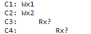
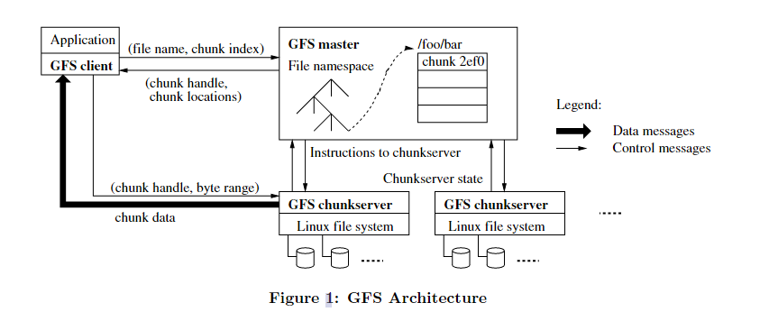

# Google Files System

## 	Storage System

存储系统是构建故障包容系统的基石。因为由此应用本身可以是无状态的。  

### 	Why hard

分布式存储的难点：

- 高性能，多个服务器上的共享数据结构
- 多个服务器会带来持续的故障
- 容错的设计
- 复制：潜在的不一致性
- 强一致性：需要发送信息，会降低性能

### 	Consistency

理想的模型是：表现得像一个单一系统。假设有如下情况：

客户3和4读到的`x`应该是多少呢？

如何定义一致性？

一种方法是用锁来强行保证一致性。另一种方法是使用主从复制。

## 	GFS

### 	Problems

GFS的结构是怎样的？

GFS客户端怎么工作？

GFS是如何工作的？

背景：

- Google的很多服务（MapReduce，爬虫、日志存储/分析）需要一个大型的、快速的、统一的存储系统。
- 自动的错误恢复
- 每个部署只需要一个数据中心
- 目标是对于超大文件的序列访问（读或添加）

总体的结构：

- 客户（库、RPC）
- Coordinator跟踪文件名
- 块服务器（chunkserver）存储64MB的块
- 大文件被分成很多64MB的块，每个块有一个**全局的不可变的64位的唯一标识**，也就是**块句柄**（chunck handle）。分布在很多块服务器上。块的大小越大，簿记的额外开销就越少。
- 每个块在三个块服务器上有复制
  - 为什么是3而不是2呢？

- Master
  - 维持文件系统所有的元数据：包括命名空间、访问控制信息、从文件到块的映射，以及块的当前位置。
  - 同时需要控制一些系统级别的服务，如块的出租管理、孤儿块的垃圾收集以及不同块服务器之间的块的迁移。
  - Master通过心跳消息周期性地同各个块服务器交流，给它们指令，并收集它们的状态。

- 客户端
  - 链接每个应用中的GFS的客户端代码实现了文件系统的基本API（如`open`等），然后可以和块服务器和Master交流，让它们去实现文件的读写。

- 缓存
  - 

Coordinator的状态

- 在内存中有一张表（必须要小，保证速度）。这张表中保存：
  - 文件名到块句柄数组
  - 块句柄到
    - 版本

作为MapReduce的文件系统：

### 	Architecture

单个Master的结构：

- 使得master可以利用全局信息做复杂的块的替换和复制决策。但是也必须限制master在读和写中的参与，防止它成为性能的瓶颈。
- 客户端通过master了解到它需要和哪些块交流。它在一定的时间内缓存了这个信息，然后在接下来的操作中直接和这些块服务器交流。

流程：

chunk size：

- advateges of large chunk size
  - reduce times of interacts with master
  - reduce network overhead in TCP
  - reduce metadata stored in memory
- disadvanteges
  - chunkserver becomes hot pot, but not a major issure
    - since most reads are sequential 
- ??
  - lazy allocation
    - avoids wasting space(internal fragmentation)
    - but how?
  - hot spot
    - example: an excutable starts on hundreds of machines
    - solve: store such excutable in a higher replication factor

Meta data: 

- using log
- all kept in master's memory location
- in-memory data structures
  - periodic scan implements garbage collection
  - potential concern: capacity of the system is limited by the memory size of master, but not serious
  - stores filenamespaces data using prefix compression
- chunk locations
  - is it neccesary to keep locations of every chunk in master?
    - NO, let master request chunkserver for that. This eliminates the problem of syncing master and chunkserver.
    - REASON: chunkserver has the final word of where the chunks are. There is no point of trying to maintain a consistent view.

  - master uses heartBeat message to monitor chunkservers and keep itself up-to-date.

- Operation log
  - it is a historical record of critical metadata changes
  - replicate it on different machines, and only inform the client after flushing it both locally and remotely

???

- leases
  - 
- mutation

Master

Fault tolerance 

- Fast Recovery
  - Chunkserver can restore their state in seconds, no matter what failures
- Chunk Replication
  - 3 replicas for each chunk on multiple chunkservers

### 	Metadata

#### 	In-Memory Data Structure

#### 	Chunk Locations

#### 	Operation Log

#### 	

## 	Working Process

客户C想要读一个文件时，步骤是怎样的？

1. C向CO（coordinator）发送文件名和偏移量
2. CO找出对于这个偏移的块句柄
3. CO把块句柄和块服务器的最新版本回复C
4. C缓存这个句柄和块服务器的列表（缓存文件名到块句柄的对应信息）
5. C把块句柄和偏移发送给相距最近的块服务器
6. 块服务器总磁盘中读出块文件，将返回给C。

如果C要做一次记录添加呢？

1. C询问CO，文件的最后一个块的信息
2. CO告诉C第一级和第二级
3. 

- 分布式是一个关键抽象
  - 接口/语义应该是怎么样的？
  - 内部应该如何工作？

- 