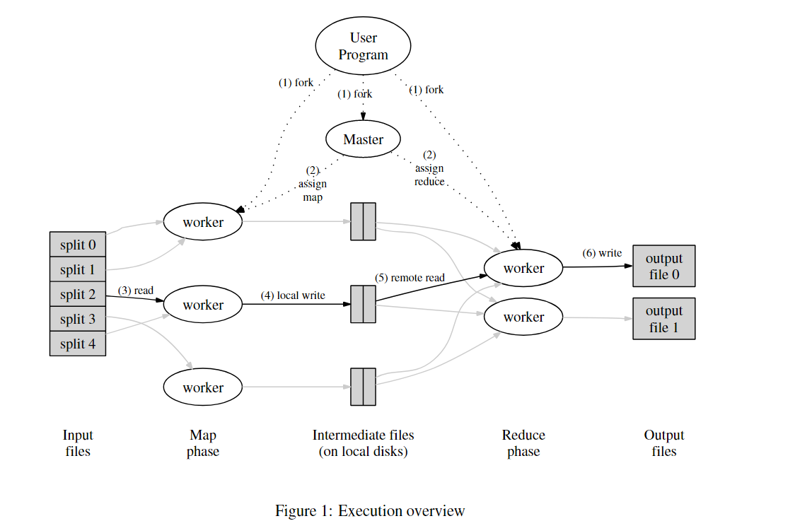

# Map Reduce





## Examples

map和reduce函数类型应该是：

```go
map(k1, v1) list(k2, v2)
reduce(k2, list(v2)) list(v2)
```

### Document Word count

```go
map(key: <document name>, value: <document contents>)
-> list(word: <every word in document>, value: <count of this word>)

reduce(key: <word>, list<value>: <list of counts>)
-> value: <total counts of this word>
```

### Distributed Grep

### Count of URL Access Frequency

网页请求的日志 -> 一系列`<URL, 1>` -> `<URL, total count>`

### Reverse Web-Link Graph

这个是上面对`map`和`reduce`的类型的完美例子。

- Map
  - 输入键值对
    - `key`：网页名`source`
    - `value`：网页内容`content`
  - 输出链表内容
    - `key`：目标URL`target`
    - `value`：存在到达目标URL的网页名`source`
- Reduce：简单的拼接
  - 输出
    - `key`：目标URL`target`
    - `value`：所有存在到达目标URL的网页名的`source`的链表


### Term-Vector Host

### Inverted Index

### Distributed Sort


## Implementation

### Execution Overview

`map`调用是分布在一系列机器上的，它将输入数据集分割$M$个集合，这种分割也是可以并行的。

`reduce`是在使用一个分割函数（例如$hash(key) \mod R$），将中间键空间$R$分割为$R$个部分的过程中被分布的。$R$是用户定义的。

具体执行：

1. 首先是用户程序中的`MapReduce`库将输入文件分割为$M$个部分，每个部分16MB到64MB（这也是用户选择的）。然后在一个机器集群中执行这个程序的副本。
2. 其中一个副本是特别的，它是主版（master）。而其他的副本则是由master分配工作的工人（workers）。
3. 分配了`map`工作的工人读取对应部分的输入的部分，它从输入数据中解析出键值对，并将其传给用户定义的`map`函数。这个函数产生的中间键值对**缓存在内存中**。
4. 这些缓冲的键值对周期性地被写入磁盘，然后被分割函数分为$R$个部分。这些缓冲的键值对在磁盘上的位置被传回master，而master需要把这些东西的位置交给`reduce`工人。
5. master通知了`reduce`工人这些地址之后，工人用远程程序调用读入这些存在本地磁盘上的缓存数据。当他已经读入所有的中间数据之后，它讲所有的中间键排序，相同的键聚集在一起。
6. `reduce`工人遍历所有排序好的中间数据，而且对每个唯一的中间键，它将这个键和对应的`value`传给用户定义的`Reduce`函数。这个函数的输出被添加到这个`reduce`分区的最终输出文件中。
7. 当所有的`map`和`reduce`任务都完成之后，master唤醒用户程序程序。控制权返回用户代码。

这一切顺利完成之后，`MapReduce`的结果就在$R$个输出文件中了。通常用户不需要自己合并这些文件，而是把这些文件作为另一个`MapReduce`的调用的输入，然后合并。

### Master Data Structure

Master需要保存的状态有：对于每一个`map`和`reduce`任务，需要保存他们的状态（空闲、正在进行或是完成），以及每个工人机器的ID（对于非空闲的任务）。

Master是将中间文件区域位置从`map`任务传播到`reduce`任务的管道。

## Fault Tolerance

### Worker Failure

Master用ping周期性地检测和每个工人之间的链接。如果在一定时间内没能从某个工人那里收到回复，就把这个工人标记为“失败”。这个工人完成的所有`map`任务会被重新设置为初始的空闲状态，然后这些任务就有资格                                                                                                                                                                                                                                                                                                                                                                                                                                                                                                                                                                                                                                                                              

### Master Failure

### Semanties in the Presence of Faulures


**Q1** 论文试图解决什么问题？

给定一个很大的数据集，要在成百上千台不同的机器上（并行），在合理的时间内，从数据中计算得到所需要的结果，而且能处理失败的情况（容错）。例如：根据大量的爬虫网页，网页请求记录，计算倒排索引，网络文件的各种图结构的表示，每个主机爬下来的页面数量，某一天里最常见的查询等等。

**Q2** 这是否是一个新的问题？

不是。

**Q3** 这篇文章要验证一个什么科学假设？

**Q4 **有哪些相关研究？如何归类？谁是这一课题在领域内值得关注的研究员？

**Q5 **论文中提到的解决方案之关键是什么？


**Q6** 论文中的实验是如何设计的？

**Q7** 用于定量评估的数据集是什么？代码有没有开源？

**Q8 **论文中的实验及结果有没有很好地支持需要验证的科学假设？

**Q9 **这篇论文到底有什么贡献？

**Q10** 下一步呢？有什么工作可以继续深入？


卡加斯了发射机发送了可积分是令肌肤。

是到复空间阿斯拉达分离式上飞机

啥课几点过来撒见到过
的空间爱上了估计的时代峰峻辽阔的萨就发生阿斯蒂芬两水晶傻了看到附件撒了个。
是空节点刚加了个奥斯卡福建省啦国家队。

阿斯加德来发生光棍节拉设计费高考历史


## Basic Problems

**Q1** 论文试图解决什么问题？

**Q2** 这是否是一个新的问题？

**Q3** 这篇文章要验证一个什么科学假设？

**Q4 **有哪些相关研究？如何归类？谁是这一课题在领域内值得关注的研究员？

**Q5 **论文中提到的解决方案之关键是什么？

**Q6** 论文中的实验是如何设计的？

**Q7** 用于定量评估的数据集是什么？代码有没有开源？

**Q8 **论文中的实验及结果有没有很好地支持需要验证的科学假设？

**Q9 **这篇论文到底有什么贡献？

**Q10** 下一步呢？有什么工作可以继续深入？


## 	Project

