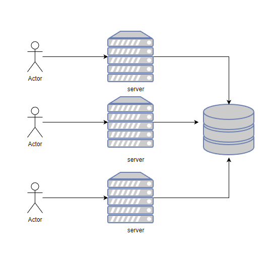

## Introduction

What I mean by "distributed system": a group of computers cooperating to provide a service. This class is mostly about infrastructure services e.g. storage for big web sites, MapReduce, peer-to-peer sharing lots of important infrastructure is distributed.

Goals:

- Parallelism
- Fault tolerance
- Physical
- Security/isolated

Challenges:

- Concurrency
- Partial failure
- Performance

基础设施 - 抽象

- Storage 
- Communications
- Computations

We want to bulid a distributed system which feels like a non-distributed system.

Implementation: RPC, threads, concurrency control

### 性能

- 可伸缩性：两倍的计算机数量得到两倍的吞吐量



### 	容错（Fault Tolerance）

- 可用性（Availability）：即使遇到错误，系统也能继续提供服务。
- 可恢复性（recoverability）：保存数据最后的状态用于恢复
- 非易失性存储器（non-volatile storage）
- 复制（replication）：主从同步

### 	一致性（consistancy）

```put(k,v)```之后```get(k)```得到```v```。由于缓存导致的数据不一致是很常见的。一致性有强弱之分。强一致性的代价很高。所有弱一致性非常值得讨论。