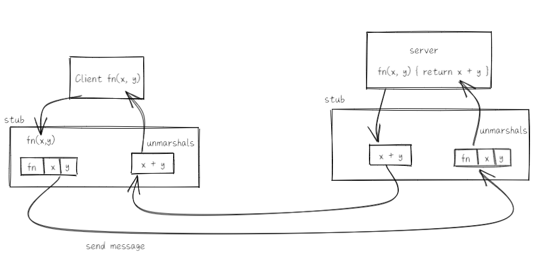

# RPC


## 	Threads

线程允许一个程序在一个时间做几件事情。而且共享内存。每个线程保存自己的状态：PC、寄存器、栈、等待的事情。

线程的优势：

- I/O并发：服务端可以使用多个线程接收多个客户发来的请求，而且每个请求都可能阻塞（例如磁盘读写，或者锁），这时这种阻塞不会影响到其他的线程
- 多核性能：可以利用多核心的CPU提升执行速度
- 便利性：	

可以替代多线程的方法：事件驱动（event-driven）。在单个线程中显式地交错各种活动。维护一个记录各种活动的状态的表（例如每个客户的请求）。

一个“事件”循环可能包括：

- 检查每个时间是否有新的输入来了（例如来自服务端的回复）。然后为每个活动进行下一步，更新它们的状态。

事件驱动可以带来I/O并发的同时节省线程所需的开销。但它无法得到多核处理器的加成，而且为其写代码也是很痛苦的。

线程的挑战；

- 共享数据的安全性，例如两个线程同时做$n = n+1$，这就导致了一个“竞争”。解决方案例如锁（GO的`sync.Mutex`）或者禁止共享可变数据
- 线程之间的协调。一个线程在生产数据，而另一个线程在消耗数据，如何使得消费者在等待的时候释放CPU，而生产者能在适当的时候唤醒消费者？考虑使用管道（`channel`）或者条件变量
- 死锁

Go应对这些挑战的两个方案：


### Vote Example

理论上来说，

### Web Crawler Example

网页爬虫：获取所有的网页。给定一个网页，它递归地找到所有的。但是每个每个网页只获取一次，而且不能陷入循环。

爬虫的挑战：

- 利用I/O并发
  - 网络延迟的影响比网络容量更大
  - 要增加每秒钟获取的URL数，就需要使用线程来实现并发
- 要让每个URL只获取一次
  - 避免浪费网络带宽
  - 对于远程服务器更好，需要记住每个URL是否访问过

序列爬虫：

- 通过递归的序列调用进行深度优先搜索
- 用一个`fetched`的`map`防止重复、打破循环
- 但是每次只能获取一页，很慢。如果直接在这个函数前加一个`go`变成线程执行会怎样呢？

```go
// Serial crawler
func Serial(url string, fetcher Fetcher, fetched map[string]bool) {
	if fetched[url] {
		return
	}
	fetched[url] = true
	urls, err := fetcher.Fetch(url)
	if err != nil {
		return
	}
	for _, u := range urls {
		Serial(u, fetcher, fetched)
	}
	return
}
```

`ConcurrentMutex`爬虫：

- 对每一次取页创建一个线程，所有由非常多的并发取页。
- 通过`go func`运行匿名函数
- 线程之间共享`fetched`这个`map`
- 为什么要使用`Mutex`？
  - 两个线程同时对一个`map`进行读写可能造成问题
  - 但是这里注释掉`Lock`和`Unlock()`，运行结果也是正确的，但是依然能检测到竞争条件。
- `ConcurrentMutex`怎么知道事情做完了？
  - 使用`sync.WaitGroup`，

```go
// Concurrent crawler with shared state and Mutex
type fetchState struct {
	mu      sync.Mutex
	fetched map[string]bool
}
func makeState() *fetchState {
	f := &fetchState{}
	f.fetched = make(map[string]bool)
	return f
}

func ConcurrentMutex(url string, fetcher Fetcher, f *fetchState) {
	f.mu.Lock()
	already := f.fetched[url]
	f.fetched[url] = true
	f.mu.Unlock()
	if already {
		return
	}
	urls, err := fetcher.Fetch(url)
	if err != nil {
		return
	}
	var done sync.WaitGroup
	for _, u := range urls {
		done.Add(1)
		go func(u string) {
			defer done.Done()
			ConcurrentMutex(u, fetcher, f)
		}(u)
	}
	done.Wait()
	return
}

```


### 使用`channel`的做法

管道是一个`string`的数组，先用一个线程把`url`放入管道中。然后调用`coordinator`：

```go
func ConcurrentChannel(url string, fetcher Fetcher) {
	ch := make(chan []string)
	go func() {
		ch <- []string{url}
	}()
	coordinator(ch, fetcher)
}
```

`coordinator`：

```go
// Concurrent crawler with channels
func coordinator(ch chan []string, fetcher Fetcher) {
	n := 1
	fetched := make(map[string]bool)
	for urls := range ch {
		for _, u := range urls {
			if fetched[u] == false {
				fetched[u] = true
				n += 1
				go worker(u, ch, fetcher)
			}
		}
		n -= 1
		if n == 0 {
			break
		}
	}
}
```


`worker`：取到`url`，放入管道

```go
func worker(url string, ch chan []string, fetcher Fetcher) {
	urls, err := fetcher.Fetch(url)
	if err != nil {
		ch <- []string{}
	} else {
		ch <- urls
	}
}
```


```go


//
// main
//

func main() {
	fmt.Printf("=== Serial===\n")
	Serial("http://golang.org/", fetcher, make(map[string]bool))
	fmt.Printf("=== ConcurrentMutex ===\n")
	ConcurrentMutex("http://golang.org/", fetcher, makeState())
	fmt.Printf("=== ConcurrentChannel ===\n")
	ConcurrentChannel("http://golang.org/", fetcher)
}
// Fetcher
type Fetcher interface {
	// Fetch returns a slice of URLs found on the page.
	Fetch(url string) (urls []string, err error)
}
// fakeFetcher is Fetcher that returns canned results.
type fakeFetcher map[string]*fakeResult
type fakeResult struct {
	body string
	urls []string
}
func (f fakeFetcher) Fetch(url string) ([]string, error) {
	if res, ok := f[url]; ok {
		fmt.Printf("found:   %s\n", url)
		return res.urls, nil
	}
	fmt.Printf("missing: %s\n", url)
	return nil, fmt.Errorf("not found: %s", url)
}
// fetcher is a populated fakeFetcher.
var fetcher = fakeFetcher{
	"http://golang.org/": &fakeResult{
		"The Go Programming Language",
		[]string{
			"http://golang.org/pkg/",
			"http://golang.org/cmd/",
		},
	},
	"http://golang.org/pkg/": &fakeResult{
		"Packages",
		[]string{
			"http://golang.org/",
			"http://golang.org/cmd/",
			"http://golang.org/pkg/fmt/",
			"http://golang.org/pkg/os/",
		},
	},
	"http://golang.org/pkg/fmt/": &fakeResult{
		"Package fmt",
		[]string{
			"http://golang.org/",
			"http://golang.org/pkg/",
		},
	},
	"http://golang.org/pkg/os/": &fakeResult{
		"Package os",
		[]string{
			"http://golang.org/",
			"http://golang.org/pkg/",
		},
	},
}
```


## Remote Procdure Call (RPC)

- 远程过程调用是分布式系统中的关键部件。
- RPC的目标是为客户端和服务器之间的交流提供一种易于编程的机制。
- 可以隐藏网络协议的细节
- 把数据（字符串、数组、字典等）转化为“有线格式”
- 可移植性

RPC的消息图：



软件结构：

### Example: kv.go

一个玩具的键值存储服务器：使用`Put(key, value)`和`Get(key)=>value`

```go
// Common RPC request/reply definitions
type PutArgs struct {
	Key   string
	Value string
}
type PutReply struct {
}
type GetArgs struct {
	Key string
}
type GetReply struct {
	Value string
}
func main() {
	server()
	put("subject", "6.824")
	fmt.Printf("Put(subject, 6.824) done\n")
	fmt.Printf("get(subject) -> %s\n", get("subject"))
}
```

客户端：

- `connect()`的`Dial()`创建了一个对服务器的TCP连接
- `get()`和`put()`是客户端的“桩”
- `Call()`要求RPC库进行调用
  - 确定服务器函数名，参数，以及何处放置恢复
  - 库安排参数，发送请求，等待，然后将回复解码
  - 一般来说还会有一个`reply.Err`来表示服务级别的失败

```go
// Client
func connect() *rpc.Client {
	client, err := rpc.Dial("tcp", ":1234")
	if err != nil {
		log.Fatal("dialing:", err)
	}
	return client
}
func get(key string) string {
	client := connect()
	args := GetArgs{"subject"}
	reply := GetReply{}
	err := client.Call("KV.Get", &args, &reply)
	if err != nil {
		log.Fatal("error:", err)
	}
	client.Close()
	return reply.Value
}
func put(key string, val string) {
	client := connect()//使用TCP连接到服务器？
	args := PutArgs{"subject", "6.824"}
	reply := PutReply{}
	err := client.Call("KV.Put", &args, &reply)//让服务器执行
	if err != nil {
		log.Fatal("error:", err)
	}
	client.Close()
}
```

服务端：

- Go要求服务端将一个带着方法的对象申明为RPC句柄（handler）
- 然后用RPC库注册这个对象
- 服务端接收TCP连接，然后把这个连接交给RPC库
- RPC库要做的：
  - 读取每个请求
  - 为每个请求创建一个`goroutine`
  - 解码请求
  - 在`Register()`创建的表了查找有名字的对象
  - 调用这个对象的方法
  - 编码回复
  - 把回复写入TCP连接
- 服务器的`Get()`和`Put()`句柄必须必须使用锁，因为RPC库创建的新的`goroutine`会读取参数，修改回复

其他细节的解释：

- 编码：将数据格式化为数据报。Go的RPC库可以传递字符串、数组、对象（如果是指针，就传入指针指向的对象）、映射。但是不能传管道和指函数。

```go
// Server
type KV struct {
	mu   sync.Mutex
	data map[string]string
}
func server() {
	kv := new(KV) //这个键值对对象被声明为句柄
	kv.data = map[string]string{}
	rpcs := rpc.NewServer()
	rpcs.Register(kv)//注册这个对象
	l, e := net.Listen("tcp", ":1234")//等待客户端的TCP连接
	if e != nil {
		log.Fatal("listen error:", e)
	}
	go func() {//创建一个线程接收TCP连接
		for {
			conn, err := l.Accept()
			if err == nil {
				go rpcs.ServeConn(conn)
			} else {
				break
			}
		}
		l.Close()
	}()
}
func (kv *KV) Get(args *GetArgs, reply *GetReply) error {
	kv.mu.Lock()
	defer kv.mu.Unlock()
	reply.Value = kv.data[args.Key]
	return nil
}
func (kv *KV) Put(args *PutArgs, reply *PutReply) error {
	kv.mu.Lock()
	defer kv.mu.Unlock()
	kv.data[args.Key] = args.Value
	return nil
}
```


### Example 

Server

```go
package main
import (
	"net"
	"net/rpc"
)
//其中Hello方法必须满足Go语言的RPC规则：
//1 方法只能有两个可序列化的参数
//2 其中第二个参数是指针类型，
//3 并且返回一个error类型，
//4 同时必须是公开的方法。
type HelloService struct {}
func (h *HelloService) Hello(request string, reply *string) error{
	*reply = "hello:" + request
	return nil
}
func main() {
	//然后就可以将HelloService类型的对象注册为一个RPC服务：
	//其中rpc.Register函数调用会将对象类型中所有满足RPC规则的对象方法注册为RPC函数，
	//所有注册的方法会放在“HelloService”服务空间之下
	err := rpc.RegisterName("HelloService",new(HelloService))
	if err != nil {
		panic(err)
	}
	//然后我们建立一个唯一的TCP链接，并且通过rpc.ServeConn函数在该TCP链接上为对方提供RPC服务。
	lis ,err := net.Listen("tcp",":1234")
	if err != nil {
		panic(err)
	}
	con,err := lis.Accept()
	if err != nil {
		panic(err)
	}
	rpc.ServeConn(con)
}
```

客户端：

```go
package main
import (
	"fmt"
	"net/rpc"
)
func main() {
	//首先是通过rpc.Dial拨号RPC服务，然后通过client.Call调用具体的RPC方法
	cli,err := rpc.Dial("tcp",":1234")
	if err != nil {
		panic(err)
	}
	var reply string
	//在调用client.Call时，
	//第一个参数是用点号链接的RPC服务名字和方法名字，
	//第二和第三个参数分别我们定义RPC方法的两个参数。
	err = cli.Call("HelloService.Hello","你好",&reply)
	if err != nil {
		panic(err)
	}
	fmt.Println(reply)
}
```

